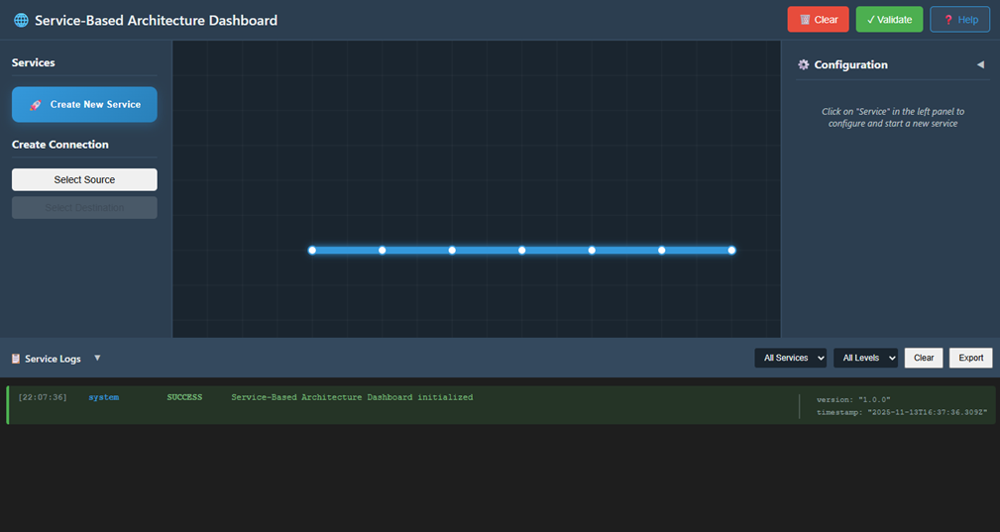
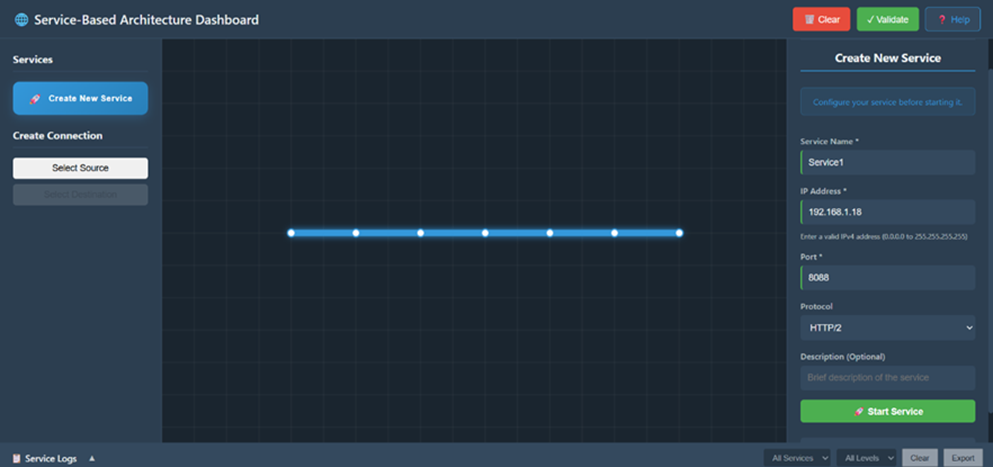
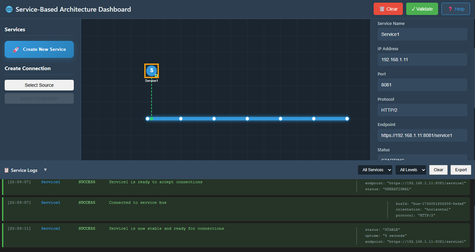
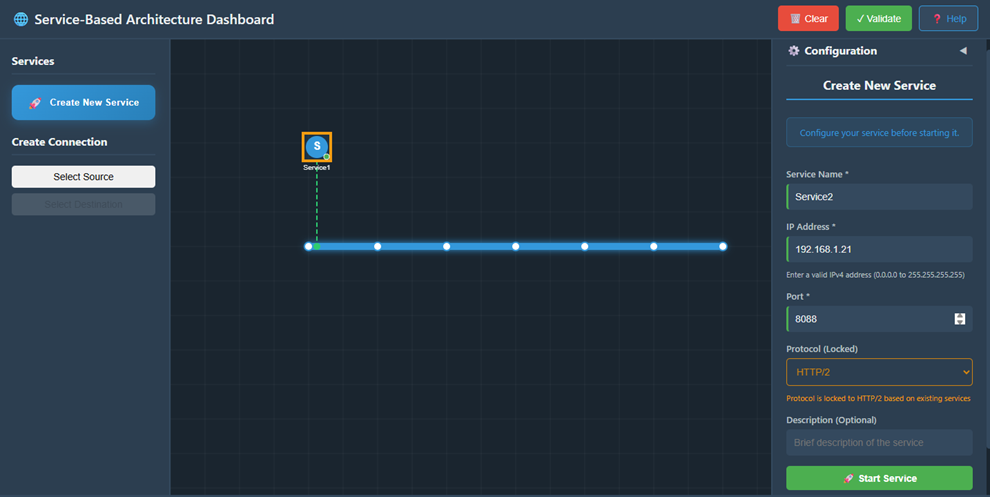
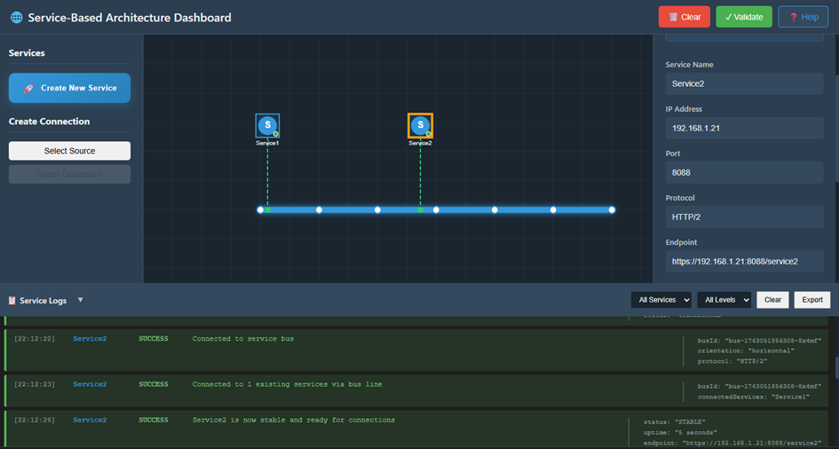
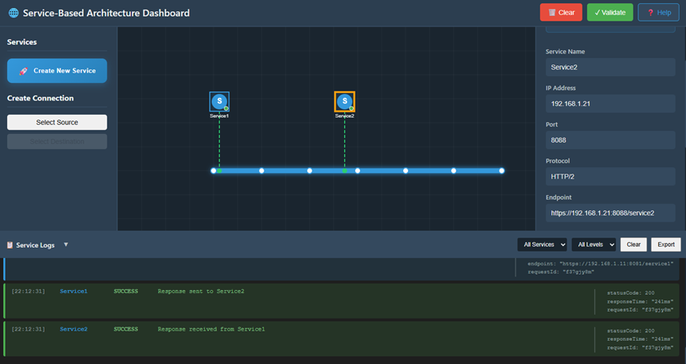
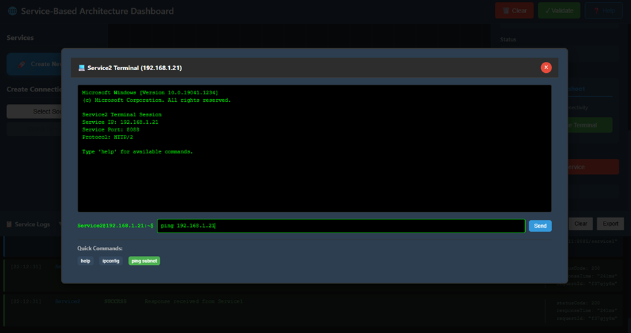
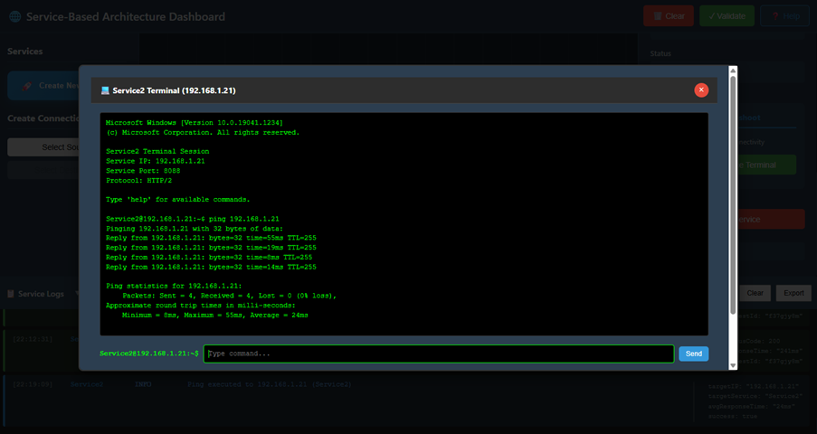

# Procedure

## Step 1: Create and Start Service 1

### 1. Start Service Creation
Click the Create New Service button located in the Services Panel on the dashboard. This opens the configuration panel for a new service.



**Fig: Service-Based Architecture Dashboard**

### 2. Configure Service 1
In the Service Configuration Panel, enter the following details:

- **Service Name:** Enter Service1.
- **IP Address:** Provide a valid IPv4 address. Example: 192.168.1.11
- **Port:** Specify a valid port number, such as 8081 or according to your setup.
- **Protocol:** Select the required protocol from the dropdown: HTTP/1 or HTTP/2
- **Description (Optional):** Add a short description of the service if needed.



**Fig: Configure the Service**

### 3. Start Service 1
Click the Start Service button to initialize and deploy Service1.



**Fig: Service1 is now Stable**

### 4. Verify Service 1 Logs
After starting the service:

- Wait about 5 seconds for initialization.
- Scroll to the Service Logs Panel at the bottom.
- Look for log messages such as:
  - "Service1 initialized successfully"
  - "Service1 is now active"

This confirms Service1 is running and ready.

---

## Step 2: Create Service 2 and Establish Connection

### 1. Create Service 2
Click the Create New Service button again to start creating your second service.

### 2. Configure Service 2
In the configuration panel, fill in:

- **Service Name:** Enter Service2.
- **IP Address:** Provide a different valid IPv4 address. Example: 192.168.1.21
- **Port:** Enter a port number such as 8088.
- **Protocol:** It may auto-select based on Service1's protocol. Otherwise, select HTTP/2 manually.



**Fig: Configure the Service**

### 3. Start Service 2
Click Start Service to deploy and activate Service2.



**Fig: Service2 is now Stable**

### 4. Verify Inter-Service Connection Logs
Once Service2 starts:

- Open the Service Logs Panel again.
- Look for logs showing communication between Service1 and Service2:
  - "Service1 → Response sent to Service2"
  - "Service2 → Response received from Service1"

These logs confirm that the connection between the two services is successfully established.



**Fig: Verify the Request/Response Logs**

---

## Step 3: Troubleshoot and Validate Connectivity

### 1. Open Terminal for Service2

1. Click on the Service2 icon on the dashboard.
2. In the right-hand configuration panel, scroll down.
3. Click the Open Service Terminal button.

This opens a dedicated terminal window showing:

- Service Name
- Service IP (e.g., 192.168.1.16)
- Port
- Status



**Fig: NF Terminal**

### 2. Execute a Ping Command
In the terminal command input box, type the ping command with Service1's IP address:

```
ping <Service1_IP>
```

Example:
```
ping 192.168.1.21
```

### 3. Send Command
Click the Send button to execute the ping command.



**Fig: Ping Test**

### 4. Analyze Connectivity Results
Check the terminal output:

- You should see multiple lines like: "Reply from 192.168.1.18: bytes=32 time<1ms"
- After completion, a summary appears showing:
  - Packets Sent: 4
  - Packets Received: 4
  - Packet Loss: 0%
