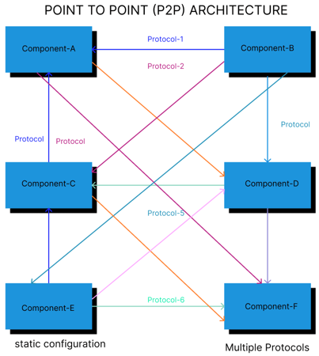
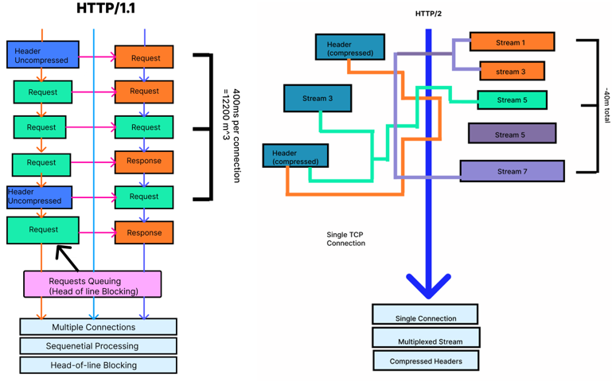

## 1. What is a Service?
A service is a specific capability or function that one Network Function (NF) exposes to other authorized NFs through standardized Service-Based Interfaces (SBI). Services represent discrete operations that can be discovered, accessed, and consumed by other network components without requiring dedicated point-to-point connections.

### Service Producer and Consumer Model
As shown in the diagram, each Network Function can act as both:
* Service Producer: Exposing services that other NFs can consume
* Service Consumer: Consuming services offered by other NFs

### Service Operations
Network Functions communicate through four primary service operations over SBI:
1. Request: A consumer NF sends a service request to a producer NF
2. Reply: The producer NF responds with the requested information or action result
3. Subscribe: A consumer NF subscribes to notifications from a producer NF for specific events
4. Notify: The producer NF sends event notifications to subscribed consumer NFs

### Example Scenario

<svg width="900" height="400" viewBox="0 0 3337 1487" fill="none" xmlns="http://www.w3.org/2000/svg">
<rect x="1" y="58" width="968" height="1327" fill="#DAF1FF"/>
<g filter="url(#filter0_d_1022_4)">
<rect x="1" y="58" width="968" height="1327" fill="#0C8FDF"/>
<rect x="0.5" y="57.5" width="969" height="1328" stroke="black"/>
<rect x="0.5" y="57.5" width="969" height="1328" stroke="black" stroke-opacity="0.2"/>
</g>
<g filter="url(#filter1_d_1022_4)">
<rect x="2319" y="58" width="968" height="1327" fill="#1E94DC"/>
<rect x="2319.5" y="58.5" width="967" height="1326" stroke="black"/>
<rect x="2319.5" y="58.5" width="967" height="1326" stroke="black" stroke-opacity="0.2"/>
<rect x="2319.5" y="58.5" width="967" height="1326" stroke="black" stroke-opacity="0.2"/>
<rect x="2319.5" y="58.5" width="967" height="1326" stroke="black" stroke-opacity="0.2"/>
</g>
<ellipse cx="478" cy="482" rx="307" ry="159" fill="#D9D9D9"/>
<path d="M363.909 459.091V494H359.818L340.795 466.591H340.455V494H336.227V459.091H340.318L359.409 486.568H359.75V459.091H363.909ZM372.368 494V459.091H393.3V462.841H376.595V474.636H391.732V478.386H376.595V494H372.368ZM433.131 467.818C432.926 466.091 432.097 464.75 430.642 463.795C429.188 462.841 427.403 462.364 425.29 462.364C423.744 462.364 422.392 462.614 421.233 463.114C420.085 463.614 419.188 464.301 418.54 465.176C417.903 466.051 417.585 467.045 417.585 468.159C417.585 469.091 417.807 469.892 418.25 470.562C418.705 471.222 419.284 471.773 419.989 472.216C420.693 472.648 421.432 473.006 422.205 473.29C422.977 473.562 423.688 473.784 424.335 473.955L427.881 474.909C428.79 475.148 429.801 475.477 430.915 475.898C432.04 476.318 433.114 476.892 434.136 477.619C435.17 478.335 436.023 479.256 436.693 480.381C437.364 481.506 437.699 482.886 437.699 484.523C437.699 486.409 437.205 488.114 436.216 489.636C435.239 491.159 433.807 492.369 431.92 493.267C430.045 494.165 427.767 494.614 425.085 494.614C422.585 494.614 420.42 494.21 418.591 493.403C416.773 492.597 415.341 491.472 414.295 490.028C413.261 488.585 412.676 486.909 412.54 485H416.903C417.017 486.318 417.46 487.409 418.233 488.273C419.017 489.125 420.006 489.761 421.199 490.182C422.403 490.591 423.699 490.795 425.085 490.795C426.699 490.795 428.148 490.534 429.432 490.011C430.716 489.477 431.733 488.739 432.483 487.795C433.233 486.841 433.608 485.727 433.608 484.455C433.608 483.295 433.284 482.352 432.636 481.625C431.989 480.898 431.136 480.307 430.08 479.852C429.023 479.398 427.881 479 426.653 478.659L422.358 477.432C419.631 476.648 417.472 475.528 415.881 474.074C414.29 472.619 413.494 470.716 413.494 468.364C413.494 466.409 414.023 464.705 415.08 463.25C416.148 461.784 417.58 460.648 419.375 459.841C421.182 459.023 423.199 458.614 425.426 458.614C427.676 458.614 429.676 459.017 431.426 459.824C433.176 460.619 434.563 461.71 435.585 463.097C436.619 464.483 437.165 466.057 437.222 467.818H433.131ZM455.081 494.545C452.558 494.545 450.382 493.989 448.553 492.875C446.734 491.75 445.331 490.182 444.342 488.17C443.365 486.148 442.876 483.795 442.876 481.114C442.876 478.432 443.365 476.068 444.342 474.023C445.331 471.966 446.706 470.364 448.467 469.216C450.24 468.057 452.308 467.477 454.672 467.477C456.036 467.477 457.382 467.705 458.712 468.159C460.041 468.614 461.251 469.352 462.342 470.375C463.433 471.386 464.303 472.727 464.95 474.398C465.598 476.068 465.922 478.125 465.922 480.568V482.273H445.74V478.795H461.831C461.831 477.318 461.536 476 460.945 474.841C460.365 473.682 459.536 472.767 458.456 472.097C457.388 471.426 456.126 471.091 454.672 471.091C453.07 471.091 451.683 471.489 450.513 472.284C449.354 473.068 448.462 474.091 447.837 475.352C447.212 476.614 446.899 477.966 446.899 479.409V481.727C446.899 483.705 447.24 485.381 447.922 486.756C448.615 488.119 449.575 489.159 450.803 489.875C452.03 490.58 453.456 490.932 455.081 490.932C456.138 490.932 457.092 490.784 457.945 490.489C458.808 490.182 459.553 489.727 460.178 489.125C460.803 488.511 461.286 487.75 461.626 486.841L465.513 487.932C465.104 489.25 464.416 490.409 463.45 491.409C462.484 492.398 461.291 493.17 459.871 493.727C458.45 494.273 456.854 494.545 455.081 494.545ZM472.041 494V467.818H475.928V471.773H476.2C476.678 470.477 477.541 469.426 478.791 468.619C480.041 467.812 481.45 467.409 483.018 467.409C483.314 467.409 483.683 467.415 484.126 467.426C484.57 467.437 484.905 467.455 485.132 467.477V471.568C484.996 471.534 484.683 471.483 484.195 471.415C483.717 471.335 483.212 471.295 482.678 471.295C481.405 471.295 480.268 471.562 479.268 472.097C478.28 472.619 477.496 473.347 476.916 474.278C476.348 475.199 476.064 476.25 476.064 477.432V494H472.041ZM512.107 467.818L502.425 494H498.334L488.652 467.818H493.016L500.243 488.682H500.516L507.743 467.818H512.107ZM517.416 494V467.818H521.439V494H517.416ZM519.462 463.455C518.678 463.455 518.001 463.188 517.433 462.653C516.876 462.119 516.598 461.477 516.598 460.727C516.598 459.977 516.876 459.335 517.433 458.801C518.001 458.267 518.678 458 519.462 458C520.246 458 520.916 458.267 521.473 458.801C522.041 459.335 522.325 459.977 522.325 460.727C522.325 461.477 522.041 462.119 521.473 462.653C520.916 463.188 520.246 463.455 519.462 463.455ZM539.443 494.545C536.989 494.545 534.875 493.966 533.102 492.807C531.33 491.648 529.966 490.051 529.011 488.017C528.057 485.983 527.58 483.659 527.58 481.045C527.58 478.386 528.068 476.04 529.045 474.006C530.034 471.96 531.409 470.364 533.17 469.216C534.943 468.057 537.011 467.477 539.375 467.477C541.216 467.477 542.875 467.818 544.352 468.5C545.83 469.182 547.04 470.136 547.983 471.364C548.926 472.591 549.511 474.023 549.739 475.659H545.716C545.409 474.466 544.727 473.409 543.67 472.489C542.625 471.557 541.216 471.091 539.443 471.091C537.875 471.091 536.5 471.5 535.318 472.318C534.148 473.125 533.233 474.267 532.574 475.744C531.926 477.21 531.602 478.932 531.602 480.909C531.602 482.932 531.92 484.693 532.557 486.193C533.205 487.693 534.114 488.858 535.284 489.688C536.466 490.517 537.852 490.932 539.443 490.932C540.489 490.932 541.438 490.75 542.29 490.386C543.142 490.023 543.864 489.5 544.455 488.818C545.045 488.136 545.466 487.318 545.716 486.364H549.739C549.511 487.909 548.949 489.301 548.051 490.54C547.165 491.767 545.989 492.744 544.523 493.472C543.068 494.188 541.375 494.545 539.443 494.545ZM566.597 494.545C564.074 494.545 561.898 493.989 560.068 492.875C558.25 491.75 556.847 490.182 555.858 488.17C554.881 486.148 554.392 483.795 554.392 481.114C554.392 478.432 554.881 476.068 555.858 474.023C556.847 471.966 558.222 470.364 559.983 469.216C561.756 468.057 563.824 467.477 566.188 467.477C567.551 467.477 568.898 467.705 570.227 468.159C571.557 468.614 572.767 469.352 573.858 470.375C574.949 471.386 575.818 472.727 576.466 474.398C577.114 476.068 577.438 478.125 577.438 480.568V482.273H557.256V478.795H573.347C573.347 477.318 573.051 476 572.46 474.841C571.881 473.682 571.051 472.767 569.972 472.097C568.903 471.426 567.642 471.091 566.188 471.091C564.585 471.091 563.199 471.489 562.028 472.284C560.869 473.068 559.977 474.091 559.352 475.352C558.727 476.614 558.415 477.966 558.415 479.409V481.727C558.415 483.705 558.756 485.381 559.438 486.756C560.131 488.119 561.091 489.159 562.318 489.875C563.545 490.58 564.972 490.932 566.597 490.932C567.653 490.932 568.608 490.784 569.46 490.489C570.324 490.182 571.068 489.727 571.693 489.125C572.318 488.511 572.801 487.75 573.142 486.841L577.028 487.932C576.619 489.25 575.932 490.409 574.966 491.409C574 492.398 572.807 493.17 571.386 493.727C569.966 494.273 568.369 494.545 566.597 494.545ZM599.034 494H594.602L607.42 459.091H611.784L624.602 494H620.17L609.739 464.614H609.466L599.034 494ZM600.67 480.364H618.534V484.114H600.67V480.364ZM640.058 459.091V494H635.831V463.523H635.626L627.104 469.182V464.886L635.831 459.091H640.058ZM336.227 552V517.091H348.023C350.761 517.091 353 517.585 354.739 518.574C356.489 519.551 357.784 520.875 358.625 522.545C359.466 524.216 359.886 526.08 359.886 528.136C359.886 530.193 359.466 532.062 358.625 533.744C357.795 535.426 356.511 536.767 354.773 537.767C353.034 538.756 350.807 539.25 348.091 539.25H339.636V535.5H347.955C349.83 535.5 351.335 535.176 352.472 534.528C353.608 533.881 354.432 533.006 354.943 531.903C355.466 530.79 355.727 529.534 355.727 528.136C355.727 526.739 355.466 525.489 354.943 524.386C354.432 523.284 353.602 522.42 352.455 521.795C351.307 521.159 349.784 520.841 347.886 520.841H340.455V552H336.227ZM366.151 552V525.818H370.037V529.773H370.31C370.787 528.477 371.651 527.426 372.901 526.619C374.151 525.812 375.56 525.409 377.128 525.409C377.423 525.409 377.793 525.415 378.236 525.426C378.679 525.437 379.014 525.455 379.241 525.477V529.568C379.105 529.534 378.793 529.483 378.304 529.415C377.827 529.335 377.321 529.295 376.787 529.295C375.514 529.295 374.378 529.562 373.378 530.097C372.389 530.619 371.605 531.347 371.026 532.278C370.457 533.199 370.173 534.25 370.173 535.432V552H366.151ZM393.849 552.545C391.486 552.545 389.412 551.983 387.628 550.858C385.855 549.733 384.469 548.159 383.469 546.136C382.48 544.114 381.986 541.75 381.986 539.045C381.986 536.318 382.48 533.937 383.469 531.903C384.469 529.869 385.855 528.29 387.628 527.165C389.412 526.04 391.486 525.477 393.849 525.477C396.213 525.477 398.281 526.04 400.054 527.165C401.838 528.29 403.224 529.869 404.213 531.903C405.213 533.937 405.713 536.318 405.713 539.045C405.713 541.75 405.213 544.114 404.213 546.136C403.224 548.159 401.838 549.733 400.054 550.858C398.281 551.983 396.213 552.545 393.849 552.545ZM393.849 548.932C395.645 548.932 397.122 548.472 398.281 547.551C399.44 546.631 400.298 545.42 400.855 543.92C401.412 542.42 401.69 540.795 401.69 539.045C401.69 537.295 401.412 535.665 400.855 534.153C400.298 532.642 399.44 531.42 398.281 530.489C397.122 529.557 395.645 529.091 393.849 529.091C392.054 529.091 390.577 529.557 389.418 530.489C388.259 531.42 387.401 532.642 386.844 534.153C386.287 535.665 386.009 537.295 386.009 539.045C386.009 540.795 386.287 542.42 386.844 543.92C387.401 545.42 388.259 546.631 389.418 547.551C390.577 548.472 392.054 548.932 393.849 548.932ZM421.74 552.545C419.558 552.545 417.632 551.994 415.962 550.892C414.291 549.778 412.984 548.21 412.041 546.188C411.098 544.153 410.626 541.75 410.626 538.977C410.626 536.227 411.098 533.841 412.041 531.818C412.984 529.795 414.297 528.233 415.979 527.131C417.661 526.028 419.604 525.477 421.808 525.477C423.513 525.477 424.859 525.761 425.848 526.33C426.848 526.886 427.609 527.523 428.132 528.239C428.666 528.943 429.081 529.523 429.376 529.977H429.717V517.091H433.74V552H429.854V547.977H429.376C429.081 548.455 428.661 549.057 428.115 549.784C427.57 550.5 426.791 551.142 425.78 551.71C424.768 552.267 423.422 552.545 421.74 552.545ZM422.286 548.932C423.899 548.932 425.263 548.511 426.376 547.67C427.49 546.818 428.337 545.642 428.916 544.142C429.496 542.631 429.786 540.886 429.786 538.909C429.786 536.955 429.501 535.244 428.933 533.778C428.365 532.301 427.524 531.153 426.411 530.335C425.297 529.506 423.922 529.091 422.286 529.091C420.581 529.091 419.161 529.528 418.024 530.403C416.899 531.267 416.053 532.443 415.484 533.932C414.928 535.409 414.649 537.068 414.649 538.909C414.649 540.773 414.933 542.466 415.501 543.989C416.081 545.5 416.933 546.705 418.058 547.602C419.195 548.489 420.604 548.932 422.286 548.932ZM458.166 541.295V525.818H462.189V552H458.166V547.568H457.893C457.28 548.898 456.325 550.028 455.03 550.96C453.734 551.881 452.098 552.341 450.121 552.341C448.484 552.341 447.03 551.983 445.757 551.267C444.484 550.54 443.484 549.449 442.757 547.994C442.03 546.528 441.666 544.682 441.666 542.455V525.818H445.689V542.182C445.689 544.091 446.223 545.614 447.291 546.75C448.371 547.886 449.746 548.455 451.416 548.455C452.416 548.455 453.433 548.199 454.467 547.688C455.513 547.176 456.388 546.392 457.092 545.335C457.808 544.278 458.166 542.932 458.166 541.295ZM480.193 552.545C477.739 552.545 475.625 551.966 473.852 550.807C472.08 549.648 470.716 548.051 469.761 546.017C468.807 543.983 468.33 541.659 468.33 539.045C468.33 536.386 468.818 534.04 469.795 532.006C470.784 529.96 472.159 528.364 473.92 527.216C475.693 526.057 477.761 525.477 480.125 525.477C481.966 525.477 483.625 525.818 485.102 526.5C486.58 527.182 487.79 528.136 488.733 529.364C489.676 530.591 490.261 532.023 490.489 533.659H486.466C486.159 532.466 485.477 531.409 484.42 530.489C483.375 529.557 481.966 529.091 480.193 529.091C478.625 529.091 477.25 529.5 476.068 530.318C474.898 531.125 473.983 532.267 473.324 533.744C472.676 535.21 472.352 536.932 472.352 538.909C472.352 540.932 472.67 542.693 473.307 544.193C473.955 545.693 474.864 546.858 476.034 547.688C477.216 548.517 478.602 548.932 480.193 548.932C481.239 548.932 482.188 548.75 483.04 548.386C483.892 548.023 484.614 547.5 485.205 546.818C485.795 546.136 486.216 545.318 486.466 544.364H490.489C490.261 545.909 489.699 547.301 488.801 548.54C487.915 549.767 486.739 550.744 485.273 551.472C483.818 552.188 482.125 552.545 480.193 552.545ZM507.347 552.545C504.824 552.545 502.648 551.989 500.818 550.875C499 549.75 497.597 548.182 496.608 546.17C495.631 544.148 495.142 541.795 495.142 539.114C495.142 536.432 495.631 534.068 496.608 532.023C497.597 529.966 498.972 528.364 500.733 527.216C502.506 526.057 504.574 525.477 506.938 525.477C508.301 525.477 509.648 525.705 510.977 526.159C512.307 526.614 513.517 527.352 514.608 528.375C515.699 529.386 516.568 530.727 517.216 532.398C517.864 534.068 518.188 536.125 518.188 538.568V540.273H498.006V536.795H514.097C514.097 535.318 513.801 534 513.21 532.841C512.631 531.682 511.801 530.767 510.722 530.097C509.653 529.426 508.392 529.091 506.938 529.091C505.335 529.091 503.949 529.489 502.778 530.284C501.619 531.068 500.727 532.091 500.102 533.352C499.477 534.614 499.165 535.966 499.165 537.409V539.727C499.165 541.705 499.506 543.381 500.188 544.756C500.881 546.119 501.841 547.159 503.068 547.875C504.295 548.58 505.722 548.932 507.347 548.932C508.403 548.932 509.358 548.784 510.21 548.489C511.074 548.182 511.818 547.727 512.443 547.125C513.068 546.511 513.551 545.75 513.892 544.841L517.778 545.932C517.369 547.25 516.682 548.409 515.716 549.409C514.75 550.398 513.557 551.17 512.136 551.727C510.716 552.273 509.119 552.545 507.347 552.545ZM524.307 552V525.818H528.193V529.773H528.466C528.943 528.477 529.807 527.426 531.057 526.619C532.307 525.812 533.716 525.409 535.284 525.409C535.58 525.409 535.949 525.415 536.392 525.426C536.835 525.437 537.17 525.455 537.398 525.477V529.568C537.261 529.534 536.949 529.483 536.46 529.415C535.983 529.335 535.477 529.295 534.943 529.295C533.67 529.295 532.534 529.562 531.534 530.097C530.545 530.619 529.761 531.347 529.182 532.278C528.614 533.199 528.33 534.25 528.33 535.432V552H524.307Z" fill="black"/>
<ellipse cx="2803" cy="944" rx="307" ry="159" fill="#D9D9D9"/>
<ellipse cx="2803" cy="482" rx="307" ry="159" fill="#D9D9D9"/>
<ellipse cx="478" cy="944" rx="307" ry="159" fill="#D9D9D9"/>
<g filter="url(#filter2_d_1022_4)">
<path d="M2337.67 389.945C2337.64 379.635 2329.25 371.303 2318.94 371.333C2308.64 371.364 2300.3 379.746 2300.33 390.055C2300.36 400.365 2308.75 408.697 2319.06 408.667C2329.36 408.636 2337.7 400.254 2337.67 389.945ZM966.518 391.532C965.155 392.903 965.162 395.119 966.532 396.482L988.872 418.69C990.243 420.053 992.459 420.046 993.822 418.675C995.185 417.304 995.178 415.088 993.807 413.726L973.95 393.985L993.69 374.128C995.053 372.757 995.046 370.541 993.675 369.178C992.304 367.815 990.088 367.822 988.726 369.193L966.518 391.532ZM2319 390L2318.99 386.5L968.99 390.5L969 394L969.01 397.5L2319.01 393.5L2319 390Z" fill="black"/>
</g>
<g filter="url(#filter3_d_1022_4)">
<path d="M950.333 533C950.333 543.309 958.691 551.667 969 551.667C979.309 551.667 987.667 543.309 987.667 533C987.667 522.691 979.309 514.333 969 514.333C958.691 514.333 950.333 522.691 950.333 533ZM2321.47 535.475C2322.84 534.108 2322.84 531.892 2321.47 530.525L2299.2 508.251C2297.83 506.884 2295.62 506.884 2294.25 508.251C2292.88 509.618 2292.88 511.834 2294.25 513.201L2314.05 533L2294.25 552.799C2292.88 554.166 2292.88 556.382 2294.25 557.749C2295.62 559.116 2297.83 559.116 2299.2 557.749L2321.47 535.475ZM969 533V536.5H2319V533V529.5H969V533Z" fill="black"/>
</g>
<g filter="url(#filter4_ddd_1022_4)">
<path d="M950.333 896C950.333 906.309 958.691 914.667 969 914.667C979.309 914.667 987.667 906.309 987.667 896C987.667 885.691 979.309 877.333 969 877.333C958.691 877.333 950.333 885.691 950.333 896ZM2321.47 898.475C2322.84 897.108 2322.84 894.892 2321.47 893.525L2299.2 871.251C2297.83 869.884 2295.62 869.884 2294.25 871.251C2292.88 872.618 2292.88 874.834 2294.25 876.201L2314.05 896L2294.25 915.799C2292.88 917.166 2292.88 919.382 2294.25 920.749C2295.62 922.116 2297.83 922.116 2299.2 920.749L2321.47 898.475ZM969 896V899.5H2319V896V892.5H969V896Z" fill="#FF7C2B"/>
</g>
<g filter="url(#filter5_d_1022_4)">
<path d="M2337.67 1035C2337.67 1024.69 2329.31 1016.33 2319 1016.33C2308.69 1016.33 2300.33 1024.69 2300.33 1035C2300.33 1045.31 2308.69 1053.67 2319 1053.67C2329.31 1053.67 2337.67 1045.31 2337.67 1035ZM966.525 1032.53C965.158 1033.89 965.158 1036.11 966.525 1037.47L988.799 1059.75C990.166 1061.12 992.382 1061.12 993.749 1059.75C995.116 1058.38 995.116 1056.17 993.749 1054.8L973.95 1035L993.749 1015.2C995.116 1013.83 995.116 1011.62 993.749 1010.25C992.382 1008.88 990.166 1008.88 988.799 1010.25L966.525 1032.53ZM2319 1035V1031.5L969 1031.5V1035V1038.5L2319 1038.5V1035Z" fill="#FF7C2B"/>
</g>
<ellipse cx="1224" cy="763" rx="19" ry="440" fill="#88D4BE"/>
<ellipse cx="1842.5" cy="482" rx="16.5" ry="159" fill="#88D4BE"/>
<ellipse cx="2050" cy="978.5" rx="14" ry="124.5" fill="#88D4BE"/>
<path d="M148.534 169.091V220H142.568L114.827 180.028H114.33V220H108.165V169.091H114.131L141.972 209.162H142.469V169.091H148.534ZM160.87 220V169.091H191.395V174.56H167.035V191.761H189.108V197.23H167.035V220H160.87ZM223.729 220H217.266L235.96 169.091H242.323L261.016 220H254.553L239.34 177.145H238.942L223.729 220ZM226.116 200.114H252.167V205.582H226.116V200.114Z" fill="black"/>
<path d="M2492.53 184.091V235H2486.57L2458.83 195.028H2458.33V235H2452.16V184.091H2458.13L2485.97 224.162H2486.47V184.091H2492.53ZM2504.87 235V184.091H2535.4V189.56H2511.03V206.761H2533.11V212.23H2511.03V235H2504.87ZM2565.64 235V184.091H2583.44C2586.99 184.091 2589.91 184.704 2592.21 185.93C2594.52 187.14 2596.23 188.772 2597.36 190.827C2598.49 192.866 2599.05 195.128 2599.05 197.614C2599.05 199.801 2598.66 201.607 2597.88 203.033C2597.12 204.458 2596.11 205.585 2594.85 206.413C2593.61 207.242 2592.26 207.855 2590.8 208.253V208.75C2592.36 208.849 2593.92 209.396 2595.5 210.391C2597.07 211.385 2598.39 212.81 2599.45 214.666C2600.51 216.522 2601.04 218.793 2601.04 221.477C2601.04 224.029 2600.46 226.325 2599.3 228.363C2598.14 230.401 2596.31 232.017 2593.81 233.21C2591.3 234.403 2588.05 235 2584.04 235H2565.64ZM2571.81 229.531H2584.04C2588.06 229.531 2590.92 228.752 2592.61 227.195C2594.32 225.62 2595.17 223.714 2595.17 221.477C2595.17 219.754 2594.73 218.163 2593.86 216.705C2592.98 215.23 2591.73 214.053 2590.1 213.175C2588.48 212.28 2586.56 211.832 2584.33 211.832H2571.81V229.531ZM2571.81 206.463H2583.24C2585.1 206.463 2586.77 206.098 2588.26 205.369C2589.77 204.64 2590.96 203.613 2591.84 202.287C2592.74 200.961 2593.18 199.403 2593.18 197.614C2593.18 195.376 2592.41 193.479 2590.85 191.921C2589.29 190.347 2586.82 189.56 2583.44 189.56H2571.81V206.463Z" fill="black"/>
<path d="M363.909 907.091V942H359.818L340.795 914.591H340.455V942H336.227V907.091H340.318L359.409 934.568H359.75V907.091H363.909ZM372.368 942V907.091H393.3V910.841H376.595V922.636H391.732V926.386H376.595V942H372.368ZM433.131 915.818C432.926 914.091 432.097 912.75 430.642 911.795C429.188 910.841 427.403 910.364 425.29 910.364C423.744 910.364 422.392 910.614 421.233 911.114C420.085 911.614 419.188 912.301 418.54 913.176C417.903 914.051 417.585 915.045 417.585 916.159C417.585 917.091 417.807 917.892 418.25 918.562C418.705 919.222 419.284 919.773 419.989 920.216C420.693 920.648 421.432 921.006 422.205 921.29C422.977 921.562 423.688 921.784 424.335 921.955L427.881 922.909C428.79 923.148 429.801 923.477 430.915 923.898C432.04 924.318 433.114 924.892 434.136 925.619C435.17 926.335 436.023 927.256 436.693 928.381C437.364 929.506 437.699 930.886 437.699 932.523C437.699 934.409 437.205 936.114 436.216 937.636C435.239 939.159 433.807 940.369 431.92 941.267C430.045 942.165 427.767 942.614 425.085 942.614C422.585 942.614 420.42 942.21 418.591 941.403C416.773 940.597 415.341 939.472 414.295 938.028C413.261 936.585 412.676 934.909 412.54 933H416.903C417.017 934.318 417.46 935.409 418.233 936.273C419.017 937.125 420.006 937.761 421.199 938.182C422.403 938.591 423.699 938.795 425.085 938.795C426.699 938.795 428.148 938.534 429.432 938.011C430.716 937.477 431.733 936.739 432.483 935.795C433.233 934.841 433.608 933.727 433.608 932.455C433.608 931.295 433.284 930.352 432.636 929.625C431.989 928.898 431.136 928.307 430.08 927.852C429.023 927.398 427.881 927 426.653 926.659L422.358 925.432C419.631 924.648 417.472 923.528 415.881 922.074C414.29 920.619 413.494 918.716 413.494 916.364C413.494 914.409 414.023 912.705 415.08 911.25C416.148 909.784 417.58 908.648 419.375 907.841C421.182 907.023 423.199 906.614 425.426 906.614C427.676 906.614 429.676 907.017 431.426 907.824C433.176 908.619 434.563 909.71 435.585 911.097C436.619 912.483 437.165 914.057 437.222 915.818H433.131ZM455.081 942.545C452.558 942.545 450.382 941.989 448.553 940.875C446.734 939.75 445.331 938.182 444.342 936.17C443.365 934.148 442.876 931.795 442.876 929.114C442.876 926.432 443.365 924.068 444.342 922.023C445.331 919.966 446.706 918.364 448.467 917.216C450.24 916.057 452.308 915.477 454.672 915.477C456.036 915.477 457.382 915.705 458.712 916.159C460.041 916.614 461.251 917.352 462.342 918.375C463.433 919.386 464.303 920.727 464.95 922.398C465.598 924.068 465.922 926.125 465.922 928.568V930.273H445.74V926.795H461.831C461.831 925.318 461.536 924 460.945 922.841C460.365 921.682 459.536 920.767 458.456 920.097C457.388 919.426 456.126 919.091 454.672 919.091C453.07 919.091 451.683 919.489 450.513 920.284C449.354 921.068 448.462 922.091 447.837 923.352C447.212 924.614 446.899 925.966 446.899 927.409V929.727C446.899 931.705 447.24 933.381 447.922 934.756C448.615 936.119 449.575 937.159 450.803 937.875C452.03 938.58 453.456 938.932 455.081 938.932C456.138 938.932 457.092 938.784 457.945 938.489C458.808 938.182 459.553 937.727 460.178 937.125C460.803 936.511 461.286 935.75 461.626 934.841L465.513 935.932C465.104 937.25 464.416 938.409 463.45 939.409C462.484 940.398 461.291 941.17 459.871 941.727C458.45 942.273 456.854 942.545 455.081 942.545ZM472.041 942V915.818H475.928V919.773H476.2C476.678 918.477 477.541 917.426 478.791 916.619C480.041 915.812 481.45 915.409 483.018 915.409C483.314 915.409 483.683 915.415 484.126 915.426C484.57 915.437 484.905 915.455 485.132 915.477V919.568C484.996 919.534 484.683 919.483 484.195 919.415C483.717 919.335 483.212 919.295 482.678 919.295C481.405 919.295 480.268 919.562 479.268 920.097C478.28 920.619 477.496 921.347 476.916 922.278C476.348 923.199 476.064 924.25 476.064 925.432V942H472.041ZM512.107 915.818L502.425 942H498.334L488.652 915.818H493.016L500.243 936.682H500.516L507.743 915.818H512.107ZM517.416 942V915.818H521.439V942H517.416ZM519.462 911.455C518.678 911.455 518.001 911.188 517.433 910.653C516.876 910.119 516.598 909.477 516.598 908.727C516.598 907.977 516.876 907.335 517.433 906.801C518.001 906.267 518.678 906 519.462 906C520.246 906 520.916 906.267 521.473 906.801C522.041 907.335 522.325 907.977 522.325 908.727C522.325 909.477 522.041 910.119 521.473 910.653C520.916 911.188 520.246 911.455 519.462 911.455ZM539.443 942.545C536.989 942.545 534.875 941.966 533.102 940.807C531.33 939.648 529.966 938.051 529.011 936.017C528.057 933.983 527.58 931.659 527.58 929.045C527.58 926.386 528.068 924.04 529.045 922.006C530.034 919.96 531.409 918.364 533.17 917.216C534.943 916.057 537.011 915.477 539.375 915.477C541.216 915.477 542.875 915.818 544.352 916.5C545.83 917.182 547.04 918.136 547.983 919.364C548.926 920.591 549.511 922.023 549.739 923.659H545.716C545.409 922.466 544.727 921.409 543.67 920.489C542.625 919.557 541.216 919.091 539.443 919.091C537.875 919.091 536.5 919.5 535.318 920.318C534.148 921.125 533.233 922.267 532.574 923.744C531.926 925.21 531.602 926.932 531.602 928.909C531.602 930.932 531.92 932.693 532.557 934.193C533.205 935.693 534.114 936.858 535.284 937.688C536.466 938.517 537.852 938.932 539.443 938.932C540.489 938.932 541.438 938.75 542.29 938.386C543.142 938.023 543.864 937.5 544.455 936.818C545.045 936.136 545.466 935.318 545.716 934.364H549.739C549.511 935.909 548.949 937.301 548.051 938.54C547.165 939.767 545.989 940.744 544.523 941.472C543.068 942.188 541.375 942.545 539.443 942.545ZM566.597 942.545C564.074 942.545 561.898 941.989 560.068 940.875C558.25 939.75 556.847 938.182 555.858 936.17C554.881 934.148 554.392 931.795 554.392 929.114C554.392 926.432 554.881 924.068 555.858 922.023C556.847 919.966 558.222 918.364 559.983 917.216C561.756 916.057 563.824 915.477 566.188 915.477C567.551 915.477 568.898 915.705 570.227 916.159C571.557 916.614 572.767 917.352 573.858 918.375C574.949 919.386 575.818 920.727 576.466 922.398C577.114 924.068 577.438 926.125 577.438 928.568V930.273H557.256V926.795H573.347C573.347 925.318 573.051 924 572.46 922.841C571.881 921.682 571.051 920.767 569.972 920.097C568.903 919.426 567.642 919.091 566.188 919.091C564.585 919.091 563.199 919.489 562.028 920.284C560.869 921.068 559.977 922.091 559.352 923.352C558.727 924.614 558.415 925.966 558.415 927.409V929.727C558.415 931.705 558.756 933.381 559.438 934.756C560.131 936.119 561.091 937.159 562.318 937.875C563.545 938.58 564.972 938.932 566.597 938.932C567.653 938.932 568.608 938.784 569.46 938.489C570.324 938.182 571.068 937.727 571.693 937.125C572.318 936.511 572.801 935.75 573.142 934.841L577.028 935.932C576.619 937.25 575.932 938.409 574.966 939.409C574 940.398 572.807 941.17 571.386 941.727C569.966 942.273 568.369 942.545 566.597 942.545ZM597.602 942V907.091H609.807C612.239 907.091 614.244 907.511 615.824 908.352C617.403 909.182 618.58 910.301 619.352 911.71C620.125 913.108 620.511 914.659 620.511 916.364C620.511 917.864 620.244 919.102 619.71 920.08C619.188 921.057 618.494 921.83 617.631 922.398C616.778 922.966 615.852 923.386 614.852 923.659V924C615.92 924.068 616.994 924.443 618.074 925.125C619.153 925.807 620.057 926.784 620.784 928.057C621.511 929.33 621.875 930.886 621.875 932.727C621.875 934.477 621.477 936.051 620.682 937.449C619.886 938.847 618.631 939.955 616.915 940.773C615.199 941.591 612.966 942 610.216 942H597.602ZM601.83 938.25H610.216C612.977 938.25 614.938 937.716 616.097 936.648C617.267 935.568 617.852 934.261 617.852 932.727C617.852 931.545 617.551 930.455 616.949 929.455C616.347 928.443 615.489 927.636 614.375 927.034C613.261 926.42 611.943 926.114 610.42 926.114H601.83V938.25ZM601.83 922.432H609.67C610.943 922.432 612.091 922.182 613.114 921.682C614.148 921.182 614.966 920.477 615.568 919.568C616.182 918.659 616.489 917.591 616.489 916.364C616.489 914.83 615.955 913.528 614.886 912.46C613.818 911.381 612.125 910.841 609.807 910.841H601.83V922.432ZM640.48 907.091V942H636.253V911.523H636.048L627.526 917.182V912.886L636.253 907.091H640.48ZM364.318 976H360.091C359.841 974.784 359.403 973.716 358.778 972.795C358.165 971.875 357.415 971.102 356.528 970.477C355.653 969.841 354.682 969.364 353.614 969.045C352.545 968.727 351.432 968.568 350.273 968.568C348.159 968.568 346.244 969.102 344.528 970.17C342.824 971.239 341.466 972.812 340.455 974.892C339.455 976.972 338.955 979.523 338.955 982.545C338.955 985.568 339.455 988.119 340.455 990.199C341.466 992.278 342.824 993.852 344.528 994.92C346.244 995.989 348.159 996.523 350.273 996.523C351.432 996.523 352.545 996.364 353.614 996.045C354.682 995.727 355.653 995.256 356.528 994.631C357.415 993.994 358.165 993.216 358.778 992.295C359.403 991.364 359.841 990.295 360.091 989.091H364.318C364 990.875 363.42 992.472 362.58 993.881C361.739 995.29 360.693 996.489 359.443 997.477C358.193 998.455 356.79 999.199 355.233 999.71C353.688 1000.22 352.034 1000.48 350.273 1000.48C347.295 1000.48 344.648 999.75 342.33 998.295C340.011 996.841 338.188 994.773 336.858 992.091C335.528 989.409 334.864 986.227 334.864 982.545C334.864 978.864 335.528 975.682 336.858 973C338.188 970.318 340.011 968.25 342.33 966.795C344.648 965.341 347.295 964.614 350.273 964.614C352.034 964.614 353.688 964.869 355.233 965.381C356.79 965.892 358.193 966.642 359.443 967.631C360.693 968.608 361.739 969.801 362.58 971.21C363.42 972.608 364 974.205 364.318 976ZM381.24 1000.55C378.876 1000.55 376.803 999.983 375.018 998.858C373.246 997.733 371.859 996.159 370.859 994.136C369.871 992.114 369.376 989.75 369.376 987.045C369.376 984.318 369.871 981.937 370.859 979.903C371.859 977.869 373.246 976.29 375.018 975.165C376.803 974.04 378.876 973.477 381.24 973.477C383.604 973.477 385.672 974.04 387.445 975.165C389.229 976.29 390.615 977.869 391.604 979.903C392.604 981.937 393.104 984.318 393.104 987.045C393.104 989.75 392.604 992.114 391.604 994.136C390.615 996.159 389.229 997.733 387.445 998.858C385.672 999.983 383.604 1000.55 381.24 1000.55ZM381.24 996.932C383.036 996.932 384.513 996.472 385.672 995.551C386.831 994.631 387.689 993.42 388.246 991.92C388.803 990.42 389.081 988.795 389.081 987.045C389.081 985.295 388.803 983.665 388.246 982.153C387.689 980.642 386.831 979.42 385.672 978.489C384.513 977.557 383.036 977.091 381.24 977.091C379.445 977.091 377.967 977.557 376.808 978.489C375.649 979.42 374.791 980.642 374.234 982.153C373.678 983.665 373.399 985.295 373.399 987.045C373.399 988.795 373.678 990.42 374.234 991.92C374.791 993.42 375.649 994.631 376.808 995.551C377.967 996.472 379.445 996.932 381.24 996.932ZM403.267 984.25V1000H399.244V973.818H403.131V977.909H403.472C404.085 976.58 405.017 975.511 406.267 974.705C407.517 973.886 409.131 973.477 411.108 973.477C412.881 973.477 414.432 973.841 415.761 974.568C417.091 975.284 418.125 976.375 418.864 977.841C419.602 979.295 419.972 981.136 419.972 983.364V1000H415.949V983.636C415.949 981.58 415.415 979.977 414.347 978.83C413.278 977.67 411.813 977.091 409.949 977.091C408.665 977.091 407.517 977.369 406.506 977.926C405.506 978.483 404.716 979.295 404.136 980.364C403.557 981.432 403.267 982.727 403.267 984.25ZM445.868 979.682L442.254 980.705C442.027 980.102 441.692 979.517 441.249 978.949C440.817 978.369 440.226 977.892 439.476 977.517C438.726 977.142 437.766 976.955 436.595 976.955C434.993 976.955 433.658 977.324 432.589 978.062C431.533 978.79 431.004 979.716 431.004 980.841C431.004 981.841 431.368 982.631 432.095 983.21C432.822 983.79 433.959 984.273 435.504 984.659L439.391 985.614C441.732 986.182 443.476 987.051 444.624 988.222C445.771 989.381 446.345 990.875 446.345 992.705C446.345 994.205 445.913 995.545 445.05 996.727C444.197 997.909 443.004 998.841 441.47 999.523C439.936 1000.2 438.152 1000.55 436.118 1000.55C433.447 1000.55 431.237 999.966 429.487 998.807C427.737 997.648 426.629 995.955 426.163 993.727L429.982 992.773C430.345 994.182 431.033 995.239 432.044 995.943C433.067 996.648 434.402 997 436.05 997C437.925 997 439.413 996.602 440.516 995.807C441.629 995 442.186 994.034 442.186 992.909C442.186 992 441.868 991.239 441.232 990.625C440.595 990 439.618 989.534 438.3 989.227L433.936 988.205C431.538 987.636 429.777 986.756 428.652 985.562C427.538 984.358 426.982 982.852 426.982 981.045C426.982 979.568 427.396 978.261 428.226 977.125C429.067 975.989 430.209 975.097 431.652 974.449C433.107 973.801 434.754 973.477 436.595 973.477C439.186 973.477 441.22 974.045 442.697 975.182C444.186 976.318 445.243 977.818 445.868 979.682ZM468.901 989.295V973.818H472.923V1000H468.901V995.568H468.628C468.014 996.898 467.06 998.028 465.764 998.96C464.469 999.881 462.832 1000.34 460.855 1000.34C459.219 1000.34 457.764 999.983 456.491 999.267C455.219 998.54 454.219 997.449 453.491 995.994C452.764 994.528 452.401 992.682 452.401 990.455V973.818H456.423V990.182C456.423 992.091 456.957 993.614 458.026 994.75C459.105 995.886 460.48 996.455 462.151 996.455C463.151 996.455 464.168 996.199 465.202 995.688C466.247 995.176 467.122 994.392 467.827 993.335C468.543 992.278 468.901 990.932 468.901 989.295ZM480.291 1000V973.818H484.178V977.909H484.518C485.064 976.511 485.945 975.426 487.161 974.653C488.376 973.869 489.837 973.477 491.541 973.477C493.268 973.477 494.706 973.869 495.854 974.653C497.013 975.426 497.916 976.511 498.564 977.909H498.837C499.507 976.557 500.513 975.483 501.854 974.688C503.195 973.881 504.803 973.477 506.678 973.477C509.018 973.477 510.933 974.21 512.422 975.676C513.911 977.131 514.655 979.398 514.655 982.477V1000H510.632V982.477C510.632 980.545 510.104 979.165 509.047 978.335C507.99 977.506 506.746 977.091 505.314 977.091C503.473 977.091 502.047 977.648 501.036 978.761C500.024 979.864 499.518 981.261 499.518 982.955V1000H495.428V982.068C495.428 980.58 494.945 979.381 493.979 978.472C493.013 977.551 491.768 977.091 490.246 977.091C489.2 977.091 488.223 977.369 487.314 977.926C486.416 978.483 485.689 979.256 485.132 980.244C484.587 981.222 484.314 982.352 484.314 983.636V1000H480.291ZM532.987 1000.55C530.464 1000.55 528.288 999.989 526.459 998.875C524.641 997.75 523.237 996.182 522.249 994.17C521.271 992.148 520.783 989.795 520.783 987.114C520.783 984.432 521.271 982.068 522.249 980.023C523.237 977.966 524.612 976.364 526.374 975.216C528.146 974.057 530.214 973.477 532.578 973.477C533.942 973.477 535.288 973.705 536.618 974.159C537.947 974.614 539.158 975.352 540.249 976.375C541.339 977.386 542.209 978.727 542.857 980.398C543.504 982.068 543.828 984.125 543.828 986.568V988.273H523.646V984.795H539.737C539.737 983.318 539.442 982 538.851 980.841C538.271 979.682 537.442 978.767 536.362 978.097C535.294 977.426 534.033 977.091 532.578 977.091C530.976 977.091 529.589 977.489 528.419 978.284C527.26 979.068 526.368 980.091 525.743 981.352C525.118 982.614 524.805 983.966 524.805 985.409V987.727C524.805 989.705 525.146 991.381 525.828 992.756C526.521 994.119 527.482 995.159 528.709 995.875C529.936 996.58 531.362 996.932 532.987 996.932C534.044 996.932 534.999 996.784 535.851 996.489C536.714 996.182 537.459 995.727 538.084 995.125C538.709 994.511 539.192 993.75 539.533 992.841L543.419 993.932C543.01 995.25 542.322 996.409 541.357 997.409C540.391 998.398 539.197 999.17 537.777 999.727C536.357 1000.27 534.76 1000.55 532.987 1000.55ZM549.947 1000V973.818H553.834V977.773H554.107C554.584 976.477 555.447 975.426 556.697 974.619C557.947 973.812 559.357 973.409 560.925 973.409C561.22 973.409 561.589 973.415 562.033 973.426C562.476 973.437 562.811 973.455 563.038 973.477V977.568C562.902 977.534 562.589 977.483 562.101 977.415C561.624 977.335 561.118 977.295 560.584 977.295C559.311 977.295 558.175 977.562 557.175 978.097C556.186 978.619 555.402 979.347 554.822 980.278C554.254 981.199 553.97 982.25 553.97 983.432V1000H549.947Z" fill="black"/>
<path d="M2706.91 455.091V490H2702.82L2683.8 462.591H2683.45V490H2679.23V455.091H2683.32L2702.41 482.568H2702.75V455.091H2706.91ZM2715.37 490V455.091H2736.3V458.841H2719.6V470.636H2734.73V474.386H2719.6V490H2715.37ZM2776.13 463.818C2775.93 462.091 2775.1 460.75 2773.64 459.795C2772.19 458.841 2770.4 458.364 2768.29 458.364C2766.74 458.364 2765.39 458.614 2764.23 459.114C2763.09 459.614 2762.19 460.301 2761.54 461.176C2760.9 462.051 2760.59 463.045 2760.59 464.159C2760.59 465.091 2760.81 465.892 2761.25 466.562C2761.7 467.222 2762.28 467.773 2762.99 468.216C2763.69 468.648 2764.43 469.006 2765.2 469.29C2765.98 469.562 2766.69 469.784 2767.34 469.955L2770.88 470.909C2771.79 471.148 2772.8 471.477 2773.91 471.898C2775.04 472.318 2776.11 472.892 2777.14 473.619C2778.17 474.335 2779.02 475.256 2779.69 476.381C2780.36 477.506 2780.7 478.886 2780.7 480.523C2780.7 482.409 2780.2 484.114 2779.22 485.636C2778.24 487.159 2776.81 488.369 2774.92 489.267C2773.05 490.165 2770.77 490.614 2768.09 490.614C2765.59 490.614 2763.42 490.21 2761.59 489.403C2759.77 488.597 2758.34 487.472 2757.3 486.028C2756.26 484.585 2755.68 482.909 2755.54 481H2759.9C2760.02 482.318 2760.46 483.409 2761.23 484.273C2762.02 485.125 2763.01 485.761 2764.2 486.182C2765.4 486.591 2766.7 486.795 2768.09 486.795C2769.7 486.795 2771.15 486.534 2772.43 486.011C2773.72 485.477 2774.73 484.739 2775.48 483.795C2776.23 482.841 2776.61 481.727 2776.61 480.455C2776.61 479.295 2776.28 478.352 2775.64 477.625C2774.99 476.898 2774.14 476.307 2773.08 475.852C2772.02 475.398 2770.88 475 2769.65 474.659L2765.36 473.432C2762.63 472.648 2760.47 471.528 2758.88 470.074C2757.29 468.619 2756.49 466.716 2756.49 464.364C2756.49 462.409 2757.02 460.705 2758.08 459.25C2759.15 457.784 2760.58 456.648 2762.38 455.841C2764.18 455.023 2766.2 454.614 2768.43 454.614C2770.68 454.614 2772.68 455.017 2774.43 455.824C2776.18 456.619 2777.56 457.71 2778.59 459.097C2779.62 460.483 2780.16 462.057 2780.22 463.818H2776.13ZM2798.08 490.545C2795.56 490.545 2793.38 489.989 2791.55 488.875C2789.73 487.75 2788.33 486.182 2787.34 484.17C2786.37 482.148 2785.88 479.795 2785.88 477.114C2785.88 474.432 2786.37 472.068 2787.34 470.023C2788.33 467.966 2789.71 466.364 2791.47 465.216C2793.24 464.057 2795.31 463.477 2797.67 463.477C2799.04 463.477 2800.38 463.705 2801.71 464.159C2803.04 464.614 2804.25 465.352 2805.34 466.375C2806.43 467.386 2807.3 468.727 2807.95 470.398C2808.6 472.068 2808.92 474.125 2808.92 476.568V478.273H2788.74V474.795H2804.83C2804.83 473.318 2804.54 472 2803.94 470.841C2803.37 469.682 2802.54 468.767 2801.46 468.097C2800.39 467.426 2799.13 467.091 2797.67 467.091C2796.07 467.091 2794.68 467.489 2793.51 468.284C2792.35 469.068 2791.46 470.091 2790.84 471.352C2790.21 472.614 2789.9 473.966 2789.9 475.409V477.727C2789.9 479.705 2790.24 481.381 2790.92 482.756C2791.62 484.119 2792.58 485.159 2793.8 485.875C2795.03 486.58 2796.46 486.932 2798.08 486.932C2799.14 486.932 2800.09 486.784 2800.94 486.489C2801.81 486.182 2802.55 485.727 2803.18 485.125C2803.8 484.511 2804.29 483.75 2804.63 482.841L2808.51 483.932C2808.1 485.25 2807.42 486.409 2806.45 487.409C2805.48 488.398 2804.29 489.17 2802.87 489.727C2801.45 490.273 2799.85 490.545 2798.08 490.545ZM2815.04 490V463.818H2818.93V467.773H2819.2C2819.68 466.477 2820.54 465.426 2821.79 464.619C2823.04 463.812 2824.45 463.409 2826.02 463.409C2826.31 463.409 2826.68 463.415 2827.13 463.426C2827.57 463.437 2827.9 463.455 2828.13 463.477V467.568C2828 467.534 2827.68 467.483 2827.19 467.415C2826.72 467.335 2826.21 467.295 2825.68 467.295C2824.4 467.295 2823.27 467.562 2822.27 468.097C2821.28 468.619 2820.5 469.347 2819.92 470.278C2819.35 471.199 2819.06 472.25 2819.06 473.432V490H2815.04ZM2855.11 463.818L2845.42 490H2841.33L2831.65 463.818H2836.02L2843.24 484.682H2843.52L2850.74 463.818H2855.11ZM2860.42 490V463.818H2864.44V490H2860.42ZM2862.46 459.455C2861.68 459.455 2861 459.188 2860.43 458.653C2859.88 458.119 2859.6 457.477 2859.6 456.727C2859.6 455.977 2859.88 455.335 2860.43 454.801C2861 454.267 2861.68 454 2862.46 454C2863.25 454 2863.92 454.267 2864.47 454.801C2865.04 455.335 2865.33 455.977 2865.33 456.727C2865.33 457.477 2865.04 458.119 2864.47 458.653C2863.92 459.188 2863.25 459.455 2862.46 459.455ZM2882.44 490.545C2879.99 490.545 2877.88 489.966 2876.1 488.807C2874.33 487.648 2872.97 486.051 2872.01 484.017C2871.06 481.983 2870.58 479.659 2870.58 477.045C2870.58 474.386 2871.07 472.04 2872.05 470.006C2873.03 467.96 2874.41 466.364 2876.17 465.216C2877.94 464.057 2880.01 463.477 2882.38 463.477C2884.22 463.477 2885.88 463.818 2887.35 464.5C2888.83 465.182 2890.04 466.136 2890.98 467.364C2891.93 468.591 2892.51 470.023 2892.74 471.659H2888.72C2888.41 470.466 2887.73 469.409 2886.67 468.489C2885.63 467.557 2884.22 467.091 2882.44 467.091C2880.88 467.091 2879.5 467.5 2878.32 468.318C2877.15 469.125 2876.23 470.267 2875.57 471.744C2874.93 473.21 2874.6 474.932 2874.6 476.909C2874.6 478.932 2874.92 480.693 2875.56 482.193C2876.2 483.693 2877.11 484.858 2878.28 485.688C2879.47 486.517 2880.85 486.932 2882.44 486.932C2883.49 486.932 2884.44 486.75 2885.29 486.386C2886.14 486.023 2886.86 485.5 2887.45 484.818C2888.05 484.136 2888.47 483.318 2888.72 482.364H2892.74C2892.51 483.909 2891.95 485.301 2891.05 486.54C2890.16 487.767 2888.99 488.744 2887.52 489.472C2886.07 490.188 2884.38 490.545 2882.44 490.545ZM2909.6 490.545C2907.07 490.545 2904.9 489.989 2903.07 488.875C2901.25 487.75 2899.85 486.182 2898.86 484.17C2897.88 482.148 2897.39 479.795 2897.39 477.114C2897.39 474.432 2897.88 472.068 2898.86 470.023C2899.85 467.966 2901.22 466.364 2902.98 465.216C2904.76 464.057 2906.82 463.477 2909.19 463.477C2910.55 463.477 2911.9 463.705 2913.23 464.159C2914.56 464.614 2915.77 465.352 2916.86 466.375C2917.95 467.386 2918.82 468.727 2919.47 470.398C2920.11 472.068 2920.44 474.125 2920.44 476.568V478.273H2900.26V474.795H2916.35C2916.35 473.318 2916.05 472 2915.46 470.841C2914.88 469.682 2914.05 468.767 2912.97 468.097C2911.9 467.426 2910.64 467.091 2909.19 467.091C2907.59 467.091 2906.2 467.489 2905.03 468.284C2903.87 469.068 2902.98 470.091 2902.35 471.352C2901.73 472.614 2901.41 473.966 2901.41 475.409V477.727C2901.41 479.705 2901.76 481.381 2902.44 482.756C2903.13 484.119 2904.09 485.159 2905.32 485.875C2906.55 486.58 2907.97 486.932 2909.6 486.932C2910.65 486.932 2911.61 486.784 2912.46 486.489C2913.32 486.182 2914.07 485.727 2914.69 485.125C2915.32 484.511 2915.8 483.75 2916.14 482.841L2920.03 483.932C2919.62 485.25 2918.93 486.409 2917.97 487.409C2917 488.398 2915.81 489.17 2914.39 489.727C2912.97 490.273 2911.37 490.545 2909.6 490.545ZM2942.03 490H2937.6L2950.42 455.091H2954.78L2967.6 490H2963.17L2952.74 460.614H2952.47L2942.03 490ZM2943.67 476.364H2961.53V480.114H2943.67V476.364ZM2983.06 455.091V490H2978.83V459.523H2978.63L2970.1 465.182V460.886L2978.83 455.091H2983.06ZM2707.32 524H2703.09C2702.84 522.784 2702.4 521.716 2701.78 520.795C2701.16 519.875 2700.41 519.102 2699.53 518.477C2698.65 517.841 2697.68 517.364 2696.61 517.045C2695.55 516.727 2694.43 516.568 2693.27 516.568C2691.16 516.568 2689.24 517.102 2687.53 518.17C2685.82 519.239 2684.47 520.812 2683.45 522.892C2682.45 524.972 2681.95 527.523 2681.95 530.545C2681.95 533.568 2682.45 536.119 2683.45 538.199C2684.47 540.278 2685.82 541.852 2687.53 542.92C2689.24 543.989 2691.16 544.523 2693.27 544.523C2694.43 544.523 2695.55 544.364 2696.61 544.045C2697.68 543.727 2698.65 543.256 2699.53 542.631C2700.41 541.994 2701.16 541.216 2701.78 540.295C2702.4 539.364 2702.84 538.295 2703.09 537.091H2707.32C2707 538.875 2706.42 540.472 2705.58 541.881C2704.74 543.29 2703.69 544.489 2702.44 545.477C2701.19 546.455 2699.79 547.199 2698.23 547.71C2696.69 548.222 2695.03 548.477 2693.27 548.477C2690.3 548.477 2687.65 547.75 2685.33 546.295C2683.01 544.841 2681.19 542.773 2679.86 540.091C2678.53 537.409 2677.86 534.227 2677.86 530.545C2677.86 526.864 2678.53 523.682 2679.86 521C2681.19 518.318 2683.01 516.25 2685.33 514.795C2687.65 513.341 2690.3 512.614 2693.27 512.614C2695.03 512.614 2696.69 512.869 2698.23 513.381C2699.79 513.892 2701.19 514.642 2702.44 515.631C2703.69 516.608 2704.74 517.801 2705.58 519.21C2706.42 520.608 2707 522.205 2707.32 524ZM2724.24 548.545C2721.88 548.545 2719.8 547.983 2718.02 546.858C2716.25 545.733 2714.86 544.159 2713.86 542.136C2712.87 540.114 2712.38 537.75 2712.38 535.045C2712.38 532.318 2712.87 529.937 2713.86 527.903C2714.86 525.869 2716.25 524.29 2718.02 523.165C2719.8 522.04 2721.88 521.477 2724.24 521.477C2726.6 521.477 2728.67 522.04 2730.44 523.165C2732.23 524.29 2733.62 525.869 2734.6 527.903C2735.6 529.937 2736.1 532.318 2736.1 535.045C2736.1 537.75 2735.6 540.114 2734.6 542.136C2733.62 544.159 2732.23 545.733 2730.44 546.858C2728.67 547.983 2726.6 548.545 2724.24 548.545ZM2724.24 544.932C2726.04 544.932 2727.51 544.472 2728.67 543.551C2729.83 542.631 2730.69 541.42 2731.25 539.92C2731.8 538.42 2732.08 536.795 2732.08 535.045C2732.08 533.295 2731.8 531.665 2731.25 530.153C2730.69 528.642 2729.83 527.42 2728.67 526.489C2727.51 525.557 2726.04 525.091 2724.24 525.091C2722.44 525.091 2720.97 525.557 2719.81 526.489C2718.65 527.42 2717.79 528.642 2717.23 530.153C2716.68 531.665 2716.4 533.295 2716.4 535.045C2716.4 536.795 2716.68 538.42 2717.23 539.92C2717.79 541.42 2718.65 542.631 2719.81 543.551C2720.97 544.472 2722.44 544.932 2724.24 544.932ZM2746.27 532.25V548H2742.24V521.818H2746.13V525.909H2746.47C2747.09 524.58 2748.02 523.511 2749.27 522.705C2750.52 521.886 2752.13 521.477 2754.11 521.477C2755.88 521.477 2757.43 521.841 2758.76 522.568C2760.09 523.284 2761.13 524.375 2761.86 525.841C2762.6 527.295 2762.97 529.136 2762.97 531.364V548H2758.95V531.636C2758.95 529.58 2758.41 527.977 2757.35 526.83C2756.28 525.67 2754.81 525.091 2752.95 525.091C2751.66 525.091 2750.52 525.369 2749.51 525.926C2748.51 526.483 2747.72 527.295 2747.14 528.364C2746.56 529.432 2746.27 530.727 2746.27 532.25ZM2788.87 527.682L2785.25 528.705C2785.03 528.102 2784.69 527.517 2784.25 526.949C2783.82 526.369 2783.23 525.892 2782.48 525.517C2781.73 525.142 2780.77 524.955 2779.6 524.955C2777.99 524.955 2776.66 525.324 2775.59 526.062C2774.53 526.79 2774 527.716 2774 528.841C2774 529.841 2774.37 530.631 2775.1 531.21C2775.82 531.79 2776.96 532.273 2778.5 532.659L2782.39 533.614C2784.73 534.182 2786.48 535.051 2787.62 536.222C2788.77 537.381 2789.35 538.875 2789.35 540.705C2789.35 542.205 2788.91 543.545 2788.05 544.727C2787.2 545.909 2786 546.841 2784.47 547.523C2782.94 548.205 2781.15 548.545 2779.12 548.545C2776.45 548.545 2774.24 547.966 2772.49 546.807C2770.74 545.648 2769.63 543.955 2769.16 541.727L2772.98 540.773C2773.35 542.182 2774.03 543.239 2775.04 543.943C2776.07 544.648 2777.4 545 2779.05 545C2780.92 545 2782.41 544.602 2783.52 543.807C2784.63 543 2785.19 542.034 2785.19 540.909C2785.19 540 2784.87 539.239 2784.23 538.625C2783.6 538 2782.62 537.534 2781.3 537.227L2776.94 536.205C2774.54 535.636 2772.78 534.756 2771.65 533.562C2770.54 532.358 2769.98 530.852 2769.98 529.045C2769.98 527.568 2770.4 526.261 2771.23 525.125C2772.07 523.989 2773.21 523.097 2774.65 522.449C2776.11 521.801 2777.75 521.477 2779.6 521.477C2782.19 521.477 2784.22 522.045 2785.7 523.182C2787.19 524.318 2788.24 525.818 2788.87 527.682ZM2811.9 537.295V521.818H2815.92V548H2811.9V543.568H2811.63C2811.01 544.898 2810.06 546.028 2808.76 546.96C2807.47 547.881 2805.83 548.341 2803.86 548.341C2802.22 548.341 2800.76 547.983 2799.49 547.267C2798.22 546.54 2797.22 545.449 2796.49 543.994C2795.76 542.528 2795.4 540.682 2795.4 538.455V521.818H2799.42V538.182C2799.42 540.091 2799.96 541.614 2801.03 542.75C2802.11 543.886 2803.48 544.455 2805.15 544.455C2806.15 544.455 2807.17 544.199 2808.2 543.688C2809.25 543.176 2810.12 542.392 2810.83 541.335C2811.54 540.278 2811.9 538.932 2811.9 537.295ZM2823.29 548V521.818H2827.18V525.909H2827.52C2828.06 524.511 2828.94 523.426 2830.16 522.653C2831.38 521.869 2832.84 521.477 2834.54 521.477C2836.27 521.477 2837.71 521.869 2838.85 522.653C2840.01 523.426 2840.92 524.511 2841.56 525.909H2841.84C2842.51 524.557 2843.51 523.483 2844.85 522.688C2846.19 521.881 2847.8 521.477 2849.68 521.477C2852.02 521.477 2853.93 522.21 2855.42 523.676C2856.91 525.131 2857.65 527.398 2857.65 530.477V548H2853.63V530.477C2853.63 528.545 2853.1 527.165 2852.05 526.335C2850.99 525.506 2849.75 525.091 2848.31 525.091C2846.47 525.091 2845.05 525.648 2844.04 526.761C2843.02 527.864 2842.52 529.261 2842.52 530.955V548H2838.43V530.068C2838.43 528.58 2837.94 527.381 2836.98 526.472C2836.01 525.551 2834.77 525.091 2833.25 525.091C2832.2 525.091 2831.22 525.369 2830.31 525.926C2829.42 526.483 2828.69 527.256 2828.13 528.244C2827.59 529.222 2827.31 530.352 2827.31 531.636V548H2823.29ZM2875.99 548.545C2873.46 548.545 2871.29 547.989 2869.46 546.875C2867.64 545.75 2866.24 544.182 2865.25 542.17C2864.27 540.148 2863.78 537.795 2863.78 535.114C2863.78 532.432 2864.27 530.068 2865.25 528.023C2866.24 525.966 2867.61 524.364 2869.37 523.216C2871.15 522.057 2873.21 521.477 2875.58 521.477C2876.94 521.477 2878.29 521.705 2879.62 522.159C2880.95 522.614 2882.16 523.352 2883.25 524.375C2884.34 525.386 2885.21 526.727 2885.86 528.398C2886.5 530.068 2886.83 532.125 2886.83 534.568V536.273H2866.65V532.795H2882.74C2882.74 531.318 2882.44 530 2881.85 528.841C2881.27 527.682 2880.44 526.767 2879.36 526.097C2878.29 525.426 2877.03 525.091 2875.58 525.091C2873.98 525.091 2872.59 525.489 2871.42 526.284C2870.26 527.068 2869.37 528.091 2868.74 529.352C2868.12 530.614 2867.81 531.966 2867.81 533.409V535.727C2867.81 537.705 2868.15 539.381 2868.83 540.756C2869.52 542.119 2870.48 543.159 2871.71 543.875C2872.94 544.58 2874.36 544.932 2875.99 544.932C2877.04 544.932 2878 544.784 2878.85 544.489C2879.71 544.182 2880.46 543.727 2881.08 543.125C2881.71 542.511 2882.19 541.75 2882.53 540.841L2886.42 541.932C2886.01 543.25 2885.32 544.409 2884.36 545.409C2883.39 546.398 2882.2 547.17 2880.78 547.727C2879.36 548.273 2877.76 548.545 2875.99 548.545ZM2892.95 548V521.818H2896.83V525.773H2897.11C2897.58 524.477 2898.45 523.426 2899.7 522.619C2900.95 521.812 2902.36 521.409 2903.92 521.409C2904.22 521.409 2904.59 521.415 2905.03 521.426C2905.48 521.437 2905.81 521.455 2906.04 521.477V525.568C2905.9 525.534 2905.59 525.483 2905.1 525.415C2904.62 525.335 2904.12 525.295 2903.58 525.295C2902.31 525.295 2901.17 525.562 2900.17 526.097C2899.19 526.619 2898.4 527.347 2897.82 528.278C2897.25 529.199 2896.97 530.25 2896.97 531.432V548H2892.95Z" fill="black"/>
<path d="M2682.91 903.091V938H2678.82L2659.8 910.591H2659.45V938H2655.23V903.091H2659.32L2678.41 930.568H2678.75V903.091H2682.91ZM2691.37 938V903.091H2712.3V906.841H2695.6V918.636H2710.73V922.386H2695.6V938H2691.37ZM2752.13 911.818C2751.93 910.091 2751.1 908.75 2749.64 907.795C2748.19 906.841 2746.4 906.364 2744.29 906.364C2742.74 906.364 2741.39 906.614 2740.23 907.114C2739.09 907.614 2738.19 908.301 2737.54 909.176C2736.9 910.051 2736.59 911.045 2736.59 912.159C2736.59 913.091 2736.81 913.892 2737.25 914.562C2737.7 915.222 2738.28 915.773 2738.99 916.216C2739.69 916.648 2740.43 917.006 2741.2 917.29C2741.98 917.562 2742.69 917.784 2743.34 917.955L2746.88 918.909C2747.79 919.148 2748.8 919.477 2749.91 919.898C2751.04 920.318 2752.11 920.892 2753.14 921.619C2754.17 922.335 2755.02 923.256 2755.69 924.381C2756.36 925.506 2756.7 926.886 2756.7 928.523C2756.7 930.409 2756.2 932.114 2755.22 933.636C2754.24 935.159 2752.81 936.369 2750.92 937.267C2749.05 938.165 2746.77 938.614 2744.09 938.614C2741.59 938.614 2739.42 938.21 2737.59 937.403C2735.77 936.597 2734.34 935.472 2733.3 934.028C2732.26 932.585 2731.68 930.909 2731.54 929H2735.9C2736.02 930.318 2736.46 931.409 2737.23 932.273C2738.02 933.125 2739.01 933.761 2740.2 934.182C2741.4 934.591 2742.7 934.795 2744.09 934.795C2745.7 934.795 2747.15 934.534 2748.43 934.011C2749.72 933.477 2750.73 932.739 2751.48 931.795C2752.23 930.841 2752.61 929.727 2752.61 928.455C2752.61 927.295 2752.28 926.352 2751.64 925.625C2750.99 924.898 2750.14 924.307 2749.08 923.852C2748.02 923.398 2746.88 923 2745.65 922.659L2741.36 921.432C2738.63 920.648 2736.47 919.528 2734.88 918.074C2733.29 916.619 2732.49 914.716 2732.49 912.364C2732.49 910.409 2733.02 908.705 2734.08 907.25C2735.15 905.784 2736.58 904.648 2738.38 903.841C2740.18 903.023 2742.2 902.614 2744.43 902.614C2746.68 902.614 2748.68 903.017 2750.43 903.824C2752.18 904.619 2753.56 905.71 2754.59 907.097C2755.62 908.483 2756.16 910.057 2756.22 911.818H2752.13ZM2774.08 938.545C2771.56 938.545 2769.38 937.989 2767.55 936.875C2765.73 935.75 2764.33 934.182 2763.34 932.17C2762.37 930.148 2761.88 927.795 2761.88 925.114C2761.88 922.432 2762.37 920.068 2763.34 918.023C2764.33 915.966 2765.71 914.364 2767.47 913.216C2769.24 912.057 2771.31 911.477 2773.67 911.477C2775.04 911.477 2776.38 911.705 2777.71 912.159C2779.04 912.614 2780.25 913.352 2781.34 914.375C2782.43 915.386 2783.3 916.727 2783.95 918.398C2784.6 920.068 2784.92 922.125 2784.92 924.568V926.273H2764.74V922.795H2780.83C2780.83 921.318 2780.54 920 2779.94 918.841C2779.37 917.682 2778.54 916.767 2777.46 916.097C2776.39 915.426 2775.13 915.091 2773.67 915.091C2772.07 915.091 2770.68 915.489 2769.51 916.284C2768.35 917.068 2767.46 918.091 2766.84 919.352C2766.21 920.614 2765.9 921.966 2765.9 923.409V925.727C2765.9 927.705 2766.24 929.381 2766.92 930.756C2767.62 932.119 2768.58 933.159 2769.8 933.875C2771.03 934.58 2772.46 934.932 2774.08 934.932C2775.14 934.932 2776.09 934.784 2776.94 934.489C2777.81 934.182 2778.55 933.727 2779.18 933.125C2779.8 932.511 2780.29 931.75 2780.63 930.841L2784.51 931.932C2784.1 933.25 2783.42 934.409 2782.45 935.409C2781.48 936.398 2780.29 937.17 2778.87 937.727C2777.45 938.273 2775.85 938.545 2774.08 938.545ZM2791.04 938V911.818H2794.93V915.773H2795.2C2795.68 914.477 2796.54 913.426 2797.79 912.619C2799.04 911.812 2800.45 911.409 2802.02 911.409C2802.31 911.409 2802.68 911.415 2803.13 911.426C2803.57 911.437 2803.9 911.455 2804.13 911.477V915.568C2804 915.534 2803.68 915.483 2803.19 915.415C2802.72 915.335 2802.21 915.295 2801.68 915.295C2800.4 915.295 2799.27 915.562 2798.27 916.097C2797.28 916.619 2796.5 917.347 2795.92 918.278C2795.35 919.199 2795.06 920.25 2795.06 921.432V938H2791.04ZM2831.11 911.818L2821.42 938H2817.33L2807.65 911.818H2812.02L2819.24 932.682H2819.52L2826.74 911.818H2831.11ZM2836.42 938V911.818H2840.44V938H2836.42ZM2838.46 907.455C2837.68 907.455 2837 907.188 2836.43 906.653C2835.88 906.119 2835.6 905.477 2835.6 904.727C2835.6 903.977 2835.88 903.335 2836.43 902.801C2837 902.267 2837.68 902 2838.46 902C2839.25 902 2839.92 902.267 2840.47 902.801C2841.04 903.335 2841.33 903.977 2841.33 904.727C2841.33 905.477 2841.04 906.119 2840.47 906.653C2839.92 907.188 2839.25 907.455 2838.46 907.455ZM2858.44 938.545C2855.99 938.545 2853.88 937.966 2852.1 936.807C2850.33 935.648 2848.97 934.051 2848.01 932.017C2847.06 929.983 2846.58 927.659 2846.58 925.045C2846.58 922.386 2847.07 920.04 2848.05 918.006C2849.03 915.96 2850.41 914.364 2852.17 913.216C2853.94 912.057 2856.01 911.477 2858.38 911.477C2860.22 911.477 2861.88 911.818 2863.35 912.5C2864.83 913.182 2866.04 914.136 2866.98 915.364C2867.93 916.591 2868.51 918.023 2868.74 919.659H2864.72C2864.41 918.466 2863.73 917.409 2862.67 916.489C2861.63 915.557 2860.22 915.091 2858.44 915.091C2856.88 915.091 2855.5 915.5 2854.32 916.318C2853.15 917.125 2852.23 918.267 2851.57 919.744C2850.93 921.21 2850.6 922.932 2850.6 924.909C2850.6 926.932 2850.92 928.693 2851.56 930.193C2852.2 931.693 2853.11 932.858 2854.28 933.688C2855.47 934.517 2856.85 934.932 2858.44 934.932C2859.49 934.932 2860.44 934.75 2861.29 934.386C2862.14 934.023 2862.86 933.5 2863.45 932.818C2864.05 932.136 2864.47 931.318 2864.72 930.364H2868.74C2868.51 931.909 2867.95 933.301 2867.05 934.54C2866.16 935.767 2864.99 936.744 2863.52 937.472C2862.07 938.188 2860.38 938.545 2858.44 938.545ZM2885.6 938.545C2883.07 938.545 2880.9 937.989 2879.07 936.875C2877.25 935.75 2875.85 934.182 2874.86 932.17C2873.88 930.148 2873.39 927.795 2873.39 925.114C2873.39 922.432 2873.88 920.068 2874.86 918.023C2875.85 915.966 2877.22 914.364 2878.98 913.216C2880.76 912.057 2882.82 911.477 2885.19 911.477C2886.55 911.477 2887.9 911.705 2889.23 912.159C2890.56 912.614 2891.77 913.352 2892.86 914.375C2893.95 915.386 2894.82 916.727 2895.47 918.398C2896.11 920.068 2896.44 922.125 2896.44 924.568V926.273H2876.26V922.795H2892.35C2892.35 921.318 2892.05 920 2891.46 918.841C2890.88 917.682 2890.05 916.767 2888.97 916.097C2887.9 915.426 2886.64 915.091 2885.19 915.091C2883.59 915.091 2882.2 915.489 2881.03 916.284C2879.87 917.068 2878.98 918.091 2878.35 919.352C2877.73 920.614 2877.41 921.966 2877.41 923.409V925.727C2877.41 927.705 2877.76 929.381 2878.44 930.756C2879.13 932.119 2880.09 933.159 2881.32 933.875C2882.55 934.58 2883.97 934.932 2885.6 934.932C2886.65 934.932 2887.61 934.784 2888.46 934.489C2889.32 934.182 2890.07 933.727 2890.69 933.125C2891.32 932.511 2891.8 931.75 2892.14 930.841L2896.03 931.932C2895.62 933.25 2894.93 934.409 2893.97 935.409C2893 936.398 2891.81 937.17 2890.39 937.727C2888.97 938.273 2887.37 938.545 2885.6 938.545ZM2916.6 938V903.091H2928.81C2931.24 903.091 2933.24 903.511 2934.82 904.352C2936.4 905.182 2937.58 906.301 2938.35 907.71C2939.13 909.108 2939.51 910.659 2939.51 912.364C2939.51 913.864 2939.24 915.102 2938.71 916.08C2938.19 917.057 2937.49 917.83 2936.63 918.398C2935.78 918.966 2934.85 919.386 2933.85 919.659V920C2934.92 920.068 2935.99 920.443 2937.07 921.125C2938.15 921.807 2939.06 922.784 2939.78 924.057C2940.51 925.33 2940.88 926.886 2940.88 928.727C2940.88 930.477 2940.48 932.051 2939.68 933.449C2938.89 934.847 2937.63 935.955 2935.91 936.773C2934.2 937.591 2931.97 938 2929.22 938H2916.6ZM2920.83 934.25H2929.22C2931.98 934.25 2933.94 933.716 2935.1 932.648C2936.27 931.568 2936.85 930.261 2936.85 928.727C2936.85 927.545 2936.55 926.455 2935.95 925.455C2935.35 924.443 2934.49 923.636 2933.38 923.034C2932.26 922.42 2930.94 922.114 2929.42 922.114H2920.83V934.25ZM2920.83 918.432H2928.67C2929.94 918.432 2931.09 918.182 2932.11 917.682C2933.15 917.182 2933.97 916.477 2934.57 915.568C2935.18 914.659 2935.49 913.591 2935.49 912.364C2935.49 910.83 2934.95 909.528 2933.89 908.46C2932.82 907.381 2931.13 906.841 2928.81 906.841H2920.83V918.432ZM2959.48 903.091V938H2955.25V907.523H2955.05L2946.53 913.182V908.886L2955.25 903.091H2959.48ZM2655.23 996V961.091H2667.02C2669.76 961.091 2672 961.585 2673.74 962.574C2675.49 963.551 2676.78 964.875 2677.62 966.545C2678.47 968.216 2678.89 970.08 2678.89 972.136C2678.89 974.193 2678.47 976.062 2677.62 977.744C2676.8 979.426 2675.51 980.767 2673.77 981.767C2672.03 982.756 2669.81 983.25 2667.09 983.25H2658.64V979.5H2666.95C2668.83 979.5 2670.34 979.176 2671.47 978.528C2672.61 977.881 2673.43 977.006 2673.94 975.903C2674.47 974.79 2674.73 973.534 2674.73 972.136C2674.73 970.739 2674.47 969.489 2673.94 968.386C2673.43 967.284 2672.6 966.42 2671.45 965.795C2670.31 965.159 2668.78 964.841 2666.89 964.841H2659.45V996H2655.23ZM2685.15 996V969.818H2689.04V973.773H2689.31C2689.79 972.477 2690.65 971.426 2691.9 970.619C2693.15 969.812 2694.56 969.409 2696.13 969.409C2696.42 969.409 2696.79 969.415 2697.24 969.426C2697.68 969.437 2698.01 969.455 2698.24 969.477V973.568C2698.11 973.534 2697.79 973.483 2697.3 973.415C2696.83 973.335 2696.32 973.295 2695.79 973.295C2694.51 973.295 2693.38 973.562 2692.38 974.097C2691.39 974.619 2690.61 975.347 2690.03 976.278C2689.46 977.199 2689.17 978.25 2689.17 979.432V996H2685.15ZM2712.85 996.545C2710.49 996.545 2708.41 995.983 2706.63 994.858C2704.86 993.733 2703.47 992.159 2702.47 990.136C2701.48 988.114 2700.99 985.75 2700.99 983.045C2700.99 980.318 2701.48 977.937 2702.47 975.903C2703.47 973.869 2704.86 972.29 2706.63 971.165C2708.41 970.04 2710.49 969.477 2712.85 969.477C2715.21 969.477 2717.28 970.04 2719.05 971.165C2720.84 972.29 2722.22 973.869 2723.21 975.903C2724.21 977.937 2724.71 980.318 2724.71 983.045C2724.71 985.75 2724.21 988.114 2723.21 990.136C2722.22 992.159 2720.84 993.733 2719.05 994.858C2717.28 995.983 2715.21 996.545 2712.85 996.545ZM2712.85 992.932C2714.64 992.932 2716.12 992.472 2717.28 991.551C2718.44 990.631 2719.3 989.42 2719.86 987.92C2720.41 986.42 2720.69 984.795 2720.69 983.045C2720.69 981.295 2720.41 979.665 2719.86 978.153C2719.3 976.642 2718.44 975.42 2717.28 974.489C2716.12 973.557 2714.64 973.091 2712.85 973.091C2711.05 973.091 2709.58 973.557 2708.42 974.489C2707.26 975.42 2706.4 976.642 2705.84 978.153C2705.29 979.665 2705.01 981.295 2705.01 983.045C2705.01 984.795 2705.29 986.42 2705.84 987.92C2706.4 989.42 2707.26 990.631 2708.42 991.551C2709.58 992.472 2711.05 992.932 2712.85 992.932ZM2740.74 996.545C2738.56 996.545 2736.63 995.994 2734.96 994.892C2733.29 993.778 2731.98 992.21 2731.04 990.188C2730.1 988.153 2729.63 985.75 2729.63 982.977C2729.63 980.227 2730.1 977.841 2731.04 975.818C2731.98 973.795 2733.3 972.233 2734.98 971.131C2736.66 970.028 2738.6 969.477 2740.81 969.477C2742.51 969.477 2743.86 969.761 2744.85 970.33C2745.85 970.886 2746.61 971.523 2747.13 972.239C2747.67 972.943 2748.08 973.523 2748.38 973.977H2748.72V961.091H2752.74V996H2748.85V991.977H2748.38C2748.08 992.455 2747.66 993.057 2747.12 993.784C2746.57 994.5 2745.79 995.142 2744.78 995.71C2743.77 996.267 2742.42 996.545 2740.74 996.545ZM2741.29 992.932C2742.9 992.932 2744.26 992.511 2745.38 991.67C2746.49 990.818 2747.34 989.642 2747.92 988.142C2748.5 986.631 2748.79 984.886 2748.79 982.909C2748.79 980.955 2748.5 979.244 2747.93 977.778C2747.37 976.301 2746.52 975.153 2745.41 974.335C2744.3 973.506 2742.92 973.091 2741.29 973.091C2739.58 973.091 2738.16 973.528 2737.02 974.403C2735.9 975.267 2735.05 976.443 2734.48 977.932C2733.93 979.409 2733.65 981.068 2733.65 982.909C2733.65 984.773 2733.93 986.466 2734.5 987.989C2735.08 989.5 2735.93 990.705 2737.06 991.602C2738.19 992.489 2739.6 992.932 2741.29 992.932ZM2777.17 985.295V969.818H2781.19V996H2777.17V991.568H2776.89C2776.28 992.898 2775.33 994.028 2774.03 994.96C2772.73 995.881 2771.1 996.341 2769.12 996.341C2767.48 996.341 2766.03 995.983 2764.76 995.267C2763.48 994.54 2762.48 993.449 2761.76 991.994C2761.03 990.528 2760.67 988.682 2760.67 986.455V969.818H2764.69V986.182C2764.69 988.091 2765.22 989.614 2766.29 990.75C2767.37 991.886 2768.75 992.455 2770.42 992.455C2771.42 992.455 2772.43 992.199 2773.47 991.688C2774.51 991.176 2775.39 990.392 2776.09 989.335C2776.81 988.278 2777.17 986.932 2777.17 985.295ZM2799.19 996.545C2796.74 996.545 2794.63 995.966 2792.85 994.807C2791.08 993.648 2789.72 992.051 2788.76 990.017C2787.81 987.983 2787.33 985.659 2787.33 983.045C2787.33 980.386 2787.82 978.04 2788.8 976.006C2789.78 973.96 2791.16 972.364 2792.92 971.216C2794.69 970.057 2796.76 969.477 2799.12 969.477C2800.97 969.477 2802.62 969.818 2804.1 970.5C2805.58 971.182 2806.79 972.136 2807.73 973.364C2808.68 974.591 2809.26 976.023 2809.49 977.659H2805.47C2805.16 976.466 2804.48 975.409 2803.42 974.489C2802.38 973.557 2800.97 973.091 2799.19 973.091C2797.63 973.091 2796.25 973.5 2795.07 974.318C2793.9 975.125 2792.98 976.267 2792.32 977.744C2791.68 979.21 2791.35 980.932 2791.35 982.909C2791.35 984.932 2791.67 986.693 2792.31 988.193C2792.95 989.693 2793.86 990.858 2795.03 991.688C2796.22 992.517 2797.6 992.932 2799.19 992.932C2800.24 992.932 2801.19 992.75 2802.04 992.386C2802.89 992.023 2803.61 991.5 2804.2 990.818C2804.8 990.136 2805.22 989.318 2805.47 988.364H2809.49C2809.26 989.909 2808.7 991.301 2807.8 992.54C2806.91 993.767 2805.74 994.744 2804.27 995.472C2802.82 996.188 2801.13 996.545 2799.19 996.545ZM2826.35 996.545C2823.82 996.545 2821.65 995.989 2819.82 994.875C2818 993.75 2816.6 992.182 2815.61 990.17C2814.63 988.148 2814.14 985.795 2814.14 983.114C2814.14 980.432 2814.63 978.068 2815.61 976.023C2816.6 973.966 2817.97 972.364 2819.73 971.216C2821.51 970.057 2823.57 969.477 2825.94 969.477C2827.3 969.477 2828.65 969.705 2829.98 970.159C2831.31 970.614 2832.52 971.352 2833.61 972.375C2834.7 973.386 2835.57 974.727 2836.22 976.398C2836.86 978.068 2837.19 980.125 2837.19 982.568V984.273H2817.01V980.795H2833.1C2833.1 979.318 2832.8 978 2832.21 976.841C2831.63 975.682 2830.8 974.767 2829.72 974.097C2828.65 973.426 2827.39 973.091 2825.94 973.091C2824.34 973.091 2822.95 973.489 2821.78 974.284C2820.62 975.068 2819.73 976.091 2819.1 977.352C2818.48 978.614 2818.16 979.966 2818.16 981.409V983.727C2818.16 985.705 2818.51 987.381 2819.19 988.756C2819.88 990.119 2820.84 991.159 2822.07 991.875C2823.3 992.58 2824.72 992.932 2826.35 992.932C2827.4 992.932 2828.36 992.784 2829.21 992.489C2830.07 992.182 2830.82 991.727 2831.44 991.125C2832.07 990.511 2832.55 989.75 2832.89 988.841L2836.78 989.932C2836.37 991.25 2835.68 992.409 2834.72 993.409C2833.75 994.398 2832.56 995.17 2831.14 995.727C2829.72 996.273 2828.12 996.545 2826.35 996.545ZM2843.31 996V969.818H2847.19V973.773H2847.47C2847.94 972.477 2848.81 971.426 2850.06 970.619C2851.31 969.812 2852.72 969.409 2854.28 969.409C2854.58 969.409 2854.95 969.415 2855.39 969.426C2855.84 969.437 2856.17 969.455 2856.4 969.477V973.568C2856.26 973.534 2855.95 973.483 2855.46 973.415C2854.98 973.335 2854.48 973.295 2853.94 973.295C2852.67 973.295 2851.53 973.562 2850.53 974.097C2849.55 974.619 2848.76 975.347 2848.18 976.278C2847.61 977.199 2847.33 978.25 2847.33 979.432V996H2843.31Z" fill="black"/>
<path d="M1442.89 57.0817C1442.39 54.9316 1440.23 53.5997 1438.08 54.1068L1403.04 62.3713C1400.89 62.8784 1399.56 65.0326 1400.07 67.1827C1400.58 69.3329 1402.73 70.6648 1404.88 70.1576L1436.03 62.8114L1443.37 93.9568C1443.88 96.1069 1446.03 97.4388 1448.18 96.9317C1450.33 96.4245 1451.66 94.2704 1451.16 92.1202L1442.89 57.0817ZM1243 375L1246.4 377.104L1442.4 60.1036L1439 58L1435.6 55.8964L1239.6 372.896L1243 375Z" fill="black"/>
<path d="M1462.32 19.8182C1462.11 18.0909 1461.28 16.75 1459.83 15.7955C1458.38 14.8409 1456.59 14.3636 1454.48 14.3636C1452.93 14.3636 1451.58 14.6136 1450.42 15.1136C1449.27 15.6136 1448.38 16.3011 1447.73 17.1761C1447.09 18.0511 1446.77 19.0455 1446.77 20.1591C1446.77 21.0909 1446.99 21.892 1447.44 22.5625C1447.89 23.2216 1448.47 23.7727 1449.18 24.2159C1449.88 24.6477 1450.62 25.0057 1451.39 25.2898C1452.16 25.5625 1452.88 25.7841 1453.52 25.9545L1457.07 26.9091C1457.98 27.1477 1458.99 27.4773 1460.1 27.8977C1461.23 28.3182 1462.3 28.892 1463.32 29.6193C1464.36 30.3352 1465.21 31.2557 1465.88 32.3807C1466.55 33.5057 1466.89 34.8864 1466.89 36.5227C1466.89 38.4091 1466.39 40.1136 1465.4 41.6364C1464.43 43.1591 1462.99 44.3693 1461.11 45.267C1459.23 46.1648 1456.95 46.6136 1454.27 46.6136C1451.77 46.6136 1449.61 46.2102 1447.78 45.4034C1445.96 44.5966 1444.53 43.4716 1443.48 42.0284C1442.45 40.5852 1441.86 38.9091 1441.73 37H1446.09C1446.2 38.3182 1446.65 39.4091 1447.42 40.2727C1448.2 41.125 1449.19 41.7614 1450.39 42.1818C1451.59 42.5909 1452.89 42.7955 1454.27 42.7955C1455.89 42.7955 1457.34 42.5341 1458.62 42.0114C1459.9 41.4773 1460.92 40.7386 1461.67 39.7955C1462.42 38.8409 1462.8 37.7273 1462.8 36.4545C1462.8 35.2955 1462.47 34.3523 1461.82 33.625C1461.18 32.8977 1460.32 32.3068 1459.27 31.8523C1458.21 31.3977 1457.07 31 1455.84 30.6591L1451.55 29.4318C1448.82 28.6477 1446.66 27.5284 1445.07 26.0739C1443.48 24.6193 1442.68 22.7159 1442.68 20.3636C1442.68 18.4091 1443.21 16.7045 1444.27 15.25C1445.34 13.7841 1446.77 12.6477 1448.56 11.8409C1450.37 11.0227 1452.39 10.6136 1454.61 10.6136C1456.86 10.6136 1458.86 11.017 1460.61 11.8239C1462.36 12.6193 1463.75 13.7102 1464.77 15.0966C1465.81 16.483 1466.35 18.0568 1466.41 19.8182H1462.32ZM1484.27 46.5455C1481.75 46.5455 1479.57 45.9886 1477.74 44.875C1475.92 43.75 1474.52 42.1818 1473.53 40.1705C1472.55 38.1477 1472.06 35.7955 1472.06 33.1136C1472.06 30.4318 1472.55 28.0682 1473.53 26.0227C1474.52 23.9659 1475.89 22.3636 1477.65 21.2159C1479.43 20.0568 1481.5 19.4773 1483.86 19.4773C1485.22 19.4773 1486.57 19.7045 1487.9 20.1591C1489.23 20.6136 1490.44 21.3523 1491.53 22.375C1492.62 23.3864 1493.49 24.7273 1494.14 26.3977C1494.79 28.0682 1495.11 30.125 1495.11 32.5682V34.2727H1474.93V30.7955H1491.02C1491.02 29.3182 1490.72 28 1490.13 26.8409C1489.55 25.6818 1488.72 24.767 1487.64 24.0966C1486.58 23.4261 1485.31 23.0909 1483.86 23.0909C1482.26 23.0909 1480.87 23.4886 1479.7 24.2841C1478.54 25.0682 1477.65 26.0909 1477.02 27.3523C1476.4 28.6136 1476.09 29.9659 1476.09 31.4091V33.7273C1476.09 35.7045 1476.43 37.3807 1477.11 38.7557C1477.8 40.1193 1478.76 41.1591 1479.99 41.875C1481.22 42.5795 1482.64 42.9318 1484.27 42.9318C1485.33 42.9318 1486.28 42.7841 1487.13 42.4886C1488 42.1818 1488.74 41.7273 1489.37 41.125C1489.99 40.5114 1490.47 39.75 1490.81 38.8409L1494.7 39.9318C1494.29 41.25 1493.6 42.4091 1492.64 43.4091C1491.67 44.3977 1490.48 45.1705 1489.06 45.7273C1487.64 46.2727 1486.04 46.5455 1484.27 46.5455ZM1501.23 46V19.8182H1505.12V23.7727H1505.39C1505.87 22.4773 1506.73 21.4261 1507.98 20.6193C1509.23 19.8125 1510.64 19.4091 1512.21 19.4091C1512.5 19.4091 1512.87 19.4148 1513.31 19.4261C1513.76 19.4375 1514.09 19.4545 1514.32 19.4773V23.5682C1514.18 23.5341 1513.87 23.483 1513.38 23.4148C1512.9 23.3352 1512.4 23.2955 1511.87 23.2955C1510.59 23.2955 1509.46 23.5625 1508.46 24.0966C1507.47 24.6193 1506.68 25.3466 1506.1 26.2784C1505.54 27.1989 1505.25 28.25 1505.25 29.4318V46H1501.23ZM1541.29 19.8182L1531.61 46H1527.52L1517.84 19.8182H1522.2L1529.43 40.6818H1529.7L1536.93 19.8182H1541.29ZM1546.6 46V19.8182H1550.63V46H1546.6ZM1548.65 15.4545C1547.87 15.4545 1547.19 15.1875 1546.62 14.6534C1546.06 14.1193 1545.79 13.4773 1545.79 12.7273C1545.79 11.9773 1546.06 11.3352 1546.62 10.8011C1547.19 10.267 1547.87 10 1548.65 10C1549.43 10 1550.1 10.267 1550.66 10.8011C1551.23 11.3352 1551.51 11.9773 1551.51 12.7273C1551.51 13.4773 1551.23 14.1193 1550.66 14.6534C1550.1 15.1875 1549.43 15.4545 1548.65 15.4545ZM1568.63 46.5455C1566.18 46.5455 1564.06 45.9659 1562.29 44.8068C1560.52 43.6477 1559.15 42.0511 1558.2 40.017C1557.24 37.983 1556.77 35.6591 1556.77 33.0455C1556.77 30.3864 1557.26 28.0398 1558.23 26.0057C1559.22 23.9602 1560.6 22.3636 1562.36 21.2159C1564.13 20.0568 1566.2 19.4773 1568.56 19.4773C1570.4 19.4773 1572.06 19.8182 1573.54 20.5C1575.02 21.1818 1576.23 22.1364 1577.17 23.3636C1578.11 24.5909 1578.7 26.0227 1578.93 27.6591H1574.9C1574.6 26.4659 1573.91 25.4091 1572.86 24.4886C1571.81 23.5568 1570.4 23.0909 1568.63 23.0909C1567.06 23.0909 1565.69 23.5 1564.51 24.3182C1563.34 25.125 1562.42 26.267 1561.76 27.7443C1561.11 29.2102 1560.79 30.9318 1560.79 32.9091C1560.79 34.9318 1561.11 36.6932 1561.74 38.1932C1562.39 39.6932 1563.3 40.858 1564.47 41.6875C1565.65 42.517 1567.04 42.9318 1568.63 42.9318C1569.68 42.9318 1570.62 42.75 1571.48 42.3864C1572.33 42.0227 1573.05 41.5 1573.64 40.8182C1574.23 40.1364 1574.65 39.3182 1574.9 38.3636H1578.93C1578.7 39.9091 1578.14 41.3011 1577.24 42.5398C1576.35 43.767 1575.18 44.7443 1573.71 45.4716C1572.26 46.1875 1570.56 46.5455 1568.63 46.5455ZM1595.78 46.5455C1593.26 46.5455 1591.09 45.9886 1589.26 44.875C1587.44 43.75 1586.03 42.1818 1585.05 40.1705C1584.07 38.1477 1583.58 35.7955 1583.58 33.1136C1583.58 30.4318 1584.07 28.0682 1585.05 26.0227C1586.03 23.9659 1587.41 22.3636 1589.17 21.2159C1590.94 20.0568 1593.01 19.4773 1595.38 19.4773C1596.74 19.4773 1598.09 19.7045 1599.41 20.1591C1600.74 20.6136 1601.95 21.3523 1603.05 22.375C1604.14 23.3864 1605.01 24.7273 1605.65 26.3977C1606.3 28.0682 1606.62 30.125 1606.62 32.5682V34.2727H1586.44V30.7955H1602.53C1602.53 29.3182 1602.24 28 1601.65 26.8409C1601.07 25.6818 1600.24 24.767 1599.16 24.0966C1598.09 23.4261 1596.83 23.0909 1595.38 23.0909C1593.77 23.0909 1592.39 23.4886 1591.22 24.2841C1590.06 25.0682 1589.16 26.0909 1588.54 27.3523C1587.91 28.6136 1587.6 29.9659 1587.6 31.4091V33.7273C1587.6 35.7045 1587.94 37.3807 1588.62 38.7557C1589.32 40.1193 1590.28 41.1591 1591.51 41.875C1592.73 42.5795 1594.16 42.9318 1595.78 42.9318C1596.84 42.9318 1597.8 42.7841 1598.65 42.4886C1599.51 42.1818 1600.26 41.7273 1600.88 41.125C1601.51 40.5114 1601.99 39.75 1602.33 38.8409L1606.22 39.9318C1605.81 41.25 1605.12 42.4091 1604.15 43.4091C1603.19 44.3977 1601.99 45.1705 1600.57 45.7273C1599.15 46.2727 1597.56 46.5455 1595.78 46.5455ZM1626.79 46V11.0909H1638.99C1641.43 11.0909 1643.43 11.5114 1645.01 12.3523C1646.59 13.1818 1647.77 14.3011 1648.54 15.7102C1649.31 17.108 1649.7 18.6591 1649.7 20.3636C1649.7 21.8636 1649.43 23.1023 1648.9 24.0795C1648.38 25.0568 1647.68 25.8295 1646.82 26.3977C1645.97 26.9659 1645.04 27.3864 1644.04 27.6591V28C1645.11 28.0682 1646.18 28.4432 1647.26 29.125C1648.34 29.8068 1649.24 30.7841 1649.97 32.0568C1650.7 33.3295 1651.06 34.8864 1651.06 36.7273C1651.06 38.4773 1650.66 40.0511 1649.87 41.4489C1649.07 42.8466 1647.82 43.9545 1646.1 44.7727C1644.39 45.5909 1642.15 46 1639.4 46H1626.79ZM1631.02 42.25H1639.4C1642.16 42.25 1644.13 41.7159 1645.28 40.6477C1646.45 39.5682 1647.04 38.2614 1647.04 36.7273C1647.04 35.5455 1646.74 34.4545 1646.14 33.4545C1645.53 32.4432 1644.68 31.6364 1643.56 31.0341C1642.45 30.4205 1641.13 30.1136 1639.61 30.1136H1631.02V42.25ZM1631.02 26.4318H1638.86C1640.13 26.4318 1641.28 26.1818 1642.3 25.6818C1643.34 25.1818 1644.15 24.4773 1644.76 23.5682C1645.37 22.6591 1645.68 21.5909 1645.68 20.3636C1645.68 18.8295 1645.14 17.5284 1644.07 16.4602C1643.01 15.3807 1641.31 14.8409 1638.99 14.8409H1631.02V26.4318ZM1665.17 46.6136C1663.51 46.6136 1662 46.3011 1660.65 45.6761C1659.3 45.0398 1658.22 44.125 1657.43 42.9318C1656.63 41.7273 1656.24 40.2727 1656.24 38.5682C1656.24 37.0682 1656.53 35.8523 1657.12 34.9205C1657.71 33.9773 1658.5 33.2386 1659.49 32.7045C1660.48 32.1705 1661.57 31.7727 1662.76 31.5114C1663.97 31.2386 1665.18 31.0227 1666.39 30.8636C1667.99 30.6591 1669.28 30.5057 1670.26 30.4034C1671.26 30.2898 1671.99 30.1023 1672.45 29.8409C1672.91 29.5795 1673.14 29.125 1673.14 28.4773V28.3409C1673.14 26.6591 1672.68 25.3523 1671.76 24.4205C1670.86 23.4886 1669.47 23.0227 1667.62 23.0227C1665.7 23.0227 1664.2 23.4432 1663.11 24.2841C1662.01 25.125 1661.25 26.0227 1660.8 26.9773L1656.99 25.6136C1657.67 24.0227 1658.58 22.7841 1659.71 21.8977C1660.86 21 1662.11 20.375 1663.46 20.0227C1664.83 19.6591 1666.17 19.4773 1667.49 19.4773C1668.33 19.4773 1669.29 19.5795 1670.38 19.7841C1671.49 19.9773 1672.55 20.3807 1673.57 20.9943C1674.61 21.608 1675.46 22.5341 1676.14 23.7727C1676.83 25.0114 1677.17 26.6705 1677.17 28.75V46H1673.14V42.4545H1672.94C1672.67 43.0227 1672.21 43.6307 1671.58 44.2784C1670.94 44.9261 1670.09 45.4773 1669.04 45.9318C1667.98 46.3864 1666.69 46.6136 1665.17 46.6136ZM1665.78 43C1667.37 43 1668.71 42.6875 1669.8 42.0625C1670.91 41.4375 1671.74 40.6307 1672.29 39.642C1672.86 38.6534 1673.14 37.6136 1673.14 36.5227V32.8409C1672.97 33.0455 1672.6 33.233 1672.02 33.4034C1671.45 33.5625 1670.79 33.7045 1670.04 33.8295C1669.3 33.9432 1668.58 34.0455 1667.88 34.1364C1667.18 34.2159 1666.62 34.2841 1666.19 34.3409C1665.14 34.4773 1664.17 34.6989 1663.26 35.0057C1662.36 35.3011 1661.63 35.75 1661.08 36.3523C1660.53 36.9432 1660.26 37.75 1660.26 38.7727C1660.26 40.1705 1660.78 41.2273 1661.81 41.9432C1662.86 42.6477 1664.18 43 1665.78 43ZM1703.06 25.6818L1699.44 26.7045C1699.21 26.1023 1698.88 25.517 1698.44 24.9489C1698 24.3693 1697.41 23.892 1696.66 23.517C1695.91 23.142 1694.95 22.9545 1693.78 22.9545C1692.18 22.9545 1690.85 23.3239 1689.78 24.0625C1688.72 24.7898 1688.19 25.7159 1688.19 26.8409C1688.19 27.8409 1688.56 28.6307 1689.28 29.2102C1690.01 29.7898 1691.15 30.2727 1692.69 30.6591L1696.58 31.6136C1698.92 32.1818 1700.66 33.0511 1701.81 34.2216C1702.96 35.3807 1703.53 36.875 1703.53 38.7045C1703.53 40.2045 1703.1 41.5455 1702.24 42.7273C1701.38 43.9091 1700.19 44.8409 1698.66 45.5227C1697.12 46.2045 1695.34 46.5455 1693.31 46.5455C1690.63 46.5455 1688.42 45.9659 1686.67 44.8068C1684.92 43.6477 1683.82 41.9545 1683.35 39.7273L1687.17 38.7727C1687.53 40.1818 1688.22 41.2386 1689.23 41.9432C1690.25 42.6477 1691.59 43 1693.24 43C1695.11 43 1696.6 42.6023 1697.7 41.8068C1698.82 41 1699.37 40.0341 1699.37 38.9091C1699.37 38 1699.06 37.2386 1698.42 36.625C1697.78 36 1696.81 35.5341 1695.49 35.2273L1691.12 34.2045C1688.73 33.6364 1686.96 32.7557 1685.84 31.5625C1684.73 30.358 1684.17 28.8523 1684.17 27.0455C1684.17 25.5682 1684.58 24.2614 1685.41 23.125C1686.25 21.9886 1687.4 21.0966 1688.84 20.4489C1690.29 19.8011 1691.94 19.4773 1693.78 19.4773C1696.37 19.4773 1698.41 20.0455 1699.88 21.1818C1701.37 22.3182 1702.43 23.8182 1703.06 25.6818ZM1720.57 46.5455C1718.04 46.5455 1715.87 45.9886 1714.04 44.875C1712.22 43.75 1710.82 42.1818 1709.83 40.1705C1708.85 38.1477 1708.36 35.7955 1708.36 33.1136C1708.36 30.4318 1708.85 28.0682 1709.83 26.0227C1710.82 23.9659 1712.19 22.3636 1713.95 21.2159C1715.72 20.0568 1717.79 19.4773 1720.16 19.4773C1721.52 19.4773 1722.87 19.7045 1724.2 20.1591C1725.53 20.6136 1726.74 21.3523 1727.83 22.375C1728.92 23.3864 1729.79 24.7273 1730.43 26.3977C1731.08 28.0682 1731.41 30.125 1731.41 32.5682V34.2727H1711.22V30.7955H1727.32C1727.32 29.3182 1727.02 28 1726.43 26.8409C1725.85 25.6818 1725.02 24.767 1723.94 24.0966C1722.87 23.4261 1721.61 23.0909 1720.16 23.0909C1718.55 23.0909 1717.17 23.4886 1716 24.2841C1714.84 25.0682 1713.95 26.0909 1713.32 27.3523C1712.7 28.6136 1712.38 29.9659 1712.38 31.4091V33.7273C1712.38 35.7045 1712.72 37.3807 1713.41 38.7557C1714.1 40.1193 1715.06 41.1591 1716.29 41.875C1717.51 42.5795 1718.94 42.9318 1720.57 42.9318C1721.62 42.9318 1722.58 42.7841 1723.43 42.4886C1724.29 42.1818 1725.04 41.7273 1725.66 41.125C1726.29 40.5114 1726.77 39.75 1727.11 38.8409L1731 39.9318C1730.59 41.25 1729.9 42.4091 1728.93 43.4091C1727.97 44.3977 1726.78 45.1705 1725.36 45.7273C1723.93 46.2727 1722.34 46.5455 1720.57 46.5455ZM1747.41 46.5455C1745.23 46.5455 1743.3 45.9943 1741.63 44.892C1739.96 43.7784 1738.66 42.2102 1737.71 40.1875C1736.77 38.1534 1736.3 35.75 1736.3 32.9773C1736.3 30.2273 1736.77 27.8409 1737.71 25.8182C1738.66 23.7955 1739.97 22.233 1741.65 21.1307C1743.33 20.0284 1745.28 19.4773 1747.48 19.4773C1749.18 19.4773 1750.53 19.7614 1751.52 20.3295C1752.52 20.8864 1753.28 21.5227 1753.8 22.2386C1754.34 22.9432 1754.75 23.5227 1755.05 23.9773H1755.39V11.0909H1759.41V46H1755.53V41.9773H1755.05C1754.75 42.4545 1754.33 43.0568 1753.79 43.7841C1753.24 44.5 1752.46 45.142 1751.45 45.7102C1750.44 46.267 1749.09 46.5455 1747.41 46.5455ZM1747.96 42.9318C1749.57 42.9318 1750.93 42.5114 1752.05 41.6705C1753.16 40.8182 1754.01 39.642 1754.59 38.142C1755.17 36.6307 1755.46 34.8864 1755.46 32.9091C1755.46 30.9545 1755.17 29.2443 1754.61 27.7784C1754.04 26.3011 1753.2 25.1534 1752.08 24.3352C1750.97 23.5057 1749.59 23.0909 1747.96 23.0909C1746.25 23.0909 1744.83 23.5284 1743.7 24.4034C1742.57 25.267 1741.72 26.4432 1741.16 27.9318C1740.6 29.4091 1740.32 31.0682 1740.32 32.9091C1740.32 34.7727 1740.61 36.4659 1741.17 37.9886C1741.75 39.5 1742.61 40.7045 1743.73 41.6023C1744.87 42.4886 1746.28 42.9318 1747.96 42.9318ZM1785.61 11.0909V46H1781.38V11.0909H1785.61ZM1797.56 30.25V46H1793.54V19.8182H1797.43V23.9091H1797.77C1798.38 22.5795 1799.31 21.5114 1800.56 20.7045C1801.81 19.8864 1803.43 19.4773 1805.4 19.4773C1807.18 19.4773 1808.73 19.8409 1810.06 20.5682C1811.39 21.2841 1812.42 22.375 1813.16 23.8409C1813.9 25.2955 1814.27 27.1364 1814.27 29.3636V46H1810.25V29.6364C1810.25 27.5795 1809.71 25.9773 1808.64 24.8295C1807.58 23.6705 1806.11 23.0909 1804.25 23.0909C1802.96 23.0909 1801.81 23.3693 1800.8 23.9261C1799.8 24.483 1799.01 25.2955 1798.43 26.3636C1797.85 27.4318 1797.56 28.7273 1797.56 30.25ZM1833.01 19.8182V23.2273H1819.44V19.8182H1833.01ZM1823.39 13.5455H1827.41V38.5C1827.41 39.6364 1827.58 40.4886 1827.91 41.0568C1828.25 41.6136 1828.68 41.9886 1829.2 42.1818C1829.74 42.3636 1830.3 42.4545 1830.89 42.4545C1831.34 42.4545 1831.7 42.4318 1831.98 42.3864C1832.27 42.3295 1832.49 42.2841 1832.66 42.25L1833.48 45.8636C1833.21 45.9659 1832.83 46.0682 1832.34 46.1705C1831.85 46.2841 1831.23 46.3409 1830.48 46.3409C1829.35 46.3409 1828.23 46.0966 1827.14 45.608C1826.06 45.1193 1825.16 44.375 1824.45 43.375C1823.74 42.375 1823.39 41.1136 1823.39 39.5909V13.5455ZM1849.75 46.5455C1847.23 46.5455 1845.05 45.9886 1843.22 44.875C1841.41 43.75 1840 42.1818 1839.01 40.1705C1838.04 38.1477 1837.55 35.7955 1837.55 33.1136C1837.55 30.4318 1838.04 28.0682 1839.01 26.0227C1840 23.9659 1841.38 22.3636 1843.14 21.2159C1844.91 20.0568 1846.98 19.4773 1849.34 19.4773C1850.71 19.4773 1852.05 19.7045 1853.38 20.1591C1854.71 20.6136 1855.92 21.3523 1857.01 22.375C1858.11 23.3864 1858.97 24.7273 1859.62 26.3977C1860.27 28.0682 1860.59 30.125 1860.59 32.5682V34.2727H1840.41V30.7955H1856.5C1856.5 29.3182 1856.21 28 1855.62 26.8409C1855.04 25.6818 1854.21 24.767 1853.13 24.0966C1852.06 23.4261 1850.8 23.0909 1849.34 23.0909C1847.74 23.0909 1846.36 23.4886 1845.18 24.2841C1844.03 25.0682 1843.13 26.0909 1842.51 27.3523C1841.88 28.6136 1841.57 29.9659 1841.57 31.4091V33.7273C1841.57 35.7045 1841.91 37.3807 1842.59 38.7557C1843.29 40.1193 1844.25 41.1591 1845.47 41.875C1846.7 42.5795 1848.13 42.9318 1849.75 42.9318C1850.81 42.9318 1851.76 42.7841 1852.62 42.4886C1853.48 42.1818 1854.22 41.7273 1854.85 41.125C1855.47 40.5114 1855.96 39.75 1856.3 38.8409L1860.18 39.9318C1859.78 41.25 1859.09 42.4091 1858.12 43.4091C1857.16 44.3977 1855.96 45.1705 1854.54 45.7273C1853.12 46.2727 1851.53 46.5455 1849.75 46.5455ZM1866.71 46V19.8182H1870.6V23.7727H1870.87C1871.35 22.4773 1872.21 21.4261 1873.46 20.6193C1874.71 19.8125 1876.12 19.4091 1877.69 19.4091C1877.99 19.4091 1878.36 19.4148 1878.8 19.4261C1879.24 19.4375 1879.58 19.4545 1879.8 19.4773V23.5682C1879.67 23.5341 1879.36 23.483 1878.87 23.4148C1878.39 23.3352 1877.88 23.2955 1877.35 23.2955C1876.08 23.2955 1874.94 23.5625 1873.94 24.0966C1872.95 24.6193 1872.17 25.3466 1871.59 26.2784C1871.02 27.1989 1870.74 28.25 1870.74 29.4318V46H1866.71ZM1897.87 19.8182V23.2273H1883.76V19.8182H1897.87ZM1887.99 46V16.2045C1887.99 14.7045 1888.34 13.4545 1889.04 12.4545C1889.75 11.4545 1890.66 10.7045 1891.79 10.2045C1892.91 9.70454 1894.1 9.45454 1895.35 9.45454C1896.34 9.45454 1897.14 9.53409 1897.77 9.69318C1898.39 9.85227 1898.86 10 1899.17 10.1364L1898.01 13.6136C1897.8 13.5455 1897.52 13.4602 1897.16 13.358C1896.8 13.2557 1896.34 13.2045 1895.76 13.2045C1894.43 13.2045 1893.47 13.5398 1892.88 14.2102C1892.3 14.8807 1892.01 15.8636 1892.01 17.1591V46H1887.99ZM1910.46 46.6136C1908.81 46.6136 1907.3 46.3011 1905.95 45.6761C1904.6 45.0398 1903.52 44.125 1902.73 42.9318C1901.93 41.7273 1901.53 40.2727 1901.53 38.5682C1901.53 37.0682 1901.83 35.8523 1902.42 34.9205C1903.01 33.9773 1903.8 33.2386 1904.79 32.7045C1905.78 32.1705 1906.87 31.7727 1908.06 31.5114C1909.27 31.2386 1910.48 31.0227 1911.69 30.8636C1913.28 30.6591 1914.57 30.5057 1915.56 30.4034C1916.56 30.2898 1917.29 30.1023 1917.74 29.8409C1918.21 29.5795 1918.44 29.125 1918.44 28.4773V28.3409C1918.44 26.6591 1917.98 25.3523 1917.06 24.4205C1916.15 23.4886 1914.77 23.0227 1912.92 23.0227C1911 23.0227 1909.49 23.4432 1908.4 24.2841C1907.31 25.125 1906.54 26.0227 1906.1 26.9773L1902.28 25.6136C1902.96 24.0227 1903.87 22.7841 1905.01 21.8977C1906.16 21 1907.41 20.375 1908.76 20.0227C1910.12 19.6591 1911.46 19.4773 1912.78 19.4773C1913.62 19.4773 1914.59 19.5795 1915.68 19.7841C1916.78 19.9773 1917.85 20.3807 1918.87 20.9943C1919.9 21.608 1920.76 22.5341 1921.44 23.7727C1922.12 25.0114 1922.46 26.6705 1922.46 28.75V46H1918.44V42.4545H1918.24C1917.96 43.0227 1917.51 43.6307 1916.87 44.2784C1916.24 44.9261 1915.39 45.4773 1914.33 45.9318C1913.28 46.3864 1911.99 46.6136 1910.46 46.6136ZM1911.08 43C1912.67 43 1914.01 42.6875 1915.1 42.0625C1916.2 41.4375 1917.03 40.6307 1917.59 39.642C1918.16 38.6534 1918.44 37.6136 1918.44 36.5227V32.8409C1918.27 33.0455 1917.9 33.233 1917.32 33.4034C1916.75 33.5625 1916.09 33.7045 1915.34 33.8295C1914.6 33.9432 1913.88 34.0455 1913.17 34.1364C1912.48 34.2159 1911.92 34.2841 1911.49 34.3409C1910.44 34.4773 1909.46 34.6989 1908.56 35.0057C1907.66 35.3011 1906.93 35.75 1906.37 36.3523C1905.83 36.9432 1905.56 37.75 1905.56 38.7727C1905.56 40.1705 1906.07 41.2273 1907.11 41.9432C1908.15 42.6477 1909.48 43 1911.08 43ZM1940.44 46.5455C1937.99 46.5455 1935.88 45.9659 1934.1 44.8068C1932.33 43.6477 1930.97 42.0511 1930.01 40.017C1929.06 37.983 1928.58 35.6591 1928.58 33.0455C1928.58 30.3864 1929.07 28.0398 1930.05 26.0057C1931.03 23.9602 1932.41 22.3636 1934.17 21.2159C1935.94 20.0568 1938.01 19.4773 1940.38 19.4773C1942.22 19.4773 1943.88 19.8182 1945.35 20.5C1946.83 21.1818 1948.04 22.1364 1948.98 23.3636C1949.93 24.5909 1950.51 26.0227 1950.74 27.6591H1946.72C1946.41 26.4659 1945.73 25.4091 1944.67 24.4886C1943.63 23.5568 1942.22 23.0909 1940.44 23.0909C1938.88 23.0909 1937.5 23.5 1936.32 24.3182C1935.15 25.125 1934.23 26.267 1933.57 27.7443C1932.93 29.2102 1932.6 30.9318 1932.6 32.9091C1932.6 34.9318 1932.92 36.6932 1933.56 38.1932C1934.2 39.6932 1935.11 40.858 1936.28 41.6875C1937.47 42.517 1938.85 42.9318 1940.44 42.9318C1941.49 42.9318 1942.44 42.75 1943.29 42.3864C1944.14 42.0227 1944.86 41.5 1945.45 40.8182C1946.05 40.1364 1946.47 39.3182 1946.72 38.3636H1950.74C1950.51 39.9091 1949.95 41.3011 1949.05 42.5398C1948.16 43.767 1946.99 44.7443 1945.52 45.4716C1944.07 46.1875 1942.38 46.5455 1940.44 46.5455ZM1967.6 46.5455C1965.07 46.5455 1962.9 45.9886 1961.07 44.875C1959.25 43.75 1957.85 42.1818 1956.86 40.1705C1955.88 38.1477 1955.39 35.7955 1955.39 33.1136C1955.39 30.4318 1955.88 28.0682 1956.86 26.0227C1957.85 23.9659 1959.22 22.3636 1960.98 21.2159C1962.76 20.0568 1964.82 19.4773 1967.19 19.4773C1968.55 19.4773 1969.9 19.7045 1971.23 20.1591C1972.56 20.6136 1973.77 21.3523 1974.86 22.375C1975.95 23.3864 1976.82 24.7273 1977.47 26.3977C1978.11 28.0682 1978.44 30.125 1978.44 32.5682V34.2727H1958.26V30.7955H1974.35C1974.35 29.3182 1974.05 28 1973.46 26.8409C1972.88 25.6818 1972.05 24.767 1970.97 24.0966C1969.9 23.4261 1968.64 23.0909 1967.19 23.0909C1965.59 23.0909 1964.2 23.4886 1963.03 24.2841C1961.87 25.0682 1960.98 26.0909 1960.35 27.3523C1959.73 28.6136 1959.41 29.9659 1959.41 31.4091V33.7273C1959.41 35.7045 1959.76 37.3807 1960.44 38.7557C1961.13 40.1193 1962.09 41.1591 1963.32 41.875C1964.55 42.5795 1965.97 42.9318 1967.6 42.9318C1968.65 42.9318 1969.61 42.7841 1970.46 42.4886C1971.32 42.1818 1972.07 41.7273 1972.69 41.125C1973.32 40.5114 1973.8 39.75 1974.14 38.8409L1978.03 39.9318C1977.62 41.25 1976.93 42.4091 1975.97 43.4091C1975 44.3977 1973.81 45.1705 1972.39 45.7273C1970.97 46.2727 1969.37 46.5455 1967.6 46.5455ZM1999.49 28.5455C1999.49 24.25 2000.05 20.3011 2001.16 16.6989C2002.28 13.0852 2003.89 9.76136 2005.97 6.72727H2009.51C2008.69 7.85227 2007.93 9.23864 2007.21 10.8864C2006.51 12.5227 2005.89 14.3239 2005.35 16.2898C2004.82 18.2443 2004.4 20.267 2004.09 22.358C2003.8 24.4489 2003.65 26.5114 2003.65 28.5455C2003.65 31.25 2003.91 33.9943 2004.43 36.7784C2004.95 39.5625 2005.66 42.1477 2006.55 44.5341C2007.43 46.9205 2008.42 48.8636 2009.51 50.3636H2005.97C2003.89 47.3295 2002.28 44.0114 2001.16 40.4091C2000.05 36.7955 1999.49 32.8409 1999.49 28.5455ZM2035.08 19.8182C2034.88 18.0909 2034.05 16.75 2032.6 15.7955C2031.14 14.8409 2029.36 14.3636 2027.24 14.3636C2025.7 14.3636 2024.35 14.6136 2023.19 15.1136C2022.04 15.6136 2021.14 16.3011 2020.49 17.1761C2019.86 18.0511 2019.54 19.0455 2019.54 20.1591C2019.54 21.0909 2019.76 21.892 2020.2 22.5625C2020.66 23.2216 2021.24 23.7727 2021.94 24.2159C2022.65 24.6477 2023.38 25.0057 2024.16 25.2898C2024.93 25.5625 2025.64 25.7841 2026.29 25.9545L2029.83 26.9091C2030.74 27.1477 2031.75 27.4773 2032.87 27.8977C2033.99 28.3182 2035.07 28.892 2036.09 29.6193C2037.12 30.3352 2037.98 31.2557 2038.65 32.3807C2039.32 33.5057 2039.65 34.8864 2039.65 36.5227C2039.65 38.4091 2039.16 40.1136 2038.17 41.6364C2037.19 43.1591 2035.76 44.3693 2033.87 45.267C2032 46.1648 2029.72 46.6136 2027.04 46.6136C2024.54 46.6136 2022.37 46.2102 2020.54 45.4034C2018.73 44.5966 2017.29 43.4716 2016.25 42.0284C2015.21 40.5852 2014.63 38.9091 2014.49 37H2018.86C2018.97 38.3182 2019.41 39.4091 2020.19 40.2727C2020.97 41.125 2021.96 41.7614 2023.15 42.1818C2024.36 42.5909 2025.65 42.7955 2027.04 42.7955C2028.65 42.7955 2030.1 42.5341 2031.38 42.0114C2032.67 41.4773 2033.69 40.7386 2034.44 39.7955C2035.19 38.8409 2035.56 37.7273 2035.56 36.4545C2035.56 35.2955 2035.24 34.3523 2034.59 33.625C2033.94 32.8977 2033.09 32.3068 2032.03 31.8523C2030.98 31.3977 2029.83 31 2028.61 30.6591L2024.31 29.4318C2021.58 28.6477 2019.42 27.5284 2017.83 26.0739C2016.24 24.6193 2015.45 22.7159 2015.45 20.3636C2015.45 18.4091 2015.98 16.7045 2017.03 15.25C2018.1 13.7841 2019.53 12.6477 2021.33 11.8409C2023.13 11.0227 2025.15 10.6136 2027.38 10.6136C2029.63 10.6136 2031.63 11.017 2033.38 11.8239C2035.13 12.6193 2036.52 13.7102 2037.54 15.0966C2038.57 16.483 2039.12 18.0568 2039.17 19.8182H2035.08ZM2046.6 46V11.0909H2058.81C2061.24 11.0909 2063.24 11.5114 2064.82 12.3523C2066.4 13.1818 2067.58 14.3011 2068.35 15.7102C2069.13 17.108 2069.51 18.6591 2069.51 20.3636C2069.51 21.8636 2069.24 23.1023 2068.71 24.0795C2068.19 25.0568 2067.49 25.8295 2066.63 26.3977C2065.78 26.9659 2064.85 27.3864 2063.85 27.6591V28C2064.92 28.0682 2065.99 28.4432 2067.07 29.125C2068.15 29.8068 2069.06 30.7841 2069.78 32.0568C2070.51 33.3295 2070.88 34.8864 2070.88 36.7273C2070.88 38.4773 2070.48 40.0511 2069.68 41.4489C2068.89 42.8466 2067.63 43.9545 2065.91 44.7727C2064.2 45.5909 2061.97 46 2059.22 46H2046.6ZM2050.83 42.25H2059.22C2061.98 42.25 2063.94 41.7159 2065.1 40.6477C2066.27 39.5682 2066.85 38.2614 2066.85 36.7273C2066.85 35.5455 2066.55 34.4545 2065.95 33.4545C2065.35 32.4432 2064.49 31.6364 2063.38 31.0341C2062.26 30.4205 2060.94 30.1136 2059.42 30.1136H2050.83V42.25ZM2050.83 26.4318H2058.67C2059.94 26.4318 2061.09 26.1818 2062.11 25.6818C2063.15 25.1818 2063.97 24.4773 2064.57 23.5682C2065.18 22.6591 2065.49 21.5909 2065.49 20.3636C2065.49 18.8295 2064.95 17.5284 2063.89 16.4602C2062.82 15.3807 2061.13 14.8409 2058.81 14.8409H2050.83V26.4318ZM2082.05 11.0909V46H2077.82V11.0909H2082.05ZM2098.57 28.5455C2098.57 32.8409 2098.01 36.7955 2096.88 40.4091C2095.77 44.0114 2094.17 47.3295 2092.09 50.3636H2088.55C2089.37 49.2386 2090.13 47.8523 2090.83 46.2045C2091.55 44.5682 2092.17 42.7727 2092.71 40.8182C2093.24 38.8523 2093.65 36.8239 2093.95 34.733C2094.26 32.6307 2094.41 30.5682 2094.41 28.5455C2094.41 25.8409 2094.15 23.0966 2093.63 20.3125C2093.1 17.5284 2092.4 14.9432 2091.51 12.5568C2090.63 10.1705 2089.64 8.22727 2088.55 6.72727H2092.09C2094.17 9.76136 2095.77 13.0852 2096.88 16.6989C2098.01 20.3011 2098.57 24.25 2098.57 28.5455Z" fill="black"/>
<line x1="1862.95" y1="669.376" x2="1962.95" y2="1302.38" stroke="black" stroke-width="8"/>
<line x1="2067.54" y1="1104.86" x2="1962.54" y2="1304.86" stroke="black" stroke-width="8"/>
<path d="M1890.91 1382.09V1417H1886.82L1867.8 1389.59H1867.45V1417H1863.23V1382.09H1867.32L1886.41 1409.57H1886.75V1382.09H1890.91ZM1899.37 1417V1382.09H1920.3V1385.84H1903.6V1397.64H1918.73V1401.39H1903.6V1417H1899.37ZM1960.13 1390.82C1959.93 1389.09 1959.1 1387.75 1957.64 1386.8C1956.19 1385.84 1954.4 1385.36 1952.29 1385.36C1950.74 1385.36 1949.39 1385.61 1948.23 1386.11C1947.09 1386.61 1946.19 1387.3 1945.54 1388.18C1944.9 1389.05 1944.59 1390.05 1944.59 1391.16C1944.59 1392.09 1944.81 1392.89 1945.25 1393.56C1945.7 1394.22 1946.28 1394.77 1946.99 1395.22C1947.69 1395.65 1948.43 1396.01 1949.2 1396.29C1949.98 1396.56 1950.69 1396.78 1951.34 1396.95L1954.88 1397.91C1955.79 1398.15 1956.8 1398.48 1957.91 1398.9C1959.04 1399.32 1960.11 1399.89 1961.14 1400.62C1962.17 1401.34 1963.02 1402.26 1963.69 1403.38C1964.36 1404.51 1964.7 1405.89 1964.7 1407.52C1964.7 1409.41 1964.2 1411.11 1963.22 1412.64C1962.24 1414.16 1960.81 1415.37 1958.92 1416.27C1957.05 1417.16 1954.77 1417.61 1952.09 1417.61C1949.59 1417.61 1947.42 1417.21 1945.59 1416.4C1943.77 1415.6 1942.34 1414.47 1941.3 1413.03C1940.26 1411.59 1939.68 1409.91 1939.54 1408H1943.9C1944.02 1409.32 1944.46 1410.41 1945.23 1411.27C1946.02 1412.12 1947.01 1412.76 1948.2 1413.18C1949.4 1413.59 1950.7 1413.8 1952.09 1413.8C1953.7 1413.8 1955.15 1413.53 1956.43 1413.01C1957.72 1412.48 1958.73 1411.74 1959.48 1410.8C1960.23 1409.84 1960.61 1408.73 1960.61 1407.45C1960.61 1406.3 1960.28 1405.35 1959.64 1404.62C1958.99 1403.9 1958.14 1403.31 1957.08 1402.85C1956.02 1402.4 1954.88 1402 1953.65 1401.66L1949.36 1400.43C1946.63 1399.65 1944.47 1398.53 1942.88 1397.07C1941.29 1395.62 1940.49 1393.72 1940.49 1391.36C1940.49 1389.41 1941.02 1387.7 1942.08 1386.25C1943.15 1384.78 1944.58 1383.65 1946.38 1382.84C1948.18 1382.02 1950.2 1381.61 1952.43 1381.61C1954.68 1381.61 1956.68 1382.02 1958.43 1382.82C1960.18 1383.62 1961.56 1384.71 1962.59 1386.1C1963.62 1387.48 1964.16 1389.06 1964.22 1390.82H1960.13ZM1982.08 1417.55C1979.56 1417.55 1977.38 1416.99 1975.55 1415.88C1973.73 1414.75 1972.33 1413.18 1971.34 1411.17C1970.37 1409.15 1969.88 1406.8 1969.88 1404.11C1969.88 1401.43 1970.37 1399.07 1971.34 1397.02C1972.33 1394.97 1973.71 1393.36 1975.47 1392.22C1977.24 1391.06 1979.31 1390.48 1981.67 1390.48C1983.04 1390.48 1984.38 1390.7 1985.71 1391.16C1987.04 1391.61 1988.25 1392.35 1989.34 1393.38C1990.43 1394.39 1991.3 1395.73 1991.95 1397.4C1992.6 1399.07 1992.92 1401.12 1992.92 1403.57V1405.27H1972.74V1401.8H1988.83C1988.83 1400.32 1988.54 1399 1987.94 1397.84C1987.37 1396.68 1986.54 1395.77 1985.46 1395.1C1984.39 1394.43 1983.13 1394.09 1981.67 1394.09C1980.07 1394.09 1978.68 1394.49 1977.51 1395.28C1976.35 1396.07 1975.46 1397.09 1974.84 1398.35C1974.21 1399.61 1973.9 1400.97 1973.9 1402.41V1404.73C1973.9 1406.7 1974.24 1408.38 1974.92 1409.76C1975.62 1411.12 1976.58 1412.16 1977.8 1412.88C1979.03 1413.58 1980.46 1413.93 1982.08 1413.93C1983.14 1413.93 1984.09 1413.78 1984.94 1413.49C1985.81 1413.18 1986.55 1412.73 1987.18 1412.12C1987.8 1411.51 1988.29 1410.75 1988.63 1409.84L1992.51 1410.93C1992.1 1412.25 1991.42 1413.41 1990.45 1414.41C1989.48 1415.4 1988.29 1416.17 1986.87 1416.73C1985.45 1417.27 1983.85 1417.55 1982.08 1417.55ZM1999.04 1417V1390.82H2002.93V1394.77H2003.2C2003.68 1393.48 2004.54 1392.43 2005.79 1391.62C2007.04 1390.81 2008.45 1390.41 2010.02 1390.41C2010.31 1390.41 2010.68 1390.41 2011.13 1390.43C2011.57 1390.44 2011.9 1390.45 2012.13 1390.48V1394.57C2012 1394.53 2011.68 1394.48 2011.19 1394.41C2010.72 1394.34 2010.21 1394.3 2009.68 1394.3C2008.4 1394.3 2007.27 1394.56 2006.27 1395.1C2005.28 1395.62 2004.5 1396.35 2003.92 1397.28C2003.35 1398.2 2003.06 1399.25 2003.06 1400.43V1417H1999.04ZM2039.11 1390.82L2029.42 1417H2025.33L2015.65 1390.82H2020.02L2027.24 1411.68H2027.52L2034.74 1390.82H2039.11ZM2044.42 1417V1390.82H2048.44V1417H2044.42ZM2046.46 1386.45C2045.68 1386.45 2045 1386.19 2044.43 1385.65C2043.88 1385.12 2043.6 1384.48 2043.6 1383.73C2043.6 1382.98 2043.88 1382.34 2044.43 1381.8C2045 1381.27 2045.68 1381 2046.46 1381C2047.25 1381 2047.92 1381.27 2048.47 1381.8C2049.04 1382.34 2049.33 1382.98 2049.33 1383.73C2049.33 1384.48 2049.04 1385.12 2048.47 1385.65C2047.92 1386.19 2047.25 1386.45 2046.46 1386.45ZM2066.44 1417.55C2063.99 1417.55 2061.88 1416.97 2060.1 1415.81C2058.33 1414.65 2056.97 1413.05 2056.01 1411.02C2055.06 1408.98 2054.58 1406.66 2054.58 1404.05C2054.58 1401.39 2055.07 1399.04 2056.05 1397.01C2057.03 1394.96 2058.41 1393.36 2060.17 1392.22C2061.94 1391.06 2064.01 1390.48 2066.38 1390.48C2068.22 1390.48 2069.88 1390.82 2071.35 1391.5C2072.83 1392.18 2074.04 1393.14 2074.98 1394.36C2075.93 1395.59 2076.51 1397.02 2076.74 1398.66H2072.72C2072.41 1397.47 2071.73 1396.41 2070.67 1395.49C2069.63 1394.56 2068.22 1394.09 2066.44 1394.09C2064.88 1394.09 2063.5 1394.5 2062.32 1395.32C2061.15 1396.12 2060.23 1397.27 2059.57 1398.74C2058.93 1400.21 2058.6 1401.93 2058.6 1403.91C2058.6 1405.93 2058.92 1407.69 2059.56 1409.19C2060.2 1410.69 2061.11 1411.86 2062.28 1412.69C2063.47 1413.52 2064.85 1413.93 2066.44 1413.93C2067.49 1413.93 2068.44 1413.75 2069.29 1413.39C2070.14 1413.02 2070.86 1412.5 2071.45 1411.82C2072.05 1411.14 2072.47 1410.32 2072.72 1409.36H2076.74C2076.51 1410.91 2075.95 1412.3 2075.05 1413.54C2074.16 1414.77 2072.99 1415.74 2071.52 1416.47C2070.07 1417.19 2068.38 1417.55 2066.44 1417.55ZM2093.6 1417.55C2091.07 1417.55 2088.9 1416.99 2087.07 1415.88C2085.25 1414.75 2083.85 1413.18 2082.86 1411.17C2081.88 1409.15 2081.39 1406.8 2081.39 1404.11C2081.39 1401.43 2081.88 1399.07 2082.86 1397.02C2083.85 1394.97 2085.22 1393.36 2086.98 1392.22C2088.76 1391.06 2090.82 1390.48 2093.19 1390.48C2094.55 1390.48 2095.9 1390.7 2097.23 1391.16C2098.56 1391.61 2099.77 1392.35 2100.86 1393.38C2101.95 1394.39 2102.82 1395.73 2103.47 1397.4C2104.11 1399.07 2104.44 1401.12 2104.44 1403.57V1405.27H2084.26V1401.8H2100.35C2100.35 1400.32 2100.05 1399 2099.46 1397.84C2098.88 1396.68 2098.05 1395.77 2096.97 1395.1C2095.9 1394.43 2094.64 1394.09 2093.19 1394.09C2091.59 1394.09 2090.2 1394.49 2089.03 1395.28C2087.87 1396.07 2086.98 1397.09 2086.35 1398.35C2085.73 1399.61 2085.41 1400.97 2085.41 1402.41V1404.73C2085.41 1406.7 2085.76 1408.38 2086.44 1409.76C2087.13 1411.12 2088.09 1412.16 2089.32 1412.88C2090.55 1413.58 2091.97 1413.93 2093.6 1413.93C2094.65 1413.93 2095.61 1413.78 2096.46 1413.49C2097.32 1413.18 2098.07 1412.73 2098.69 1412.12C2099.32 1411.51 2099.8 1410.75 2100.14 1409.84L2104.03 1410.93C2103.62 1412.25 2102.93 1413.41 2101.97 1414.41C2101 1415.4 2099.81 1416.17 2098.39 1416.73C2096.97 1417.27 2095.37 1417.55 2093.6 1417.55ZM1873.32 1475.55C1870.95 1475.55 1868.88 1474.98 1867.1 1473.86C1865.32 1472.73 1863.94 1471.16 1862.94 1469.14C1861.95 1467.11 1861.45 1464.75 1861.45 1462.05C1861.45 1459.32 1861.95 1456.94 1862.94 1454.9C1863.94 1452.87 1865.32 1451.29 1867.1 1450.16C1868.88 1449.04 1870.95 1448.48 1873.32 1448.48C1875.68 1448.48 1877.75 1449.04 1879.52 1450.16C1881.31 1451.29 1882.69 1452.87 1883.68 1454.9C1884.68 1456.94 1885.18 1459.32 1885.18 1462.05C1885.18 1464.75 1884.68 1467.11 1883.68 1469.14C1882.69 1471.16 1881.31 1472.73 1879.52 1473.86C1877.75 1474.98 1875.68 1475.55 1873.32 1475.55ZM1873.32 1471.93C1875.11 1471.93 1876.59 1471.47 1877.75 1470.55C1878.91 1469.63 1879.77 1468.42 1880.32 1466.92C1880.88 1465.42 1881.16 1463.8 1881.16 1462.05C1881.16 1460.3 1880.88 1458.66 1880.32 1457.15C1879.77 1455.64 1878.91 1454.42 1877.75 1453.49C1876.59 1452.56 1875.11 1452.09 1873.32 1452.09C1871.52 1452.09 1870.05 1452.56 1868.89 1453.49C1867.73 1454.42 1866.87 1455.64 1866.31 1457.15C1865.76 1458.66 1865.48 1460.3 1865.48 1462.05C1865.48 1463.8 1865.76 1465.42 1866.31 1466.92C1866.87 1468.42 1867.73 1469.63 1868.89 1470.55C1870.05 1471.47 1871.52 1471.93 1873.32 1471.93ZM1891.32 1484.82V1448.82H1895.21V1452.98H1895.69C1895.98 1452.52 1896.39 1451.94 1896.91 1451.24C1897.45 1450.52 1898.21 1449.89 1899.2 1449.33C1900.2 1448.76 1901.55 1448.48 1903.25 1448.48C1905.46 1448.48 1907.4 1449.03 1909.08 1450.13C1910.77 1451.23 1912.08 1452.8 1913.02 1454.82C1913.96 1456.84 1914.44 1459.23 1914.44 1461.98C1914.44 1464.75 1913.96 1467.15 1913.02 1469.19C1912.08 1471.21 1910.77 1472.78 1909.1 1473.89C1907.43 1474.99 1905.5 1475.55 1903.32 1475.55C1901.64 1475.55 1900.29 1475.27 1899.28 1474.71C1898.27 1474.14 1897.49 1473.5 1896.95 1472.78C1896.4 1472.06 1895.98 1471.45 1895.69 1470.98H1895.35V1484.82H1891.32ZM1895.28 1461.91C1895.28 1463.89 1895.57 1465.63 1896.15 1467.14C1896.73 1468.64 1897.57 1469.82 1898.69 1470.67C1899.8 1471.51 1901.16 1471.93 1902.78 1471.93C1904.46 1471.93 1905.86 1471.49 1906.99 1470.6C1908.12 1469.7 1908.98 1468.5 1909.54 1466.99C1910.12 1465.47 1910.41 1463.77 1910.41 1461.91C1910.41 1460.07 1910.13 1458.41 1909.56 1456.93C1909 1455.44 1908.16 1454.27 1907.02 1453.4C1905.9 1452.53 1904.48 1452.09 1902.78 1452.09C1901.14 1452.09 1899.77 1452.51 1898.65 1453.34C1897.54 1454.15 1896.7 1455.3 1896.13 1456.78C1895.56 1458.24 1895.28 1459.95 1895.28 1461.91ZM1931.55 1475.55C1929.03 1475.55 1926.85 1474.99 1925.02 1473.88C1923.2 1472.75 1921.8 1471.18 1920.81 1469.17C1919.83 1467.15 1919.35 1464.8 1919.35 1462.11C1919.35 1459.43 1919.83 1457.07 1920.81 1455.02C1921.8 1452.97 1923.17 1451.36 1924.94 1450.22C1926.71 1449.06 1928.78 1448.48 1931.14 1448.48C1932.5 1448.48 1933.85 1448.7 1935.18 1449.16C1936.51 1449.61 1937.72 1450.35 1938.81 1451.38C1939.9 1452.39 1940.77 1453.73 1941.42 1455.4C1942.07 1457.07 1942.39 1459.12 1942.39 1461.57V1463.27H1922.21V1459.8H1938.3C1938.3 1458.32 1938 1457 1937.41 1455.84C1936.83 1454.68 1936 1453.77 1934.92 1453.1C1933.86 1452.43 1932.6 1452.09 1931.14 1452.09C1929.54 1452.09 1928.15 1452.49 1926.98 1453.28C1925.82 1454.07 1924.93 1455.09 1924.31 1456.35C1923.68 1457.61 1923.37 1458.97 1923.37 1460.41V1462.73C1923.37 1464.7 1923.71 1466.38 1924.39 1467.76C1925.08 1469.12 1926.04 1470.16 1927.27 1470.88C1928.5 1471.58 1929.92 1471.93 1931.55 1471.93C1932.61 1471.93 1933.56 1471.78 1934.41 1471.49C1935.28 1471.18 1936.02 1470.73 1936.65 1470.12C1937.27 1469.51 1937.75 1468.75 1938.1 1467.84L1941.98 1468.93C1941.57 1470.25 1940.88 1471.41 1939.92 1472.41C1938.95 1473.4 1937.76 1474.17 1936.34 1474.73C1934.92 1475.27 1933.32 1475.55 1931.55 1475.55ZM1948.51 1475V1448.82H1952.4V1452.77H1952.67C1953.15 1451.48 1954.01 1450.43 1955.26 1449.62C1956.51 1448.81 1957.92 1448.41 1959.49 1448.41C1959.78 1448.41 1960.15 1448.41 1960.6 1448.43C1961.04 1448.44 1961.37 1448.45 1961.6 1448.48V1452.57C1961.46 1452.53 1961.15 1452.48 1960.66 1452.41C1960.19 1452.34 1959.68 1452.3 1959.15 1452.3C1957.87 1452.3 1956.74 1452.56 1955.74 1453.1C1954.75 1453.62 1953.96 1454.35 1953.38 1455.28C1952.82 1456.2 1952.53 1457.25 1952.53 1458.43V1475H1948.51ZM1974.07 1475.61C1972.41 1475.61 1970.91 1475.3 1969.56 1474.68C1968.2 1474.04 1967.13 1473.12 1966.34 1471.93C1965.54 1470.73 1965.14 1469.27 1965.14 1467.57C1965.14 1466.07 1965.44 1464.85 1966.03 1463.92C1966.62 1462.98 1967.41 1462.24 1968.4 1461.7C1969.39 1461.17 1970.48 1460.77 1971.67 1460.51C1972.88 1460.24 1974.09 1460.02 1975.3 1459.86C1976.89 1459.66 1978.18 1459.51 1979.17 1459.4C1980.17 1459.29 1980.9 1459.1 1981.35 1458.84C1981.82 1458.58 1982.05 1458.12 1982.05 1457.48V1457.34C1982.05 1455.66 1981.59 1454.35 1980.67 1453.42C1979.76 1452.49 1978.38 1452.02 1976.53 1452.02C1974.61 1452.02 1973.1 1452.44 1972.01 1453.28C1970.92 1454.12 1970.15 1455.02 1969.71 1455.98L1965.89 1454.61C1966.57 1453.02 1967.48 1451.78 1968.62 1450.9C1969.77 1450 1971.02 1449.37 1972.37 1449.02C1973.73 1448.66 1975.07 1448.48 1976.39 1448.48C1977.23 1448.48 1978.2 1448.58 1979.29 1448.78C1980.39 1448.98 1981.45 1449.38 1982.48 1449.99C1983.51 1450.61 1984.37 1451.53 1985.05 1452.77C1985.73 1454.01 1986.07 1455.67 1986.07 1457.75V1475H1982.05V1471.45H1981.85C1981.57 1472.02 1981.12 1472.63 1980.48 1473.28C1979.85 1473.93 1979 1474.48 1977.94 1474.93C1976.89 1475.39 1975.6 1475.61 1974.07 1475.61ZM1974.69 1472C1976.28 1472 1977.62 1471.69 1978.71 1471.06C1979.81 1470.44 1980.64 1469.63 1981.2 1468.64C1981.77 1467.65 1982.05 1466.61 1982.05 1465.52V1461.84C1981.88 1462.05 1981.51 1462.23 1980.93 1462.4C1980.36 1462.56 1979.7 1462.7 1978.95 1462.83C1978.21 1462.94 1977.49 1463.05 1976.78 1463.14C1976.09 1463.22 1975.53 1463.28 1975.1 1463.34C1974.05 1463.48 1973.07 1463.7 1972.16 1464.01C1971.27 1464.3 1970.54 1464.75 1969.98 1465.35C1969.44 1465.94 1969.16 1466.75 1969.16 1467.77C1969.16 1469.17 1969.68 1470.23 1970.72 1470.94C1971.76 1471.65 1973.09 1472 1974.69 1472ZM2004.8 1448.82V1452.23H1991.23V1448.82H2004.8ZM1995.19 1442.55H1999.21V1467.5C1999.21 1468.64 1999.38 1469.49 1999.71 1470.06C2000.05 1470.61 2000.48 1470.99 2001 1471.18C2001.54 1471.36 2002.1 1471.45 2002.69 1471.45C2003.13 1471.45 2003.5 1471.43 2003.78 1471.39C2004.06 1471.33 2004.29 1471.28 2004.46 1471.25L2005.28 1474.86C2005.01 1474.97 2004.63 1475.07 2004.14 1475.17C2003.65 1475.28 2003.03 1475.34 2002.28 1475.34C2001.14 1475.34 2000.03 1475.1 1998.94 1474.61C1997.86 1474.12 1996.96 1473.38 1996.25 1472.38C1995.54 1471.38 1995.19 1470.11 1995.19 1468.59V1442.55ZM2010.85 1475V1448.82H2014.88V1475H2010.85ZM2012.9 1444.45C2012.12 1444.45 2011.44 1444.19 2010.87 1443.65C2010.31 1443.12 2010.04 1442.48 2010.04 1441.73C2010.04 1440.98 2010.31 1440.34 2010.87 1439.8C2011.44 1439.27 2012.12 1439 2012.9 1439C2013.68 1439 2014.35 1439.27 2014.91 1439.8C2015.48 1440.34 2015.76 1440.98 2015.76 1441.73C2015.76 1442.48 2015.48 1443.12 2014.91 1443.65C2014.35 1444.19 2013.68 1444.45 2012.9 1444.45ZM2032.88 1475.55C2030.52 1475.55 2028.44 1474.98 2026.66 1473.86C2024.89 1472.73 2023.5 1471.16 2022.5 1469.14C2021.51 1467.11 2021.02 1464.75 2021.02 1462.05C2021.02 1459.32 2021.51 1456.94 2022.5 1454.9C2023.5 1452.87 2024.89 1451.29 2026.66 1450.16C2028.44 1449.04 2030.52 1448.48 2032.88 1448.48C2035.24 1448.48 2037.31 1449.04 2039.09 1450.16C2040.87 1451.29 2042.26 1452.87 2043.24 1454.9C2044.24 1456.94 2044.74 1459.32 2044.74 1462.05C2044.74 1464.75 2044.24 1467.11 2043.24 1469.14C2042.26 1471.16 2040.87 1472.73 2039.09 1473.86C2037.31 1474.98 2035.24 1475.55 2032.88 1475.55ZM2032.88 1471.93C2034.68 1471.93 2036.15 1471.47 2037.31 1470.55C2038.47 1469.63 2039.33 1468.42 2039.89 1466.92C2040.44 1465.42 2040.72 1463.8 2040.72 1462.05C2040.72 1460.3 2040.44 1458.66 2039.89 1457.15C2039.33 1455.64 2038.47 1454.42 2037.31 1453.49C2036.15 1452.56 2034.68 1452.09 2032.88 1452.09C2031.09 1452.09 2029.61 1452.56 2028.45 1453.49C2027.29 1454.42 2026.43 1455.64 2025.88 1457.15C2025.32 1458.66 2025.04 1460.3 2025.04 1462.05C2025.04 1463.8 2025.32 1465.42 2025.88 1466.92C2026.43 1468.42 2027.29 1469.63 2028.45 1470.55C2029.61 1471.47 2031.09 1471.93 2032.88 1471.93ZM2054.91 1459.25V1475H2050.88V1448.82H2054.77V1452.91H2055.11C2055.73 1451.58 2056.66 1450.51 2057.91 1449.7C2059.16 1448.89 2060.77 1448.48 2062.75 1448.48C2064.52 1448.48 2066.07 1448.84 2067.4 1449.57C2068.73 1450.28 2069.77 1451.38 2070.5 1452.84C2071.24 1454.3 2071.61 1456.14 2071.61 1458.36V1475H2067.59V1458.64C2067.59 1456.58 2067.06 1454.98 2065.99 1453.83C2064.92 1452.67 2063.45 1452.09 2061.59 1452.09C2060.31 1452.09 2059.16 1452.37 2058.15 1452.93C2057.15 1453.48 2056.36 1454.3 2055.78 1455.36C2055.2 1456.43 2054.91 1457.73 2054.91 1459.25Z" fill="black"/>
<path d="M1553.23 385V350.091H1565.02C1567.75 350.091 1569.99 350.557 1571.74 351.489C1573.49 352.409 1574.78 353.676 1575.62 355.29C1576.47 356.903 1576.89 358.739 1576.89 360.795C1576.89 362.852 1576.47 364.676 1575.62 366.267C1574.78 367.858 1573.49 369.108 1571.76 370.017C1570.02 370.915 1567.8 371.364 1565.09 371.364H1555.55V367.545H1564.95C1566.82 367.545 1568.32 367.273 1569.45 366.727C1570.6 366.182 1571.43 365.409 1571.94 364.409C1572.47 363.398 1572.73 362.193 1572.73 360.795C1572.73 359.398 1572.47 358.176 1571.94 357.131C1571.42 356.085 1570.59 355.278 1569.44 354.71C1568.29 354.131 1566.77 353.841 1564.89 353.841H1557.45V385H1553.23ZM1569.66 369.318L1578.25 385H1573.34L1564.89 369.318H1569.66ZM1594.08 385.545C1591.56 385.545 1589.38 384.989 1587.55 383.875C1585.73 382.75 1584.33 381.182 1583.34 379.17C1582.37 377.148 1581.88 374.795 1581.88 372.114C1581.88 369.432 1582.37 367.068 1583.34 365.023C1584.33 362.966 1585.71 361.364 1587.47 360.216C1589.24 359.057 1591.31 358.477 1593.67 358.477C1595.04 358.477 1596.38 358.705 1597.71 359.159C1599.04 359.614 1600.25 360.352 1601.34 361.375C1602.43 362.386 1603.3 363.727 1603.95 365.398C1604.6 367.068 1604.92 369.125 1604.92 371.568V373.273H1584.74V369.795H1600.83C1600.83 368.318 1600.54 367 1599.94 365.841C1599.37 364.682 1598.54 363.767 1597.46 363.097C1596.39 362.426 1595.13 362.091 1593.67 362.091C1592.07 362.091 1590.68 362.489 1589.51 363.284C1588.35 364.068 1587.46 365.091 1586.84 366.352C1586.21 367.614 1585.9 368.966 1585.9 370.409V372.727C1585.9 374.705 1586.24 376.381 1586.92 377.756C1587.62 379.119 1588.58 380.159 1589.8 380.875C1591.03 381.58 1592.46 381.932 1594.08 381.932C1595.14 381.932 1596.09 381.784 1596.94 381.489C1597.81 381.182 1598.55 380.727 1599.18 380.125C1599.8 379.511 1600.29 378.75 1600.63 377.841L1604.51 378.932C1604.1 380.25 1603.42 381.409 1602.45 382.409C1601.48 383.398 1600.29 384.17 1598.87 384.727C1597.45 385.273 1595.85 385.545 1594.08 385.545ZM1628.9 394.818V380.977H1628.56C1628.27 381.455 1627.85 382.057 1627.3 382.784C1626.76 383.5 1625.98 384.142 1624.97 384.71C1623.96 385.267 1622.61 385.545 1620.93 385.545C1618.75 385.545 1616.82 384.994 1615.15 383.892C1613.48 382.778 1612.17 381.21 1611.23 379.188C1610.29 377.153 1609.81 374.75 1609.81 371.977C1609.81 369.227 1610.29 366.841 1611.23 364.818C1612.17 362.795 1613.48 361.233 1615.17 360.131C1616.85 359.028 1618.79 358.477 1621 358.477C1622.7 358.477 1624.05 358.761 1625.04 359.33C1626.04 359.886 1626.8 360.523 1627.32 361.239C1627.85 361.943 1628.27 362.523 1628.56 362.977H1629.04V358.818H1632.93V394.818H1628.9ZM1621.47 381.932C1623.09 381.932 1624.45 381.511 1625.56 380.67C1626.68 379.818 1627.52 378.642 1628.1 377.142C1628.68 375.631 1628.97 373.886 1628.97 371.909C1628.97 369.955 1628.69 368.244 1628.12 366.778C1627.55 365.301 1626.71 364.153 1625.6 363.335C1624.48 362.506 1623.11 362.091 1621.47 362.091C1619.77 362.091 1618.35 362.528 1617.21 363.403C1616.09 364.267 1615.24 365.443 1614.67 366.932C1614.12 368.409 1613.84 370.068 1613.84 371.909C1613.84 373.773 1614.12 375.466 1614.69 376.989C1615.27 378.5 1616.12 379.705 1617.25 380.602C1618.38 381.489 1619.79 381.932 1621.47 381.932ZM1656.79 374.295V358.818H1660.81V385H1656.79V380.568H1656.52C1655.9 381.898 1654.95 383.028 1653.65 383.96C1652.36 384.881 1650.72 385.341 1648.75 385.341C1647.11 385.341 1645.65 384.983 1644.38 384.267C1643.11 383.54 1642.11 382.449 1641.38 380.994C1640.65 379.528 1640.29 377.682 1640.29 375.455V358.818H1644.31V375.182C1644.31 377.091 1644.85 378.614 1645.92 379.75C1647 380.886 1648.37 381.455 1650.04 381.455C1651.04 381.455 1652.06 381.199 1653.09 380.688C1654.14 380.176 1655.01 379.392 1655.72 378.335C1656.43 377.278 1656.79 375.932 1656.79 374.295ZM1679.16 385.545C1676.64 385.545 1674.46 384.989 1672.63 383.875C1670.81 382.75 1669.41 381.182 1668.42 379.17C1667.44 377.148 1666.95 374.795 1666.95 372.114C1666.95 369.432 1667.44 367.068 1668.42 365.023C1669.41 362.966 1670.78 361.364 1672.55 360.216C1674.32 359.057 1676.39 358.477 1678.75 358.477C1680.11 358.477 1681.46 358.705 1682.79 359.159C1684.12 359.614 1685.33 360.352 1686.42 361.375C1687.51 362.386 1688.38 363.727 1689.03 365.398C1689.68 367.068 1690 369.125 1690 371.568V373.273H1669.82V369.795H1685.91C1685.91 368.318 1685.61 367 1685.02 365.841C1684.44 364.682 1683.61 363.767 1682.53 363.097C1681.47 362.426 1680.2 362.091 1678.75 362.091C1677.15 362.091 1675.76 362.489 1674.59 363.284C1673.43 364.068 1672.54 365.091 1671.91 366.352C1671.29 367.614 1670.98 368.966 1670.98 370.409V372.727C1670.98 374.705 1671.32 376.381 1672 377.756C1672.69 379.119 1673.65 380.159 1674.88 380.875C1676.11 381.58 1677.53 381.932 1679.16 381.932C1680.22 381.932 1681.17 381.784 1682.02 381.489C1682.89 381.182 1683.63 380.727 1684.26 380.125C1684.88 379.511 1685.36 378.75 1685.7 377.841L1689.59 378.932C1689.18 380.25 1688.49 381.409 1687.53 382.409C1686.56 383.398 1685.37 384.17 1683.95 384.727C1682.53 385.273 1680.93 385.545 1679.16 385.545ZM1714.66 364.682L1711.05 365.705C1710.82 365.102 1710.49 364.517 1710.05 363.949C1709.61 363.369 1709.02 362.892 1708.27 362.517C1707.52 362.142 1706.56 361.955 1705.39 361.955C1703.79 361.955 1702.45 362.324 1701.39 363.062C1700.33 363.79 1699.8 364.716 1699.8 365.841C1699.8 366.841 1700.16 367.631 1700.89 368.21C1701.62 368.79 1702.76 369.273 1704.3 369.659L1708.19 370.614C1710.53 371.182 1712.27 372.051 1713.42 373.222C1714.57 374.381 1715.14 375.875 1715.14 377.705C1715.14 379.205 1714.71 380.545 1713.85 381.727C1712.99 382.909 1711.8 383.841 1710.27 384.523C1708.73 385.205 1706.95 385.545 1704.91 385.545C1702.24 385.545 1700.03 384.966 1698.28 383.807C1696.53 382.648 1695.43 380.955 1694.96 378.727L1698.78 377.773C1699.14 379.182 1699.83 380.239 1700.84 380.943C1701.86 381.648 1703.2 382 1704.85 382C1706.72 382 1708.21 381.602 1709.31 380.807C1710.43 380 1710.98 379.034 1710.98 377.909C1710.98 377 1710.66 376.239 1710.03 375.625C1709.39 375 1708.41 374.534 1707.1 374.227L1702.73 373.205C1700.34 372.636 1698.57 371.756 1697.45 370.562C1696.34 369.358 1695.78 367.852 1695.78 366.045C1695.78 364.568 1696.19 363.261 1697.02 362.125C1697.86 360.989 1699.01 360.097 1700.45 359.449C1701.9 358.801 1703.55 358.477 1705.39 358.477C1707.98 358.477 1710.02 359.045 1711.49 360.182C1712.98 361.318 1714.04 362.818 1714.66 364.682ZM1732.58 358.818V362.227H1719.02V358.818H1732.58ZM1722.97 352.545H1726.99V377.5C1726.99 378.636 1727.16 379.489 1727.49 380.057C1727.83 380.614 1728.26 380.989 1728.78 381.182C1729.32 381.364 1729.88 381.455 1730.47 381.455C1730.91 381.455 1731.28 381.432 1731.56 381.386C1731.85 381.33 1732.07 381.284 1732.24 381.25L1733.06 384.864C1732.79 384.966 1732.41 385.068 1731.92 385.17C1731.43 385.284 1730.81 385.341 1730.06 385.341C1728.92 385.341 1727.81 385.097 1726.72 384.608C1725.64 384.119 1724.74 383.375 1724.03 382.375C1723.32 381.375 1722.97 380.114 1722.97 378.591V352.545Z" fill="black"/>
<path d="M1486.23 528V493.091H1498.02C1500.75 493.091 1502.99 493.557 1504.74 494.489C1506.49 495.409 1507.78 496.676 1508.62 498.29C1509.47 499.903 1509.89 501.739 1509.89 503.795C1509.89 505.852 1509.47 507.676 1508.62 509.267C1507.78 510.858 1506.49 512.108 1504.76 513.017C1503.02 513.915 1500.8 514.364 1498.09 514.364H1488.55V510.545H1497.95C1499.82 510.545 1501.32 510.273 1502.45 509.727C1503.6 509.182 1504.43 508.409 1504.94 507.409C1505.47 506.398 1505.73 505.193 1505.73 503.795C1505.73 502.398 1505.47 501.176 1504.94 500.131C1504.42 499.085 1503.59 498.278 1502.44 497.71C1501.29 497.131 1499.77 496.841 1497.89 496.841H1490.45V528H1486.23ZM1502.66 512.318L1511.25 528H1506.34L1497.89 512.318H1502.66ZM1527.08 528.545C1524.56 528.545 1522.38 527.989 1520.55 526.875C1518.73 525.75 1517.33 524.182 1516.34 522.17C1515.37 520.148 1514.88 517.795 1514.88 515.114C1514.88 512.432 1515.37 510.068 1516.34 508.023C1517.33 505.966 1518.71 504.364 1520.47 503.216C1522.24 502.057 1524.31 501.477 1526.67 501.477C1528.04 501.477 1529.38 501.705 1530.71 502.159C1532.04 502.614 1533.25 503.352 1534.34 504.375C1535.43 505.386 1536.3 506.727 1536.95 508.398C1537.6 510.068 1537.92 512.125 1537.92 514.568V516.273H1517.74V512.795H1533.83C1533.83 511.318 1533.54 510 1532.94 508.841C1532.37 507.682 1531.54 506.767 1530.46 506.097C1529.39 505.426 1528.13 505.091 1526.67 505.091C1525.07 505.091 1523.68 505.489 1522.51 506.284C1521.35 507.068 1520.46 508.091 1519.84 509.352C1519.21 510.614 1518.9 511.966 1518.9 513.409V515.727C1518.9 517.705 1519.24 519.381 1519.92 520.756C1520.62 522.119 1521.58 523.159 1522.8 523.875C1524.03 524.58 1525.46 524.932 1527.08 524.932C1528.14 524.932 1529.09 524.784 1529.94 524.489C1530.81 524.182 1531.55 523.727 1532.18 523.125C1532.8 522.511 1533.29 521.75 1533.63 520.841L1537.51 521.932C1537.1 523.25 1536.42 524.409 1535.45 525.409C1534.48 526.398 1533.29 527.17 1531.87 527.727C1530.45 528.273 1528.85 528.545 1527.08 528.545ZM1544.04 537.818V501.818H1547.93V505.977H1548.4C1548.7 505.523 1549.11 504.943 1549.63 504.239C1550.17 503.523 1550.93 502.886 1551.92 502.33C1552.92 501.761 1554.27 501.477 1555.97 501.477C1558.18 501.477 1560.12 502.028 1561.8 503.131C1563.48 504.233 1564.8 505.795 1565.74 507.818C1566.68 509.841 1567.15 512.227 1567.15 514.977C1567.15 517.75 1566.68 520.153 1565.74 522.188C1564.8 524.21 1563.49 525.778 1561.82 526.892C1560.15 527.994 1558.22 528.545 1556.04 528.545C1554.36 528.545 1553.01 528.267 1552 527.71C1550.99 527.142 1550.21 526.5 1549.67 525.784C1549.12 525.057 1548.7 524.455 1548.4 523.977H1548.06V537.818H1544.04ZM1548 514.909C1548 516.886 1548.29 518.631 1548.87 520.142C1549.44 521.642 1550.29 522.818 1551.4 523.67C1552.52 524.511 1553.88 524.932 1555.5 524.932C1557.18 524.932 1558.58 524.489 1559.71 523.602C1560.84 522.705 1561.69 521.5 1562.26 519.989C1562.84 518.466 1563.13 516.773 1563.13 514.909C1563.13 513.068 1562.85 511.409 1562.28 509.932C1561.72 508.443 1560.88 507.267 1559.74 506.403C1558.62 505.528 1557.2 505.091 1555.5 505.091C1553.86 505.091 1552.48 505.506 1551.37 506.335C1550.26 507.153 1549.42 508.301 1548.85 509.778C1548.28 511.244 1548 512.955 1548 514.909ZM1577.31 493.091V528H1573.29V493.091H1577.31ZM1587.27 537.818C1586.59 537.818 1585.98 537.761 1585.45 537.648C1584.91 537.545 1584.55 537.443 1584.34 537.341L1585.36 533.795C1586.34 534.045 1587.2 534.136 1587.95 534.068C1588.7 534 1589.37 533.665 1589.95 533.062C1590.54 532.472 1591.08 531.511 1591.57 530.182L1592.32 528.136L1582.64 501.818H1587L1594.23 522.682H1594.5L1601.73 501.818H1606.09L1594.98 531.818C1594.48 533.17 1593.86 534.29 1593.12 535.176C1592.38 536.074 1591.52 536.739 1590.55 537.17C1589.58 537.602 1588.49 537.818 1587.27 537.818Z" fill="black"/>
<path d="M1500.32 844.818C1500.11 843.091 1499.28 841.75 1497.83 840.795C1496.38 839.841 1494.59 839.364 1492.48 839.364C1490.93 839.364 1489.58 839.614 1488.42 840.114C1487.27 840.614 1486.38 841.301 1485.73 842.176C1485.09 843.051 1484.77 844.045 1484.77 845.159C1484.77 846.091 1484.99 846.892 1485.44 847.562C1485.89 848.222 1486.47 848.773 1487.18 849.216C1487.88 849.648 1488.62 850.006 1489.39 850.29C1490.16 850.562 1490.88 850.784 1491.52 850.955L1495.07 851.909C1495.98 852.148 1496.99 852.477 1498.1 852.898C1499.23 853.318 1500.3 853.892 1501.32 854.619C1502.36 855.335 1503.21 856.256 1503.88 857.381C1504.55 858.506 1504.89 859.886 1504.89 861.523C1504.89 863.409 1504.39 865.114 1503.4 866.636C1502.43 868.159 1500.99 869.369 1499.11 870.267C1497.23 871.165 1494.95 871.614 1492.27 871.614C1489.77 871.614 1487.61 871.21 1485.78 870.403C1483.96 869.597 1482.53 868.472 1481.48 867.028C1480.45 865.585 1479.86 863.909 1479.73 862H1484.09C1484.2 863.318 1484.65 864.409 1485.42 865.273C1486.2 866.125 1487.19 866.761 1488.39 867.182C1489.59 867.591 1490.89 867.795 1492.27 867.795C1493.89 867.795 1495.34 867.534 1496.62 867.011C1497.9 866.477 1498.92 865.739 1499.67 864.795C1500.42 863.841 1500.8 862.727 1500.8 861.455C1500.8 860.295 1500.47 859.352 1499.82 858.625C1499.18 857.898 1498.32 857.307 1497.27 856.852C1496.21 856.398 1495.07 856 1493.84 855.659L1489.55 854.432C1486.82 853.648 1484.66 852.528 1483.07 851.074C1481.48 849.619 1480.68 847.716 1480.68 845.364C1480.68 843.409 1481.21 841.705 1482.27 840.25C1483.34 838.784 1484.77 837.648 1486.56 836.841C1488.37 836.023 1490.39 835.614 1492.61 835.614C1494.86 835.614 1496.86 836.017 1498.61 836.824C1500.36 837.619 1501.75 838.71 1502.77 840.097C1503.81 841.483 1504.35 843.057 1504.41 844.818H1500.32ZM1527.79 860.295V844.818H1531.81V871H1527.79V866.568H1527.52C1526.9 867.898 1525.95 869.028 1524.65 869.96C1523.36 870.881 1521.72 871.341 1519.75 871.341C1518.11 871.341 1516.65 870.983 1515.38 870.267C1514.11 869.54 1513.11 868.449 1512.38 866.994C1511.65 865.528 1511.29 863.682 1511.29 861.455V844.818H1515.31V861.182C1515.31 863.091 1515.85 864.614 1516.92 865.75C1518 866.886 1519.37 867.455 1521.04 867.455C1522.04 867.455 1523.06 867.199 1524.09 866.688C1525.14 866.176 1526.01 865.392 1526.72 864.335C1527.43 863.278 1527.79 861.932 1527.79 860.295ZM1539.73 871V836.091H1543.75V848.977H1544.09C1544.39 848.523 1544.8 847.943 1545.32 847.239C1545.85 846.523 1546.61 845.886 1547.6 845.33C1548.6 844.761 1549.95 844.477 1551.66 844.477C1553.86 844.477 1555.81 845.028 1557.49 846.131C1559.17 847.233 1560.48 848.795 1561.43 850.818C1562.37 852.841 1562.84 855.227 1562.84 857.977C1562.84 860.75 1562.37 863.153 1561.43 865.188C1560.48 867.21 1559.18 868.778 1557.51 869.892C1555.84 870.994 1553.91 871.545 1551.73 871.545C1550.05 871.545 1548.7 871.267 1547.69 870.71C1546.68 870.142 1545.9 869.5 1545.35 868.784C1544.81 868.057 1544.39 867.455 1544.09 866.977H1543.61V871H1539.73ZM1543.68 857.909C1543.68 859.886 1543.97 861.631 1544.55 863.142C1545.13 864.642 1545.98 865.818 1547.09 866.67C1548.2 867.511 1549.57 867.932 1551.18 867.932C1552.86 867.932 1554.27 867.489 1555.39 866.602C1556.53 865.705 1557.38 864.5 1557.95 862.989C1558.53 861.466 1558.82 859.773 1558.82 857.909C1558.82 856.068 1558.53 854.409 1557.97 852.932C1557.41 851.443 1556.56 850.267 1555.43 849.403C1554.3 848.528 1552.89 848.091 1551.18 848.091C1549.55 848.091 1548.17 848.506 1547.06 849.335C1545.94 850.153 1545.1 851.301 1544.53 852.778C1543.97 854.244 1543.68 855.955 1543.68 857.909ZM1587.54 850.682L1583.93 851.705C1583.7 851.102 1583.36 850.517 1582.92 849.949C1582.49 849.369 1581.9 848.892 1581.15 848.517C1580.4 848.142 1579.44 847.955 1578.27 847.955C1576.66 847.955 1575.33 848.324 1574.26 849.062C1573.2 849.79 1572.68 850.716 1572.68 851.841C1572.68 852.841 1573.04 853.631 1573.77 854.21C1574.49 854.79 1575.63 855.273 1577.18 855.659L1581.06 856.614C1583.4 857.182 1585.15 858.051 1586.3 859.222C1587.44 860.381 1588.02 861.875 1588.02 863.705C1588.02 865.205 1587.59 866.545 1586.72 867.727C1585.87 868.909 1584.68 869.841 1583.14 870.523C1581.61 871.205 1579.82 871.545 1577.79 871.545C1575.12 871.545 1572.91 870.966 1571.16 869.807C1569.41 868.648 1568.3 866.955 1567.84 864.727L1571.65 863.773C1572.02 865.182 1572.7 866.239 1573.72 866.943C1574.74 867.648 1576.07 868 1577.72 868C1579.6 868 1581.09 867.602 1582.19 866.807C1583.3 866 1583.86 865.034 1583.86 863.909C1583.86 863 1583.54 862.239 1582.9 861.625C1582.27 861 1581.29 860.534 1579.97 860.227L1575.61 859.205C1573.21 858.636 1571.45 857.756 1570.32 856.562C1569.21 855.358 1568.65 853.852 1568.65 852.045C1568.65 850.568 1569.07 849.261 1569.9 848.125C1570.74 846.989 1571.88 846.097 1573.32 845.449C1574.78 844.801 1576.43 844.477 1578.27 844.477C1580.86 844.477 1582.89 845.045 1584.37 846.182C1585.86 847.318 1586.91 848.818 1587.54 850.682ZM1604.71 871.545C1602.25 871.545 1600.14 870.966 1598.37 869.807C1596.6 868.648 1595.23 867.051 1594.28 865.017C1593.32 862.983 1592.85 860.659 1592.85 858.045C1592.85 855.386 1593.33 853.04 1594.31 851.006C1595.3 848.96 1596.67 847.364 1598.44 846.216C1600.21 845.057 1602.28 844.477 1604.64 844.477C1606.48 844.477 1608.14 844.818 1609.62 845.5C1611.1 846.182 1612.31 847.136 1613.25 848.364C1614.19 849.591 1614.78 851.023 1615 852.659H1610.98C1610.67 851.466 1609.99 850.409 1608.94 849.489C1607.89 848.557 1606.48 848.091 1604.71 848.091C1603.14 848.091 1601.77 848.5 1600.58 849.318C1599.41 850.125 1598.5 851.267 1597.84 852.744C1597.19 854.21 1596.87 855.932 1596.87 857.909C1596.87 859.932 1597.19 861.693 1597.82 863.193C1598.47 864.693 1599.38 865.858 1600.55 866.688C1601.73 867.517 1603.12 867.932 1604.71 867.932C1605.75 867.932 1606.7 867.75 1607.56 867.386C1608.41 867.023 1609.13 866.5 1609.72 865.818C1610.31 865.136 1610.73 864.318 1610.98 863.364H1615C1614.78 864.909 1614.21 866.301 1613.32 867.54C1612.43 868.767 1611.25 869.744 1609.79 870.472C1608.33 871.188 1606.64 871.545 1604.71 871.545ZM1620.88 871V844.818H1624.77V848.773H1625.04C1625.52 847.477 1626.38 846.426 1627.63 845.619C1628.88 844.812 1630.29 844.409 1631.86 844.409C1632.16 844.409 1632.53 844.415 1632.97 844.426C1633.41 844.437 1633.75 844.455 1633.98 844.477V848.568C1633.84 848.534 1633.53 848.483 1633.04 848.415C1632.56 848.335 1632.06 848.295 1631.52 848.295C1630.25 848.295 1629.11 848.562 1628.11 849.097C1627.12 849.619 1626.34 850.347 1625.76 851.278C1625.19 852.199 1624.91 853.25 1624.91 854.432V871H1620.88ZM1638.74 871V844.818H1642.77V871H1638.74ZM1640.79 840.455C1640.01 840.455 1639.33 840.188 1638.76 839.653C1638.2 839.119 1637.93 838.477 1637.93 837.727C1637.93 836.977 1638.2 836.335 1638.76 835.801C1639.33 835.267 1640.01 835 1640.79 835C1641.57 835 1642.24 835.267 1642.8 835.801C1643.37 836.335 1643.65 836.977 1643.65 837.727C1643.65 838.477 1643.37 839.119 1642.8 839.653C1642.24 840.188 1641.57 840.455 1640.79 840.455ZM1650.68 871V836.091H1654.7V848.977H1655.04C1655.34 848.523 1655.75 847.943 1656.27 847.239C1656.81 846.523 1657.57 845.886 1658.56 845.33C1659.56 844.761 1660.91 844.477 1662.61 844.477C1664.82 844.477 1666.76 845.028 1668.44 846.131C1670.12 847.233 1671.44 848.795 1672.38 850.818C1673.32 852.841 1673.79 855.227 1673.79 857.977C1673.79 860.75 1673.32 863.153 1672.38 865.188C1671.44 867.21 1670.13 868.778 1668.46 869.892C1666.79 870.994 1664.86 871.545 1662.68 871.545C1661 871.545 1659.65 871.267 1658.64 870.71C1657.63 870.142 1656.85 869.5 1656.31 868.784C1655.76 868.057 1655.34 867.455 1655.04 866.977H1654.57V871H1650.68ZM1654.63 857.909C1654.63 859.886 1654.92 861.631 1655.5 863.142C1656.08 864.642 1656.93 865.818 1658.04 866.67C1659.16 867.511 1660.52 867.932 1662.13 867.932C1663.82 867.932 1665.22 867.489 1666.35 866.602C1667.48 865.705 1668.33 864.5 1668.9 862.989C1669.48 861.466 1669.77 859.773 1669.77 857.909C1669.77 856.068 1669.49 854.409 1668.92 852.932C1668.36 851.443 1667.52 850.267 1666.38 849.403C1665.25 848.528 1663.84 848.091 1662.13 848.091C1660.5 848.091 1659.12 848.506 1658.01 849.335C1656.9 850.153 1656.06 851.301 1655.49 852.778C1654.92 854.244 1654.63 855.955 1654.63 857.909ZM1690.92 871.545C1688.4 871.545 1686.23 870.989 1684.4 869.875C1682.58 868.75 1681.17 867.182 1680.19 865.17C1679.21 863.148 1678.72 860.795 1678.72 858.114C1678.72 855.432 1679.21 853.068 1680.19 851.023C1681.17 848.966 1682.55 847.364 1684.31 846.216C1686.08 845.057 1688.15 844.477 1690.52 844.477C1691.88 844.477 1693.23 844.705 1694.56 845.159C1695.88 845.614 1697.1 846.352 1698.19 847.375C1699.28 848.386 1700.15 849.727 1700.79 851.398C1701.44 853.068 1701.77 855.125 1701.77 857.568V859.273H1681.58V855.795H1697.67C1697.67 854.318 1697.38 853 1696.79 851.841C1696.21 850.682 1695.38 849.767 1694.3 849.097C1693.23 848.426 1691.97 848.091 1690.52 848.091C1688.91 848.091 1687.53 848.489 1686.36 849.284C1685.2 850.068 1684.31 851.091 1683.68 852.352C1683.06 853.614 1682.74 854.966 1682.74 856.409V858.727C1682.74 860.705 1683.08 862.381 1683.77 863.756C1684.46 865.119 1685.42 866.159 1686.65 866.875C1687.87 867.58 1689.3 867.932 1690.92 867.932C1691.98 867.932 1692.94 867.784 1693.79 867.489C1694.65 867.182 1695.4 866.727 1696.02 866.125C1696.65 865.511 1697.13 864.75 1697.47 863.841L1701.36 864.932C1700.95 866.25 1700.26 867.409 1699.29 868.409C1698.33 869.398 1697.13 870.17 1695.71 870.727C1694.29 871.273 1692.7 871.545 1690.92 871.545Z" fill="black"/>
<path d="M1556.91 994.091V1029H1552.82L1533.8 1001.59H1533.45V1029H1529.23V994.091H1533.32L1552.41 1021.57H1552.75V994.091H1556.91ZM1575.46 1029.55C1573.1 1029.55 1571.02 1028.98 1569.24 1027.86C1567.46 1026.73 1566.08 1025.16 1565.08 1023.14C1564.09 1021.11 1563.6 1018.75 1563.6 1016.05C1563.6 1013.32 1564.09 1010.94 1565.08 1008.9C1566.08 1006.87 1567.46 1005.29 1569.24 1004.16C1571.02 1003.04 1573.1 1002.48 1575.46 1002.48C1577.82 1002.48 1579.89 1003.04 1581.66 1004.16C1583.45 1005.29 1584.83 1006.87 1585.82 1008.9C1586.82 1010.94 1587.32 1013.32 1587.32 1016.05C1587.32 1018.75 1586.82 1021.11 1585.82 1023.14C1584.83 1025.16 1583.45 1026.73 1581.66 1027.86C1579.89 1028.98 1577.82 1029.55 1575.46 1029.55ZM1575.46 1025.93C1577.25 1025.93 1578.73 1025.47 1579.89 1024.55C1581.05 1023.63 1581.91 1022.42 1582.46 1020.92C1583.02 1019.42 1583.3 1017.8 1583.3 1016.05C1583.3 1014.3 1583.02 1012.66 1582.46 1011.15C1581.91 1009.64 1581.05 1008.42 1579.89 1007.49C1578.73 1006.56 1577.25 1006.09 1575.46 1006.09C1573.66 1006.09 1572.19 1006.56 1571.03 1007.49C1569.87 1008.42 1569.01 1009.64 1568.45 1011.15C1567.9 1012.66 1567.62 1014.3 1567.62 1016.05C1567.62 1017.8 1567.9 1019.42 1568.45 1020.92C1569.01 1022.42 1569.87 1023.63 1571.03 1024.55C1572.19 1025.47 1573.66 1025.93 1575.46 1025.93ZM1604.85 1002.82V1006.23H1591.28V1002.82H1604.85ZM1595.24 996.545H1599.26V1021.5C1599.26 1022.64 1599.42 1023.49 1599.75 1024.06C1600.09 1024.61 1600.53 1024.99 1601.05 1025.18C1601.58 1025.36 1602.14 1025.45 1602.74 1025.45C1603.18 1025.45 1603.54 1025.43 1603.83 1025.39C1604.11 1025.33 1604.34 1025.28 1604.51 1025.25L1605.33 1028.86C1605.05 1028.97 1604.67 1029.07 1604.18 1029.17C1603.7 1029.28 1603.08 1029.34 1602.33 1029.34C1601.19 1029.34 1600.08 1029.1 1598.99 1028.61C1597.91 1028.12 1597.01 1027.38 1596.29 1026.38C1595.59 1025.38 1595.24 1024.11 1595.24 1022.59V996.545ZM1610.9 1029V1002.82H1614.92V1029H1610.9ZM1612.95 998.455C1612.16 998.455 1611.49 998.188 1610.92 997.653C1610.36 997.119 1610.08 996.477 1610.08 995.727C1610.08 994.977 1610.36 994.335 1610.92 993.801C1611.49 993.267 1612.16 993 1612.95 993C1613.73 993 1614.4 993.267 1614.96 993.801C1615.53 994.335 1615.81 994.977 1615.81 995.727C1615.81 996.477 1615.53 997.119 1614.96 997.653C1614.4 998.188 1613.73 998.455 1612.95 998.455ZM1633.95 1002.82V1006.23H1619.84V1002.82H1633.95ZM1624.06 1029V999.205C1624.06 997.705 1624.42 996.455 1625.12 995.455C1625.83 994.455 1626.74 993.705 1627.87 993.205C1628.99 992.705 1630.18 992.455 1631.43 992.455C1632.42 992.455 1633.22 992.534 1633.85 992.693C1634.47 992.852 1634.94 993 1635.25 993.136L1634.09 996.614C1633.88 996.545 1633.6 996.46 1633.23 996.358C1632.88 996.256 1632.42 996.205 1631.84 996.205C1630.51 996.205 1629.55 996.54 1628.96 997.21C1628.38 997.881 1628.09 998.864 1628.09 1000.16V1029H1624.06ZM1642.18 1038.82C1641.5 1038.82 1640.89 1038.76 1640.36 1038.65C1639.82 1038.55 1639.45 1038.44 1639.25 1038.34L1640.27 1034.8C1641.25 1035.05 1642.11 1035.14 1642.86 1035.07C1643.61 1035 1644.28 1034.66 1644.86 1034.06C1645.45 1033.47 1645.99 1032.51 1646.47 1031.18L1647.22 1029.14L1637.54 1002.82H1641.91L1649.13 1023.68H1649.41L1656.63 1002.82H1661L1649.88 1032.82C1649.38 1034.17 1648.76 1035.29 1648.03 1036.18C1647.29 1037.07 1646.43 1037.74 1645.45 1038.17C1644.49 1038.6 1643.39 1038.82 1642.18 1038.82Z" fill="black"/>
<defs>
<filter id="filter0_d_1022_4" x="0" y="57" width="1020" height="1379" filterUnits="userSpaceOnUse" color-interpolation-filters="sRGB">
<feFlood flood-opacity="0" result="BackgroundImageFix"/>
<feColorMatrix in="SourceAlpha" type="matrix" values="0 0 0 0 0 0 0 0 0 0 0 0 0 0 0 0 0 0 127 0" result="hardAlpha"/>
<feOffset dx="46" dy="46"/>
<feGaussianBlur stdDeviation="2"/>
<feComposite in2="hardAlpha" operator="out"/>
<feColorMatrix type="matrix" values="0 0 0 0 0 0 0 0 0 0 0 0 0 0 0 0 0 0 1 0"/>
<feBlend mode="normal" in2="BackgroundImageFix" result="effect1_dropShadow_1022_4"/>
<feBlend mode="normal" in="SourceGraphic" in2="effect1_dropShadow_1022_4" result="shape"/>
</filter>
<filter id="filter1_d_1022_4" x="2319" y="58" width="1018" height="1377" filterUnits="userSpaceOnUse" color-interpolation-filters="sRGB">
<feFlood flood-opacity="0" result="BackgroundImageFix"/>
<feColorMatrix in="SourceAlpha" type="matrix" values="0 0 0 0 0 0 0 0 0 0 0 0 0 0 0 0 0 0 127 0" result="hardAlpha"/>
<feOffset dx="46" dy="46"/>
<feGaussianBlur stdDeviation="2"/>
<feComposite in2="hardAlpha" operator="out"/>
<feColorMatrix type="matrix" values="0 0 0 0 0 0 0 0 0 0 0 0 0 0 0 0 0 0 1 0"/>
<feBlend mode="normal" in2="BackgroundImageFix" result="effect1_dropShadow_1022_4"/>
<feBlend mode="normal" in="SourceGraphic" in2="effect1_dropShadow_1022_4" result="shape"/>
</filter>
<filter id="filter2_d_1022_4" x="961.5" y="368.16" width="1380.17" height="59.5469" filterUnits="userSpaceOnUse" color-interpolation-filters="sRGB">
<feFlood flood-opacity="0" result="BackgroundImageFix"/>
<feColorMatrix in="SourceAlpha" type="matrix" values="0 0 0 0 0 0 0 0 0 0 0 0 0 0 0 0 0 0 127 0" result="hardAlpha"/>
<feOffset dy="4"/>
<feGaussianBlur stdDeviation="2"/>
<feComposite in2="hardAlpha" operator="out"/>
<feColorMatrix type="matrix" values="0 0 0 0 0.107919 0 0 0 0 0.151321 0 0 0 0 0.975962 0 0 0 1 0"/>
<feBlend mode="normal" in2="BackgroundImageFix" result="effect1_dropShadow_1022_4"/>
<feBlend mode="normal" in="SourceGraphic" in2="effect1_dropShadow_1022_4" result="shape"/>
</filter>
<filter id="filter3_d_1022_4" x="946.333" y="507.227" width="1380.17" height="59.5469" filterUnits="userSpaceOnUse" color-interpolation-filters="sRGB">
<feFlood flood-opacity="0" result="BackgroundImageFix"/>
<feColorMatrix in="SourceAlpha" type="matrix" values="0 0 0 0 0 0 0 0 0 0 0 0 0 0 0 0 0 0 127 0" result="hardAlpha"/>
<feOffset dy="4"/>
<feGaussianBlur stdDeviation="2"/>
<feComposite in2="hardAlpha" operator="out"/>
<feColorMatrix type="matrix" values="0 0 0 0 0.107919 0 0 0 0 0.151321 0 0 0 0 0.975962 0 0 0 1 0"/>
<feBlend mode="normal" in2="BackgroundImageFix" result="effect1_dropShadow_1022_4"/>
<feBlend mode="normal" in="SourceGraphic" in2="effect1_dropShadow_1022_4" result="shape"/>
</filter>
<filter id="filter4_ddd_1022_4" x="946.333" y="870.227" width="1380.17" height="59.5469" filterUnits="userSpaceOnUse" color-interpolation-filters="sRGB">
<feFlood flood-opacity="0" result="BackgroundImageFix"/>
<feColorMatrix in="SourceAlpha" type="matrix" values="0 0 0 0 0 0 0 0 0 0 0 0 0 0 0 0 0 0 127 0" result="hardAlpha"/>
<feOffset dy="4"/>
<feGaussianBlur stdDeviation="2"/>
<feComposite in2="hardAlpha" operator="out"/>
<feColorMatrix type="matrix" values="0 0 0 0 0 0 0 0 0 0 0 0 0 0 0 0 0 0 0.25 0"/>
<feBlend mode="normal" in2="BackgroundImageFix" result="effect1_dropShadow_1022_4"/>
<feColorMatrix in="SourceAlpha" type="matrix" values="0 0 0 0 0 0 0 0 0 0 0 0 0 0 0 0 0 0 127 0" result="hardAlpha"/>
<feOffset dy="4"/>
<feGaussianBlur stdDeviation="2"/>
<feComposite in2="hardAlpha" operator="out"/>
<feColorMatrix type="matrix" values="0 0 0 0 0.725962 0 0 0 0 0.129137 0 0 0 0 0.517073 0 0 0 1 0"/>
<feBlend mode="normal" in2="effect1_dropShadow_1022_4" result="effect2_dropShadow_1022_4"/>
<feColorMatrix in="SourceAlpha" type="matrix" values="0 0 0 0 0 0 0 0 0 0 0 0 0 0 0 0 0 0 127 0" result="hardAlpha"/>
<feOffset dy="4"/>
<feGaussianBlur stdDeviation="2"/>
<feComposite in2="hardAlpha" operator="out"/>
<feColorMatrix type="matrix" values="0 0 0 0 1 0 0 0 0 0.487099 0 0 0 0 0.168269 0 0 0 1 0"/>
<feBlend mode="normal" in2="effect2_dropShadow_1022_4" result="effect3_dropShadow_1022_4"/>
<feBlend mode="normal" in="SourceGraphic" in2="effect3_dropShadow_1022_4" result="shape"/>
</filter>
<filter id="filter5_d_1022_4" x="961.5" y="1009.23" width="1380.17" height="59.5469" filterUnits="userSpaceOnUse" color-interpolation-filters="sRGB">
<feFlood flood-opacity="0" result="BackgroundImageFix"/>
<feColorMatrix in="SourceAlpha" type="matrix" values="0 0 0 0 0 0 0 0 0 0 0 0 0 0 0 0 0 0 127 0" result="hardAlpha"/>
<feOffset dy="4"/>
<feGaussianBlur stdDeviation="2"/>
<feComposite in2="hardAlpha" operator="out"/>
<feColorMatrix type="matrix" values="0 0 0 0 0 0 0 0 0 0 0 0 0 0 0 0 0 0 0.25 0"/>
<feBlend mode="normal" in2="BackgroundImageFix" result="effect1_dropShadow_1022_4"/>
<feBlend mode="normal" in="SourceGraphic" in2="effect1_dropShadow_1022_4" result="shape"/>
</filter>
</defs>
</svg>

Fig: Service-Based Architecture 

In the diagram:
* NF A contains: 
  * NF Service A1 (acting as Producer)
  * NF Service B1 (acting as Consumer)
* NF B contains: 
  * NF Service A1 (acting as Consumer)
  * NF Service B1 (acting as Producer)

When NF B needs information from NF A:
1. NF B (consumer) sends a Request to NF A (producer) through the SBI
2. NF A processes the request and sends a Reply back to NF B
3. If NF B needs continuous updates, it sends a Subscribe request
4. NF A then sends Notify messages whenever relevant events occur

This bidirectional communication model allows Network Functions to dynamically interact based on service needs, without pre-configured point-to-point connections. Each service operates independently and can be discovered and consumed as needed through the Service-Based Interface.

<details>
<summary><strong>3. Service-Based Architecture (SBA)</strong></summary>

## 2. Service-Based Architecture (SBA)
Service-Based Architecture fundamentally restructures how components interact. Instead of fixed point-to-point links, SBA uses a service-oriented model where functions register and discover services dynamically.

### Core Principles
* Modular Components: The architecture decomposes traditional monolithic elements into specialized, independent functions
* Service Registration: When a component starts, it registers its available services with the discovery service by sending an HTTP PUT request containing its profile

### Profile includes:
* Unique instance ID (UUID)
* Supported services and API versions
* Network location (IP address, FQDN)
* Capacity and load information

### Communication Model
* Service-Based Interfaces: Components expose services through standardized HTTP/2 REST APIs
* URI Structure: `http://{address}/n{service-name}/v{version}/{resource}`
* Direct and Indirect Communication: Components can communicate directly with each other or through a proxy that provides routing, load balancing, and security functions

</details>


<details>
<summary><strong>2. Point-to-Point (P2P) Architecture</strong></summary>

## 3. Point-to-Point (P2P) Architecture
Point-to-Point architecture represents traditional system design where components communicate through dedicated, standardized interfaces with fixed connections between specific pairs of functions.

### Interface Structure
Each connection between components uses specific protocols with predefined interfaces.

### Characteristics
* Static Configuration: All interfaces are preconfigured with fixed IP addresses and protocol parameters. Each component needs explicit configuration for every other component it communicates with.
* Protocol Diversity: Different interfaces may use different protocols, requiring protocol-specific implementations and expertise.
* Tight Coupling: Components are tightly integrated, creating dependencies where changes to one element often require modifications to connected elements.

  
Fig2: P2P Architecture 

</details>


<details>
<summary><strong>4. Difference Between P2P and SBA</strong></summary>

## 4. Difference Between P2P and SBA
| Aspect | Point-to-Point | Service-Based Architecture |
|--------|---------------|---------------------------|
| Communication Model | Dedicated interfaces between pairs | Common service bus with REST APIs |
| Protocol | Multiple protocols | Unified HTTP/2 with REST APIs |
| Configuration | Static, preconfigured connections | Dynamic service discovery |
| Coupling | Tightly coupled, rigid dependencies | Loosely coupled, modular independence |
| Scalability | Scale entire groups together | Independent scaling per component |
| Flexibility | Fixed architecture, difficult to modify | Modular, easily add/remove functions |
| Interface Complexity | Unique protocol per interface type | Standardized RESTful APIs for all |
| Service Addition | Requires new interfaces to multiple components | Register with discovery service, available immediately |
| Deployment | Hardware-based or basic virtualization | Cloud-native, containerized microservices |
| Vendor Ecosystem | Vendor lock-in common | Multi-vendor interoperability |

### Architectural Impact
P2P creates a web of fixed connections, where each strand is a specialized connection. SBA creates a hub-and-spoke model where all functions connect to a common service infrastructure, dramatically simplifying architecture and enabling flexibility.

</details>

<details>
<summary><strong>5. HTTP/1 and HTTP/2 Protocol</strong></summary>

## HTTP/1.1 Protocol
HTTP/1.1 is the long-standing version of the HTTP protocol that powered most web communication for decades before HTTP/2. While foundational and widely supported, its design has inherent limitations that affect performance, scalability, and efficiency in modern service-based systems.

### Key Features
* Text-Based Protocol: HTTP/1.1 uses human-readable text for request and response messages. While simple and easy to debug, text parsing introduces overhead and increases message size compared to binary protocols.
* Persistent Connections (Keep-Alive):Unlike HTTP/1.0, which opened a new connection for every request, HTTP/1.1 introduced persistent connections. Multiple HTTP transactions can occur over the same TCP connection, reducing repeated handshakes. However, these connections still suffer from blocking issues.
* Pipelining (Theoretical): HTTP/1.1 includes an optional pipelining feature intended to allow clients to send multiple requests without waiting for responses. In practice, pipelining was rarely used due to compatibility issues, proxy interference, and strict ordering rules that made actual performance worse.
* Connection Limits: Browsers typically restrict clients to 6 simultaneous TCP connections per domain, forcing applications to open multiple parallel connections to achieve concurrency. This approach increases CPU load and network congestion.
* Head-of-Line Blocking: Within each connection, responses must be returned in the exact order that requests were sent. If one request is slow, every subsequent request in that connection waits—creating significant latency and reducing throughput.


## HTTP/2 Protocol
HTTP/2 is a major revision of the HTTP protocol that provides significant performance improvements over HTTP/1.1. It serves as the foundation for all Service-Based Interface communication.

### Key Features
* Multiplexing: HTTP/2 allows multiple requests and responses to be sent simultaneously over a single TCP connection. Each message is broken into binary-encoded frames tagged with a stream ID, allowing interleaving of multiple streams without blocking. This eliminates head-of-line blocking where one slow request delays all subsequent requests.
* Single Persistent Connection: Instead of opening multiple parallel connections like HTTP/1.1, HTTP/2 uses one long-lived connection per destination. Components maintain this connection to send messages for multiple sessions, with each session using a different stream ID.
* Header Compression: HTTP/2 uses HPACK compression algorithm to reduce redundant header information, significantly decreasing signaling overhead.
* Binary Protocol: Unlike HTTP/1.1's text-based format, HTTP/2 uses binary framing, which is more efficient to parse and less error-prone.

### Why HTTP/2 is Superior to HTTP/1.1

  
Fig3: HTTP/1 vs HTTP/2

#### HTTP/1.1 Limitations
* Maximum 6 parallel connections per domain
* Head-of-line blocking (each request waits for response)
* To download 100 resources: requires opening/closing multiple connections sequentially
* High latency: approximately 400ms per connection roundtrip
* Uncompressed, redundant headers waste bandwidth

#### HTTP/2 Advantages
* Single connection handles unlimited concurrent streams
* No head-of-line blocking at application layer
* To download 100 resources: 1 connection + all requests in parallel = ~400ms total (10x faster)
* Reduced latency through connection reuse
* Lower memory and processing overhead
* Better TLS/SSL performance through session reuse

</details>

<details>
<summary><strong>6. REST APIs in SBA</strong></summary>

## 6. REST APIs in SBA
REST (Representational State Transfer) APIs are the standard interface mechanism for Service-Based Architecture communications. REST provides a stateless, resource-oriented model for service interactions using HTTP methods.

### REST Principles
* Resource-Based Design: Every entity is modeled as a resource with a unique URI.
* Stateless Communication: Each REST request contains all information needed to process it; the server maintains no client session state between requests. This enables horizontal scaling and load distribution.

### Standard HTTP Methods
* GET: Retrieve resource state (read-only, safe, idempotent)
* POST: Create new resources or trigger operations
* PUT: Create or fully replace resources (idempotent)
* PATCH: Partially modify existing resources
* DELETE: Remove resources

### JSON Payloads
All request and response bodies use JSON format for structured data representation.

### Example REST API Operations
Service Registration:
```http
PUT /registry/v1/instances/{instanceId} HTTP/2
Content-Type: application/json
Body: {service profile in JSON}
Service Discovery:

http
Copy code
GET /discovery/v1/instances?type=ServiceA HTTP/2
Session Creation:

http
Copy code
7. JSON Message Format
JSON (JavaScript Object Notation) is the standardized data format for all request and response messages in Service-Based Interfaces. JSON provides human-readable, structured data representation using key-value pairs, arrays, and nested objects.

Example: Service Registration Request
When a component registers with the discovery service:
```json
{
  "instanceId": "f2b2a934-1b06-41eb-8b8b-cb1a09f099af",
  "serviceType": "ComponentA",
  "status": "REGISTERED",
  "ipv4Addresses": ["192.168.1.10"],
  "allowedClients": ["ComponentB", "ComponentC"],
  "priority": 1,
  "capacity": 100,
  "services": [
    {
      "serviceId": "service-comm",
      "serviceName": "communication",
      "versions": [{"apiVersion": "v1", "fullVersion": "1.0.0"}],
      "scheme": "http",
      "status": "REGISTERED",
      "endpoints": [
        {"ipv4Address": "192.168.1.10", "port": 8080}
      ]
    }
  ]
}
```

Example: Registration Response
The discovery service responds with HTTP 201 Created:
```json
{
  "instanceId": "f2b2a934-1b06-41eb-8b8b-cb1a09f099af",
  "serviceType": "ComponentA",
  "status": "REGISTERED",
  "registrationTime": "2025-11-01T13:16:00Z",
  "heartBeatTimer": 60,
  "_links": {
    "self": {
      "href": "http://discovery.service.net/registry/v1/instances/f2b2a934-1b06-41eb-8b8b-cb1a09f099af"
    }
  }
}
```

Example: Service Discovery Request
Request:

```http
GET /discovery/v1/instances?type=ServiceB&requester=ComponentA HTTP/2
Host: discovery.service.net
Accept: application/json
```

Response JSON:

```json
{
  "instances": [
    {
      "instanceId": "d4e5f6a7-2c3d-4e5f-6a7b-8c9d0e1f2a3b",
      "serviceType": "ServiceB",
      "status": "REGISTERED",
      "ipv4Addresses": ["192.168.2.20"],
      "priority": 1,
      "capacity": 80,
      "load": 45,
      "services": [
        {
          "serviceId": "service-session",
          "serviceName": "session-management",
          "versions": [{"apiVersion": "v1"}],
          "endpoints": [
            {"ipv4Address": "192.168.2.20", "port": 8080}
          ],
          "status": "REGISTERED"
        }
      ]
    }
  ]
}
```

</details>
          "versions": [{"apiVersion": "v1"}],
          "endpoints": [
            {"ipv4Address": "192.168.2.20", "port": 8080}
          ],
          "status": "REGISTERED"
        }
      ]
    }
  ]
}
 ```

 </details>