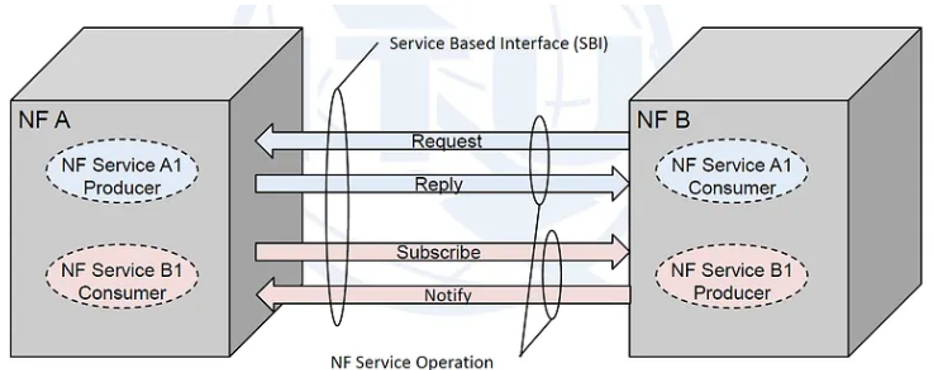

## 1. What is a Service?
A service is a specific capability or function that one Network Function (NF) exposes to other authorized NFs through standardized Service-Based Interfaces (SBI). Services represent discrete operations that can be discovered, accessed, and consumed by other network components without requiring dedicated point-to-point connections.

### Service Producer and Consumer Model
As shown in the diagram, each Network Function can act as both:
* Service Producer: Exposing services that other NFs can consume
* Service Consumer: Consuming services offered by other NFs

### Service Operations
Network Functions communicate through four primary service operations over SBI:
1. Request: A consumer NF sends a service request to a producer NF
2. Reply: The producer NF responds with the requested information or action result
3. Subscribe: A consumer NF subscribes to notifications from a producer NF for specific events
4. Notify: The producer NF sends event notifications to subscribed consumer NFs

### Example Scenario

  
Fig: Service-Based Architecture 

In the diagram:
* NF A contains: 
  * NF Service A1 (acting as Producer)
  * NF Service B1 (acting as Consumer)
* NF B contains: 
  * NF Service A1 (acting as Consumer)
  * NF Service B1 (acting as Producer)

When NF B needs information from NF A:
1. NF B (consumer) sends a Request to NF A (producer) through the SBI
2. NF A processes the request and sends a Reply back to NF B
3. If NF B needs continuous updates, it sends a Subscribe request
4. NF A then sends Notify messages whenever relevant events occur

This bidirectional communication model allows Network Functions to dynamically interact based on service needs, without pre-configured point-to-point connections. Each service operates independently and can be discovered and consumed as needed through the Service-Based Interface.

<details>
<summary><strong>3. Service-Based Architecture (SBA)</strong></summary>

## 2. Service-Based Architecture (SBA)
Service-Based Architecture fundamentally restructures how components interact. Instead of fixed point-to-point links, SBA uses a service-oriented model where functions register and discover services dynamically.

### Core Principles
* Modular Components: The architecture decomposes traditional monolithic elements into specialized, independent functions
* Service Registration: When a component starts, it registers its available services with the discovery service by sending an HTTP PUT request containing its profile

### Profile includes:
* Unique instance ID (UUID)
* Supported services and API versions
* Network location (IP address, FQDN)
* Capacity and load information

### Communication Model
* Service-Based Interfaces: Components expose services through standardized HTTP/2 REST APIs
* URI Structure: `http://{address}/n{service-name}/v{version}/{resource}`
* Direct and Indirect Communication: Components can communicate directly with each other or through a proxy that provides routing, load balancing, and security functions

</details>


<details>
<summary><strong>2. Point-to-Point (P2P) Architecture</strong></summary>

## 3. Point-to-Point (P2P) Architecture
Point-to-Point architecture represents traditional system design where components communicate through dedicated, standardized interfaces with fixed connections between specific pairs of functions.

### Interface Structure
Each connection between components uses specific protocols with predefined interfaces.

### Characteristics
* Static Configuration: All interfaces are preconfigured with fixed IP addresses and protocol parameters. Each component needs explicit configuration for every other component it communicates with.
* Protocol Diversity: Different interfaces may use different protocols, requiring protocol-specific implementations and expertise.
* Tight Coupling: Components are tightly integrated, creating dependencies where changes to one element often require modifications to connected elements.

  
Fig2: P2P Architecture 

</details>


<details>
<summary><strong>4. Difference Between P2P and SBA</strong></summary>

## 4. Difference Between P2P and SBA
| Aspect | Point-to-Point | Service-Based Architecture |
|--------|---------------|---------------------------|
| Communication Model | Dedicated interfaces between pairs | Common service bus with REST APIs |
| Protocol | Multiple protocols | Unified HTTP/2 with REST APIs |
| Configuration | Static, preconfigured connections | Dynamic service discovery |
| Coupling | Tightly coupled, rigid dependencies | Loosely coupled, modular independence |
| Scalability | Scale entire groups together | Independent scaling per component |
| Flexibility | Fixed architecture, difficult to modify | Modular, easily add/remove functions |
| Interface Complexity | Unique protocol per interface type | Standardized RESTful APIs for all |
| Service Addition | Requires new interfaces to multiple components | Register with discovery service, available immediately |
| Deployment | Hardware-based or basic virtualization | Cloud-native, containerized microservices |
| Vendor Ecosystem | Vendor lock-in common | Multi-vendor interoperability |

### Architectural Impact
P2P creates a web of fixed connections, where each strand is a specialized connection. SBA creates a hub-and-spoke model where all functions connect to a common service infrastructure, dramatically simplifying architecture and enabling flexibility.

</details>

<details>
<summary><strong>5. HTTP/1 and HTTP/2 Protocol</strong></summary>

## HTTP/1.1 Protocol
HTTP/1.1 is the long-standing version of the HTTP protocol that powered most web communication for decades before HTTP/2. While foundational and widely supported, its design has inherent limitations that affect performance, scalability, and efficiency in modern service-based systems.

### Key Features
* Text-Based Protocol: HTTP/1.1 uses human-readable text for request and response messages. While simple and easy to debug, text parsing introduces overhead and increases message size compared to binary protocols.
* Persistent Connections (Keep-Alive):Unlike HTTP/1.0, which opened a new connection for every request, HTTP/1.1 introduced persistent connections. Multiple HTTP transactions can occur over the same TCP connection, reducing repeated handshakes. However, these connections still suffer from blocking issues.
* Pipelining (Theoretical): HTTP/1.1 includes an optional pipelining feature intended to allow clients to send multiple requests without waiting for responses. In practice, pipelining was rarely used due to compatibility issues, proxy interference, and strict ordering rules that made actual performance worse.
* Connection Limits: Browsers typically restrict clients to 6 simultaneous TCP connections per domain, forcing applications to open multiple parallel connections to achieve concurrency. This approach increases CPU load and network congestion.
* Head-of-Line Blocking: Within each connection, responses must be returned in the exact order that requests were sent. If one request is slow, every subsequent request in that connection waits—creating significant latency and reducing throughput.


## HTTP/2 Protocol
HTTP/2 is a major revision of the HTTP protocol that provides significant performance improvements over HTTP/1.1. It serves as the foundation for all Service-Based Interface communication.

### Key Features
* Multiplexing: HTTP/2 allows multiple requests and responses to be sent simultaneously over a single TCP connection. Each message is broken into binary-encoded frames tagged with a stream ID, allowing interleaving of multiple streams without blocking. This eliminates head-of-line blocking where one slow request delays all subsequent requests.
* Single Persistent Connection: Instead of opening multiple parallel connections like HTTP/1.1, HTTP/2 uses one long-lived connection per destination. Components maintain this connection to send messages for multiple sessions, with each session using a different stream ID.
* Header Compression: HTTP/2 uses HPACK compression algorithm to reduce redundant header information, significantly decreasing signaling overhead.
* Binary Protocol: Unlike HTTP/1.1's text-based format, HTTP/2 uses binary framing, which is more efficient to parse and less error-prone.

### Why HTTP/2 is Superior to HTTP/1.1

  
Fig3: HTTP/1 vs HTTP/2

#### HTTP/1.1 Limitations
* Maximum 6 parallel connections per domain
* Head-of-line blocking (each request waits for response)
* To download 100 resources: requires opening/closing multiple connections sequentially
* High latency: approximately 400ms per connection roundtrip
* Uncompressed, redundant headers waste bandwidth

#### HTTP/2 Advantages
* Single connection handles unlimited concurrent streams
* No head-of-line blocking at application layer
* To download 100 resources: 1 connection + all requests in parallel = ~400ms total (10x faster)
* Reduced latency through connection reuse
* Lower memory and processing overhead
* Better TLS/SSL performance through session reuse

</details>

<details>
<summary><strong>6. REST APIs in SBA</strong></summary>

## 6. REST APIs in SBA
REST (Representational State Transfer) APIs are the standard interface mechanism for Service-Based Architecture communications. REST provides a stateless, resource-oriented model for service interactions using HTTP methods.

### REST Principles
* Resource-Based Design: Every entity is modeled as a resource with a unique URI.
* Stateless Communication: Each REST request contains all information needed to process it; the server maintains no client session state between requests. This enables horizontal scaling and load distribution.

### Standard HTTP Methods
* GET: Retrieve resource state (read-only, safe, idempotent)
* POST: Create new resources or trigger operations
* PUT: Create or fully replace resources (idempotent)
* PATCH: Partially modify existing resources
* DELETE: Remove resources

### JSON Payloads
All request and response bodies use JSON format for structured data representation.

### Example REST API Operations
Service Registration:
```http
PUT /registry/v1/instances/{instanceId} HTTP/2
Content-Type: application/json
Body: {service profile in JSON}
Service Discovery:

http
Copy code
GET /discovery/v1/instances?type=ServiceA HTTP/2
Session Creation:

http
Copy code
POST /sessions/v1/contexts HTTP/2
Content-Type: application/json
Body: {session parameters in JSON}

Fig4: Rest API Operation Flow

Advantages
Developer Familiarity: REST APIs use web development standards

Interoperability: Standardized REST interfaces enable multi-vendor deployments

Automation-Friendly: RESTful design facilitates automated orchestration and testing

</details> <details> <summary><strong>7. JSON Message Format</strong></summary>
7. JSON Message Format
JSON (JavaScript Object Notation) is the standardized data format for all request and response messages in Service-Based Interfaces. JSON provides human-readable, structured data representation using key-value pairs, arrays, and nested objects.

Example: Service Registration Request
When a component registers with the discovery service:

json
Copy code
{
  "instanceId": "f2b2a934-1b06-41eb-8b8b-cb1a09f099af",
  "serviceType": "ComponentA",
  "status": "REGISTERED",
  "ipv4Addresses": ["192.168.1.10"],
  "allowedClients": ["ComponentB", "ComponentC"],
  "priority": 1,
  "capacity": 100,
  "services": [
    {
      "serviceId": "service-comm",
      "serviceName": "communication",
      "versions": [{"apiVersion": "v1", "fullVersion": "1.0.0"}],
      "scheme": "http",
      "status": "REGISTERED",
      "endpoints": [
        {"ipv4Address": "192.168.1.10", "port": 8080}
      ]
    }
  ]
}
Example: Registration Response
The discovery service responds with HTTP 201 Created:

json
Copy code
{
  "instanceId": "f2b2a934-1b06-41eb-8b8b-cb1a09f099af",
  "serviceType": "ComponentA",
  "status": "REGISTERED",
  "registrationTime": "2025-11-01T13:16:00Z",
  "heartBeatTimer": 60,
  "_links": {
    "self": {
      "href": "http://discovery.service.net/registry/v1/instances/f2b2a934-1b06-41eb-8b8b-cb1a09f099af"
    }
  }
}
Example: Service Discovery Request
Request:

http
Copy code
GET /discovery/v1/instances?type=ServiceB&requester=ComponentA HTTP/2
Host: discovery.service.net
Accept: application/json
Response JSON:

json
Copy code
{
  "instances": [
    {
      "instanceId": "d4e5f6a7-2c3d-4e5f-6a7b-8c9d0e1f2a3b",
      "serviceType": "ServiceB",
      "status": "REGISTERED",
      "ipv4Addresses": ["192.168.2.20"],
      "priority": 1,
      "capacity": 80,
      "load": 45,
      "services": [
        {
          "serviceId": "service-session",
          "serviceName": "session-management",
          "versions": [{"apiVersion": "v1"}],
          "endpoints": [
            {"ipv4Address": "192.168.2.20", "port": 8080}
          ],
          "status": "REGISTERED"
        }
      ]
    }
  ]
}
</details> ```